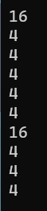
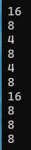
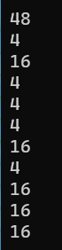
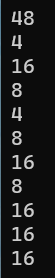

> **🍕博客主页：️[自信不孤单](https://blog.csdn.net/czh1592272237)**
>
> **🍬文章专栏：[C语言](https://blog.csdn.net/czh1592272237/category_12209876.html)**
>
> **🍚代码仓库：[破浪晓梦](https://gitee.com/polang-xiaomeng/study_c)**
>
> **🍭欢迎关注：欢迎大家点赞收藏+关注**

# sizeof与一维数组和二维数组

[toc]

------

# 前言

==sizeof的说明：==

> sizeof是C语言的一种单目操作符，如C语言的其他操作符++、--等。 它并不是函数。 sizeof操作符以字节形式给出了其操作数的存储大小。 操作数可以是一个表达式或括在括号内的类型名。 操作数的存储大小由操作数的类型决定。 带括号的用法更普遍，大多数程序员采用这种形式。 注意：sizeof操作符不能用于函数类型，不完全类型或位字段。 如未知存储大小的数组类型、未知内容的结构或联合类型、void类型等。

==数组名的意义：==

> 1. sizeof(数组名)，这里的数组名表示整个数组，计算的是整个数组的大小。
> 2. &数组名，这里的数组名表示整个数组，取出的是整个数组的地址。
> 3. 除此之外所有的数组名都表示首元素的地址。  

# 1. `sizeof()`与一维数组

```c
int main()
{
	int a[] = { 1,2,3,4 };
	printf("%d\n", sizeof(a));//16
	//sizeof(a)就是数组名单独放在sizeof内部，计算的数组总大小，单位是字节
	printf("%d\n", sizeof(a + 0));//4/8 个字节
	//a+0 其实是数组首元素的地址
	printf("%d\n", sizeof(*a));//4
	//a是数组首元素的地址 - &a[0]
	//*a -> *&a[0] -> a[0]
	printf("%d\n", sizeof(a + 1));//4/8
	//a是数组首元素的地址 -- int*
	//a+1 跳过1个整型, 是第二个元素的地址
	//
	printf("%d\n", sizeof(a[1]));//4
	printf("%d\n", sizeof(&a));//4/8
	//&a - 取出的是数组的地址，但是数组的地址也是地址呀，是地址大小就是4/8字节
	//int (*pa)[4] = &a;//int(*)[4]
	//
	printf("%d\n", sizeof(*&a));//16
	//sizeof(a)
	//int(*)[4]
	//
	printf("%d\n", sizeof(&a + 1));//4/8
	//&a -->  int (*)[4]
	//&a+1 跳过一个数组

	printf("%d\n", sizeof(&a[0]));//取出首元素的地址 4/8
	printf("%d\n", sizeof(&a[0] + 1));//第二个元素的地址 4/8

	return 0;
}
```

==在x86环境下的运行结果：==



==在x64环境下的运行结果：==



# 2. `sizeof()`与二维数组

```c
int main()
{
	int a[3][4] = { 1,2,3,4,5,6,7,8,9,10,11,12 };

	printf("%d\n", sizeof(a));//48 - a这个二维数组的数组名单独放在sizeof内部，计算整个数组的大小
	printf("%d\n", sizeof(a[0][0]));//第一行第一个元素，4个字节
	printf("%d\n", sizeof(a[0]));//16
	//a[0] 第一行的数组名，这时数组名单独放在sizeof内部了
	//计算的是数组的大小，单位是字节，16
	printf("%d\n", sizeof(a[0] + 1));//4/8
	//a[0]不是单独放在sizeof内部，a[0]表示的首元素的地址，即第一行第一个元素的地址 - &a[0][0]
	//a[0] + 1 是第一行第2个元素的地址 &a[0][1]
	printf("%d\n", sizeof(*(a[0] + 1)));//a[0][1] 大小是：4个字节
	printf("%d\n", sizeof(a + 1));// 4/8
	//a作为二维数组的数组名并非单独放在sizeof内部,所以表示首元素的地址
	//二维数组的首元素是第一行，这里的a就是第一行的地址---  int (*)[4]
	//a+1是跳过第一行，指向了第二行

	printf("%d\n", sizeof(*(a + 1)));//16
	//*(a+1)-->a[1]
	printf("%d\n", sizeof(&a[0] + 1));//4/8
	//&a[0]是第一行的地址
	//&a[0]+1是第二行的地址
	printf("%d\n", sizeof(*(&a[0] + 1)));//16  a[1]
	printf("%d\n", sizeof(*a));//16 *a - 就是第一行
	//*a -- *(a+0) -- a[0]
	printf("%d\n", sizeof(a[3]));//16
	
	return 0;
}
```

==在x86环境下的运行结果：==



==在x64环境下的运行结果：==



==可以将二维数组看成一维数组，每一行对应一维数组的一个元素，以便理解。==
