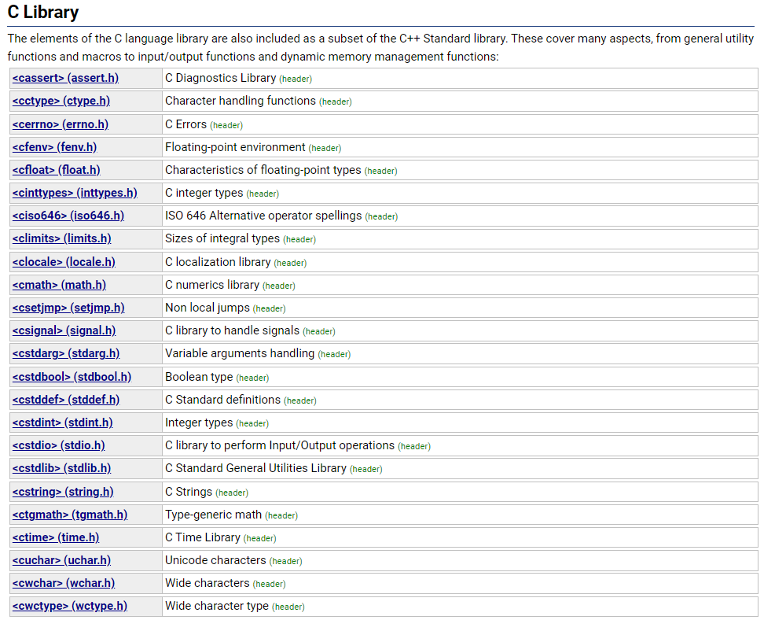

> **🍕博客主页：️[自信不孤单](https://blog.csdn.net/czh1592272237)**
>
> **🍬文章专栏：[C语言](https://blog.csdn.net/czh1592272237/category_12209876.html)**
>
> **🍚代码仓库：[破浪晓梦](https://gitee.com/polang-xiaomeng/study_c)**
>
> **🍭欢迎关注：欢迎大家点赞收藏+关注**

# 函数

[TOC]

---

# 1. 函数是什么？

数学中我们常见到函数的概念。但是你了解C语言中的函数吗？

维基百科中对函数的定义：子程序

> 在计算机科学中，子程序（英语：Subroutine, procedure, function, routine, method,subprogram,callable unit），是一个大型程序中的某部分代码， 由一个或多个语句块组成。它负责完成某项特定任务，而且相较于其他代 码，具备相对的独立性。一般会有输入参数并有返回值，提供对过程的封装和细节的隐藏。这些代码通常被集成为软件库 

# 2. C语言中函数的分类：

1. 库函数
2. 自定义函数

## 2.1 库函数：

为什么会有库函数？

我们知道在我们学习C语言编程的时候，总是在一个代码编写完成之后迫不及待的想知道结果，想
把这个结果打印到我们的屏幕上看看。这个时候我们会频繁的使用一个功能：将信息按照一定的格
式打印到屏幕上（printf）。

在编程的过程中我们会频繁的做一些字符串的拷贝工作（strcpy）。

在编程是我们也计算，总是会计算n的k次方这样的运算（pow）。
像上面我们描述的基础功能，它们不是业务性的代码。我们在开发的过程中每个程序员都可能用的到，
为了支持可移植性和提高程序的效率，所以C语言的基础库中提供了一系列类似的库函数，方便程序员
进行软件开发。那怎么学习库函数呢？

这里我们简单的看看[www.cplusplus.com](https://www.cplusplus.com )



简单的总结，C语言常用的库函数都有：

- IO函数
- 字符串操作函数
- 字符操作函数
- 内存操作函数
- 时间/日期函数
- 数学函数
- 其他库函数

strcpy

```c
char * strcpy ( char * destination, const char * source );
```

memset

```c
void * memset ( void * ptr, int value, size_t num ); 
```

注：

但是库函数必须知道的一个秘密就是：使用库函数，必须包含 #include 对应的头文件。

这里对照文档来学习上面几个库函数，目的是掌握库函数的使用方法。

### 2.1.1 如何学会使用库函数？

需要全部记住吗？No
需要学会查询工具的使用：
MSDN(Microsoft Developer Network)
www.cplusplus.com
http://en.cppreference.com（英文版）
http://zh.cppreference.com（中文版）

## 2.2 自定义函数

如果库函数能干所有的事情，那还要程序员干什么？

所有更加重要的是自定义函数。

自定义函数和库函数一样，有函数名，返回值类型和函数参数。

但是不一样的是这些都是我们自己来设计。这给程序员一个很大的发挥空间。

函数的组成：

```c
ret_type fun_name(para1, * )
{
	statement;//语句项
}
ret_type 返回类型c
fun_name 函数名
para1 函数参数
```

举两个例子：

> 写一个函数可以找出两个整数中的最大值。

```c
#include <stdio.h>
//get_max函数的设计
int get_max(int x, int y)
{
	return (x>y)?(x):(y);
}
int main()
{
	int num1 = 10;
	int num2 = 20;
	int max = get_max(num1, num2);
	printf("max = %d\n", max);
	return 0;
}
```

> 写一个函数可以交换两个整形变量的内容。 

```c
#include <stdio.h>
//实现成函数，但是不能完成任务
void Swap1(int x, int y)
{
	int tmp = 0;
	tmp = x;
	x = y;
	y = tmp;
}
//正确的版本
void Swap2(int *px, int *py)
{
	int tmp = 0;
	tmp = *px;
	*px = *py;
	*py = tmp;
}
int main()
{
	int num1 = 1;
	int num2 = 2;
	Swap1(num1, num2);
	printf("Swap1::num1 = %d num2 = %d\n", num1, num2);
	Swap2(&num1, &num2);
	printf("Swap2::num1 = %d num2 = %d\n", num1, num2);
	return 0;
}

```

# 3. 函数的参数

## 3.1 实际参数（实参）：

> 真实传给函数的参数，叫实参。
> 实参可以是：常量、变量、表达式、函数等。
> 无论实参是何种类型的量，在进行函数调用时，它们都必须有确定的值，以便把这些值传送给形参。

## 3.2 形式参数（形参）：

> 形式参数是指函数名后括号中的变量，因为形式参数只有在函数被调用的过程中才实例化（分配内存单元），所以叫形式参数。形式参数当函数调用完成之后就自动销毁了。因此形式参数只在函数中有效 

上面 `Swap1` 和 `Swap2` 函数中的参数 `x，y，px，py` 都是形式参数。在main函数中传给 `Swap1` 的 `num1` ，
`num2` 和传给 `Swap2` 函数的 `&num1` ， `&num2` 是实际参数。 

形参实例化之后其实相当于实参的一份临时拷贝。

# 4. 函数的调用：

## 4.1 传值调用

> 函数的形参和实参分别占有不同内存块，对形参的修改不会影响实参。

## 4.2 传址调用

> - 传址调用是把函数外部创建变量的内存地址传递给函数参数的一种调用函数的方式。
> - 这种传参方式可以让函数和函数外边的变量建立起真正的联系，也就是函数内部可以直接操作函数外部的变量。

## 4.3 练习

> 1. 写一个函数可以判断一个数是不是素数。
>
>
> 2. 写一个函数判断一年是不是闰年。
>
>
> 3. 写一个函数，实现一个整形有序数组的二分查找。
>
>
> 4. 写一个函数，每调用一次这个函数，就会将 num 的值增加1。

```c
1.写一个函数可以判断一个数是不是素数。
int isPrime(unsigned int number)
{
	if (number < 2)
		return 0;

	unsigned int div = 2;
	while (div * div <= number)
	{
		if (0 == number % div)
			return 0;
		div++;
	}
	return 1;
}

2.写一个函数判断一年是不是闰年。
int isLeapYear(int i)
{
  	//判断闰年的条件：能被4整除并且不能被100整除或者能被400整除
    if (((i % 4 == 0) && (i % 100 != 0)) || (i % 400 == 0))
        return 1;//判断是闰年
    else
        return 0;//判断不是闰年
}

3.写一个函数，实现一个整形有序数组的二分查找。
int binary_search(int* arr, int lenth, int key)
{
    int left = 0;
    int right = lenth - 1;
    int mid = 0;

    while (left <= right)
    {
        mid = left + ((right - left) >> 1);//效率高且没有溢出问题
        if (key > arr[mid])
        {
            left = mid + 1;
        }
        else if (key < arr[mid])
        {
            right = mid - 1;
        }
        else
        {
            return mid;
        }
    }
    return -1;//找不到返回-1
}

4.写一个函数，每调用一次这个函数，就会将 num 的值增加1。
int NumAdd(int *num)
{
	(*num)++;
}
```


# 5. 函数的嵌套调用和链式访问

函数和函数之间可以根据实际的需求进行组合的，也就是互相调用的。

## 5.1 嵌套调用

```c
#include <stdio.h>
void new_line()
{
 	printf("good\n");
}
void three_line()
{
	int i = 0;
 	for(i=0; i<3; i++)
	{
		new_line();
	}
}
int main()
{
 	three_line();
 	return 0;
}
```

运行结果：

```c
good
good
good
```

可见函数可以嵌套调用，但是不能嵌套定义。

## 5.2 链式访问

> 把一个函数的返回值作为另外一个函数的参数。

```c
#include <stdio.h>
#include <string.h>
int main()
{
	char arr[20] = "hello";
	int ret = strlen(strcat(arr, "world"));
	printf("%d\n", ret);
	return 0;
}
```

```c
#include <stdio.h>
int main()
{
	printf("%d", printf("%d", printf("%d", 43)));
	//结果是啥？
	//注：printf函数的返回值是打印在屏幕上字符的个数
	return 0;
}
```

运行结果：

```c
10
```

```c
4321
```

# 6. 函数的声明和定义

## 6.1 函数声明：

> 1. 告诉编译器有一个函数叫什么，参数是什么，返回类型是什么。但是具体是不是存在，函数声明决定不了。
>
>
> 2. 函数的声明一般出现在函数的使用之前。要满足先声明后使用。
> 3. 函数的声明一般要放在头文件中的。

## 6.2 函数定义：

> 函数的定义是指函数的具体实现，交待函数的功能实现。

**test.h的内容**

放置函数的声明

```c
#ifndef __TEST_H__
#define __TEST_H__
//函数的声明
int Add(int x, int y);
#endif //__TEST_H__
```

**test.c的内容**

放置函数的实现

```c
#include "test.h"
//函数Add的实现
int Add(int x, int y)
{
 	return x+y;
}
```

# 7. 函数递归

## 7.1 什么是递归？

> 程序调用自身的编程技巧称为递归（ recursion）。
>
> 递归做为一种算法在程序设计语言中广泛应用。 一个过程或函数在其定义或说明中有直接或间接调用自身的一种方法，它通常把一个大型复杂的问题层层转化为一个与原问题相似的规模较小的问题来求解，递归策略只需少量的程序就可描述出解题过程所需要的多次重复计算，大大地减少了程序的代码量。
>
> 递归的主要思考方式在于：把大事化小

## 7.2 递归的两个必要条件

- 存在限制条件，当满足这个限制条件的时候，递归便不再继续。
- 每次递归调用之后越来越接近这个限制条件。

### 7.2.1 练习1：

> 接受一个整型值（无符号），按照顺序打印它的每一位。
>
> 例如：
>
> 输入：1234，输出 1 2 3 4.

参考代码：

```c
#include <stdio.h>
#include <stdio.h>
void print(int n)
{
	if (n > 9)
	{
		print(n / 10);
	}
	printf("%d ", n % 10);
}
int main()
{
	int num = 1234;
	print(num);
	return 0;
}

```

### 7.2.2 练习2：

编写函数不允许创建临时变量，求字符串的长度。

参考代码：

```c
#include <stdio.h>
int Strlen(const char* str)
{
	if (*str == '\0')
		return 0;
	else
		return 1 + Strlen(str + 1);
}
int main()
{
	char* p = "abcdef";
	int len = Strlen(p);
	printf("%d\n", len);
	return 0;
}
```

## 7.3 递归与迭代

### 7.3.1 练习3：

> 求n的阶乘。（不考虑溢出）

参考代码：

```c
int factorial(int n)
{
 	if(n <= 1)
 		return 1;
 	else
 		return n * factorial(n-1);
}
```

### 7.3.2 练习4：

> 求第n个斐波那契数。（不考虑溢出）

参考代码：

```c
int fib(int n)
{
	if (n <= 2)
		return 1;
	else
		return fib(n - 1) + fib(n - 2);
}
```

但是我们发现有问题；

- 在使用 fib 这个函数的时候如果我们要计算第50个斐波那契数字的时候特别耗费时间。
- 使用 factorial 函数求10000的阶乘（不考虑结果的正确性），程序会崩溃。

为什么呢？

- 我们发现 fib 函数在调用的过程中很多计算其实在一直重复。

如果我们把代码修改一下：

```c
int count = 0;//全局变量
int fib(int n)
{
	if (n == 3)
		count++;
	if (n <= 2)
		return 1;
	else
		return fib(n - 1) + fib(n - 2);
}
```

最后我们输出看看count，是一个很大很大的值。

那我们如何改进呢？

- 在调试 `factorial` 函数的时候，如果你的参数比较大，那就会报错： `stack overflow（栈溢出）`这样的信息。

系统分配给程序的栈空间是有限的，但是如果出现了死循环，或者（死递归），这样有可能导致一直开辟栈空间，最终产生栈空间耗尽的情况，这样的现象我们称为栈溢出。

**那如何解决上述的问题：**

1. 将递归改写成非递归。


2. 使用`static`对象替代 `nonstatic` 局部对象。在递归函数设计中，可以使用 `static` 对象替代`nonstatic` 局部对象（即栈对象），这不仅可以减少每次递归调用和返回时产生和释放 `nonstatic` 对象的开销，而且 static 对象还可以保存递归调用的中间状态，并且可为各个调用层所访问。

比如，下面代码就采用了，非递归的方式来实现：

```c
//求n的阶乘
int factorial(int n)
{
	int result = 1;
	while (n > 1)
	{
		result *= n;
		n -= 1;
	}
	return result;
}
//求第n个斐波那契数
int fib(int n)
{
	int result;
	int pre_result;
	int next_older_result;
	result = pre_result = 1;
	while (n > 2)
	{
		n -= 1;
		next_older_result = pre_result;
		pre_result = result;
		result = pre_result + next_older_result;
	}
	return result;
}
```

**提示：**

1. 许多问题是以递归的形式进行解释的，这只是因为它比非递归的形式更为清晰。
2. 但是这些问题的迭代实现往往比递归实现效率更高，虽然代码的可读性稍微差些。
3. 当一个问题相当复杂，难以用迭代实现时，此时递归实现的简洁性便可以补偿它所带来的运行时开销。

### 函数递归的几个经典题目：

1. 汉诺塔问题
2. 青蛙跳台阶问题

==到此，关于《函数》的内容就结束了
感谢大家的观看
如果对您有帮助，请一键三连
您的支持就是我创作最大的动力！！！==