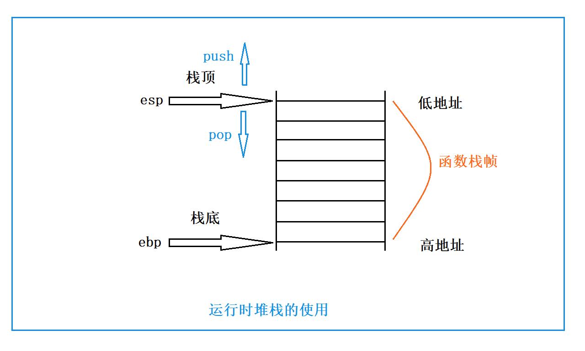
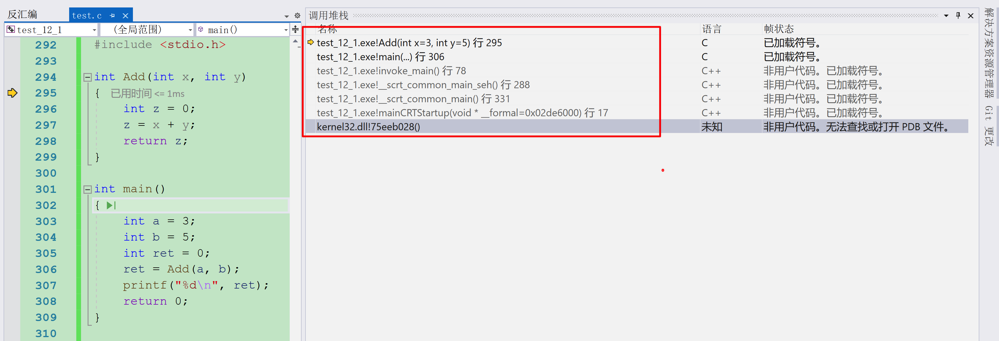
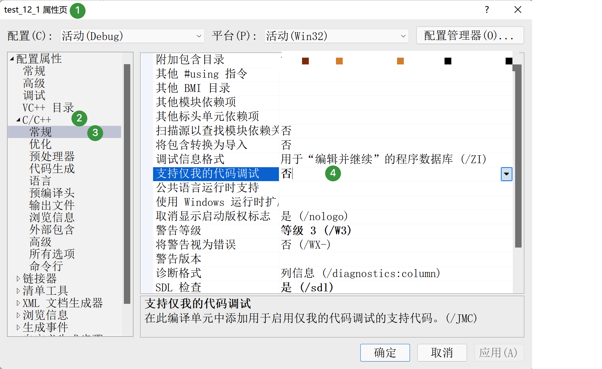
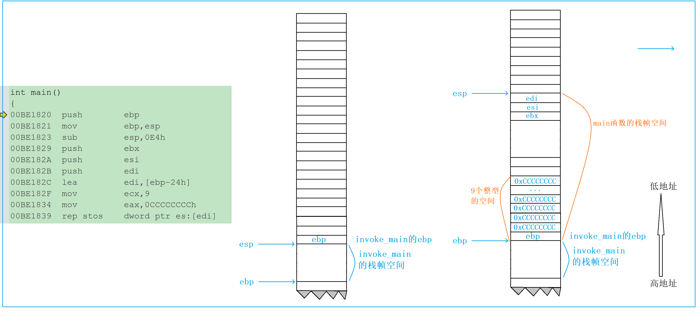
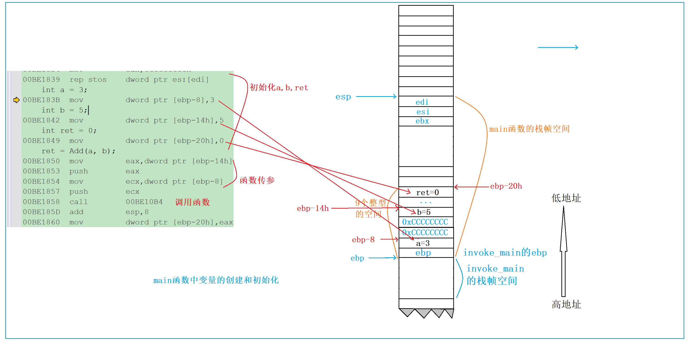

> **🍕博客主页：️[自信不孤单](https://blog.csdn.net/czh1592272237)**
>
> **🍬文章专栏：[C语言](https://blog.csdn.net/czh1592272237/category_12209876.html)**
>
> **🍚代码仓库：[破浪晓梦](https://gitee.com/polang-xiaomeng/study_c)**
>
> **🍭欢迎关注：欢迎大家点赞收藏+关注**

# 函数栈帧的创建和销毁

[TOC]

---

# 1. 什么是函数栈帧

我们在写C语言代码的时候，经常会把一个独立的功能抽象为函数，所以C程序是以函数为基本单位的。

那函数是如何调用的？函数的返回值又是如何带会的？函数参数是如何传递的？这些问题都和函数栈帧有关系。

> 函数栈帧（stack frame）就是函数调用过程中在程序的调用栈（call stack）所开辟的空间，这些空间
>
> 是用来存放：
>
> - 函数参数和函数返回值
> - 临时变量（包括函数的非静态的局部变量以及编译器自动生产的其他临时变量）
> - 保存上下文信息（包括在函数调用前后需要保持不变的寄存器）。

# 2. 理解函数栈帧能解决什么问题呢？

理解函数栈帧有什么用呢？

只要理解了函数栈帧的创建和销毁，以下问题就能够很好的理解了：

- 局部变量是如何创建的？
- 为什么局部变量不初始化内容是随机的？
- 函数调用时参数时如何传递的？传参的顺序是怎样的？
- 函数的形参和实参分别是怎样实例化的？
- 函数的返回值是如何带会的？

让我们一起走进函数栈帧的创建和销毁的过程中。

# 3. 函数栈帧的创建和销毁解析

## 3.1 什么是栈？

栈（stack）是现代计算机程序里最为重要的概念之一，几乎每一个程序都使用了栈，没有栈就没有函数，没有局部变量，也就没有我们如今看到的所有的计算机语言。

> 在经典的计算机科学中，栈被定义为一种特殊的容器，用户可以将数据压入栈中（入栈，push），也可以将已经压入栈中的数据弹出（出栈，pop），但是栈这个容器必须遵守一条规则：先入栈的数据后出栈（First In Last Out， FIFO）。就像叠成一叠的术，先叠上去的书在最下面，因此要最后才能取出。在计算机系统中，栈则是一个具有以上属性的动态内存区域。程序可以将数据压入栈中，也可以将数据从栈顶弹出。压栈操作使得栈增大，而弹出操作使得栈减小。

在经典的操作系统中，栈总是向下增长（由高地址向低地址）的。

在我们常见的i386或者x86-64下，栈顶由成为 esp 的寄存器进行定位的。

## 3.2 认识相关寄存器和汇编指令

**相关寄存器**

```c
eax：通用寄存器，保留临时数据，常用于返回值
ebx：通用寄存器，保留临时数据
ebp：栈底寄存器
esp：栈顶寄存器
eip：指令寄存器，保存当前指令的下一条指令的地址
```

**相关汇编命令**

```c
mov：数据转移指令
push：数据入栈，同时esp栈顶寄存器也要发生改变
pop：数据弹出至指定位置，同时esp栈顶寄存器也要发生改变
sub：减法命令
add：加法命令
call：函数调用，1. 压入返回地址 2. 转入目标函数
jump：通过修改eip，转入目标函数，进行调用
ret：恢复返回地址，压入eip，类似pop eip命令
```

## 3.3 解析函数栈帧的创建和销毁

### 3.3.1 预备知识

首先我们达成一些预备知识才能有效的帮助我们理解，函数栈帧的创建和销毁。

1. 每一次函数调用，都要为本次函数调用开辟空间，就是函数栈帧的空间。
2. 这块空间的维护是使用了2个寄存器： esp 和 ebp ， ebp 记录的是栈底的地址， esp 记录的是栈顶的地址。

如图所示：



3. 函数栈帧的创建和销毁过程，在不同的编译器上实现的方法大同小异，本次演示以VS2019为例。

### 3.3.2 函数的调用堆栈

演示代码：

```c
#include <stdio.h>
int Add(int x, int y)
{
	int z = 0;
	z = x + y;
	return z;
}
int main()
{
	int a = 3;
	int b = 5;
	int ret = 0;
	ret = Add(a, b);
	printf("%d\n", ret);
	return 0;
}
```

这段代码，如果我们在VS2019编译器上调试，调试进入Add函数后，我们就可以观察到函数的调用堆栈（右击勾选【显示外部代码】），如下图：



函数调用堆栈是反馈函数调用逻辑的，那我们可以清晰的观察到， `main` 函数调用之前，是由`invoke_main`函数来调用main函数。

在 `invoke_main` 函数之前的函数调用我们就暂时不考虑了。

那我们可以确定， `invoke_main` 函数应该会有自己的栈帧， `main` 函数和 `Add` 函数也会维护自己的栈帧，每个函数栈帧都有自己的 ebp 和 esp 来维护栈帧空间。

那接下来我们从main函数的栈帧创建开始讲解：

### 3.3.3 准备环境

为了让我们研究函数栈帧的过程足够清晰，不要太多干扰，我们可以关闭下面的选项，让汇编代码中排除一些编译器附加的代码：



### 3.3.4 转到反汇编

调试到main函数开始执行的第一行，右击鼠标转到反汇编。

注：VS编译器每次调试都会为程序重新分配内存，讲解中的反汇编代码是一次调试代码过程中数据，每次调试略有差异。

```c
int main()
{
//函数栈帧的创建
00BE1820 push ebp
00BE1821 mov ebp, esp
00BE1823 sub esp, 0E4h
00BE1829 push ebx
00BE182A push esi
00BE182B push edi
00BE182C lea edi, [ebp - 24h]
00BE182F mov ecx, 9
00BE1834 mov eax, 0CCCCCCCCh
00BE1839 rep stos dword ptr es : [edi]
//main函数中的核心代码
	int a = 3;
00BE183B mov dword ptr[ebp - 8], 3
	int b = 5;
00BE1842 mov dword ptr[ebp - 14h], 5
	int ret = 0;
00BE1849 mov dword ptr[ebp - 20h], 0
	ret = Add(a, b);
00BE1850 mov eax, dword ptr[ebp - 14h]
00BE1853 push eax
00BE1854 mov ecx, dword ptr[ebp - 8]
00BE1857 push ecx
00BE1858 call 00BE10B4
00BE185D add esp, 8
00BE1860 mov dword ptr[ebp - 20h], eax
	printf("%d\n", ret);
00BE1863 mov eax, dword ptr[ebp - 20h]
00BE1866 push eax
00BE1867 push 0BE7B30h
00BE186C call 00BE10D2
00BE1871 add esp, 8
	return 0;
00BE1874 xor eax, eax
}
```

### 3.3.5 函数栈帧的创建

这里我看到 `main` 函数转化来的汇编代码如上所示。

接下来我们就一行行拆解汇编代码

```c
00BE1820 push ebp //把ebp寄存器中的值进行压栈，此时的ebp中存放的是invoke_main函数栈帧的ebp，esp - 4
00BE1821 mov ebp, esp //move指令会把esp的值存放到ebp中，相当于产生了main函数的ebp，这个值就是invoke_main函数栈帧的esp
00BE1823 sub esp, 0E4h //sub会让esp中的地址减去一个16进制数字0xe4,产生新的esp，此时的esp是main函数栈帧的esp，此时结合上一条指令的ebp和当前的esp，ebp和esp之间维护了一个块栈空间，这块栈空间就是为main函数开辟的，就是main函数的栈帧空间，这一段空间中将存储main函数中的局部变量，临时数据已经调试信息等。
00BE1829 push ebx //将寄存器ebx的值压栈，esp-4
00BE182A push esi //将寄存器esi的值压栈，esp-4
00BE182B push edi //将寄存器edi的值压栈，esp-4
//上面3条指令保存了3个寄存器的值在栈区，这3个寄存器的在函数随后执行中可能会被修改，所以先保存寄存器原来的值，以便在退出函数时恢复。
//下面的代码是在初始化main函数的栈帧空间。
//1. 先把ebp-24h的地址，放在edi中
//2. 把9放在ecx中
//3. 把0xCCCCCCCC放在eax中
//4. 将从ebp-0x24h到ebp这一段的内存的每个字节都初始化为0xCC
00BE182C lea edi, [ebp - 24h]
00BE182F mov ecx, 9
00BE1834 mov eax, 0CCCCCCCCh
00BE1839 rep stos dword ptr es : [edi]
```

上面的这段代码最后4句，等价于下面的伪代码： 

```c
edi = ebp - 0x24;
ecx = 9;
eax = 0xCCCCCCCC;
for (; ecx == 0; --ecx, edi += 4)
{
	*(int*)edi = eax;
}
```



**小知识：**烫烫烫~ 


之所以上面的程序输出“烫”这么一个奇怪的字，是因为main函数调用时，在栈区开辟的空间的其中每一个字节都被初始化为0xCC，而arr数组是一个未初始化的数组，恰好在这块空间上创建的，0xCCCC（两个连续排列的0xCC）的汉字编码就是“烫”，所以0xCCCC被当作文本就是“烫”。 

接下来我们再分析main函数中的核心代码： 

```c
	int a = 3;
00BE183B mov dword ptr[ebp - 8], 3 //将3存储到ebp-8的地址处，ebp-8的位置其实就是a变量
	int b = 5;
00BE1842 mov dword ptr[ebp - 14h], 5 //将5存储到ebp-14h的地址处，ebp-14h的位置其实是b变量
	int ret = 0;
00BE1849 mov dword ptr[ebp - 20h], 0 //将0存储到ebp-20h的地址处，ebp-20h的位置其实是ret变量
//以上汇编代码表示的变量a,b,ret的创建和初始化，这就是局部的变量的创建和初始化
//其实是局部变量的创建时在局部变量所在函数的栈帧空间中创建的
//调用Add函数
	ret = Add(a, b);
//调用Add函数时的传参
//其实传参就是把参数push到栈帧空间中
00BE1850 mov eax, dword ptr[ebp - 14h] //传递b，将ebp-14h处放的5放在eax寄存器中
00BE1853 push eax //将eax的值压栈，esp-4
00BE1854 mov ecx, dword ptr[ebp - 8] //传递a，将ebp-8处放的3放在ecx寄存器中
00BE1857 push ecx //将ecx的值压栈，esp-4
//跳转调用函数
00BE1858 call 00BE10B4
00BE185D add esp, 8
00BE1860 mov dword ptr[ebp - 20h], eax
```



Add函数的传参 

```c
//调用Add函数
	ret = Add(a, b);
//调用Add函数时的传参
//其实传参就是把参数push到栈帧空间中，这里就是函数传参
00BE1850 mov eax, dword ptr[ebp - 14h] //传递b，将ebp-14h处放的5放在eax寄存器中
00BE1853 push eax //将eax的值压栈，esp-4
00BE1854 mov ecx, dword ptr[ebp - 8] //传递a，将ebp-8处放的3放在ecx寄存器中
00BE1857 push ecx //将ecx的值压栈，esp-4
//跳转调用函数
00BE1858 call 00BE10B4
00BE185D add esp, 8
00BE1860 mov dword ptr[ebp - 20h], eax
```


函数调用过程 

```c
//跳转调用函数
00BE1858 call 00BE10B4
00BE185D add esp, 8
00BE1860 mov dword ptr[ebp - 20h], eax
```

`call` 指令是要执行函数调用逻辑的，在执行call指令之前先会把call指令的下一条指令的地址进行压栈操作，这个操作是为了解决当函数调用结束后要回到call指令的下一条指令的地方，继续往后执行。 


当我们跳转到Add函数，就要开始观察Add函数的反汇编代码了。 

```c
int Add(int x, int y)
{
00BE1760 push ebp //将main函数栈帧的ebp保存,esp-4
00BE1761 mov ebp, esp //将main函数的esp赋值给新的ebp，ebp现在是Add函数的ebp
00BE1763 sub esp, 0CCh //给esp-0xCC，求出Add函数的esp
00BE1769 push ebx //将ebx的值压栈,esp-4
00BE176A push esi //将esi的值压栈,esp-4
00BE176B push edi //将edi的值压栈,esp-4
	int z = 0;
00BE176C mov dword ptr[ebp - 8], 0 //将0放在ebp-8的地址处，其实就是创建z
	z = x + y;
//接下来计算的是x+y，结果保存到z中
00BE1773 mov eax, dword ptr[ebp + 8] //将ebp+8地址处的数字存储到eax中
00BE1776 add eax, dword ptr[ebp + 0Ch] //将ebp+12地址处的数字加到eax寄存中
00BE1779 mov dword ptr[ebp - 8], eax //将eax的结果保存到ebp-8的地址处，其实就是放到z中
	return z;
00BE177C mov eax, dword ptr[ebp - 8] //将ebp-8地址处的值放在eax中，其实就是把z的值存储到eax寄存器中，这里是想通过eax寄存器带回计算的结果，做函数的返回值。
}
00BE177F pop edi
00BE1780 pop esi
00BE1781 pop ebx
00BE1782 mov esp, ebp
00BE1784 pop ebp
00BE1785 ret
```

代码执行到Add函数的时候，就要开始创建Add函数的栈帧空间了。
在Add函数中创建栈帧的方法和在main函数中是相似的，在栈帧空间的大小上略有差异而已。

1. 将main函数的 ebp 压栈
2. 计算新的 ebp 和 esp
3. 将 ebx ， esi ， edi 寄存器的值保存
4. 计算求和，在计算求和的时候，我们是通过 ebp 中的地址进行偏移访问到了函数调用前压栈进去的参数，这就是形参访问。
5. 将求出的和放在 eax 寄存器尊准备带回 


图片中的 `a'` 和 `b'` 其实就是 Add 函数的形参 `x` , `y` 。这里的分析很好的说明了函数的传参过程，以及函数在进行值传递调用的时候，形参其实是实参的一份拷贝。对形参的修改不会影响实参。 

### 3.3.6 函数栈帧的销毁

当函数调用要结束返回的时候，前面创建的函数栈帧也开始销毁。
那具体是怎么销毁的呢？我们看一下反汇编代码。 

```c
00BE177F pop edi //在栈顶弹出一个值，存放到edi中，esp+4
00BE1780 pop esi //在栈顶弹出一个值，存放到esi中，esp+4
00BE1781 pop ebx //在栈顶弹出一个值，存放到ebx中，esp+4
00BE1782 mov esp, ebp //再将Add函数的ebp的值赋值给esp，相当于回收了Add函数的栈帧空间
00BE1784 pop ebp //弹出栈顶的值存放到ebp，栈顶此时的值恰好就是main函数的ebp，esp + 4，此时恢复了main函数的栈帧维护，esp指向main函数栈帧的栈顶，ebp指向了main函数栈帧的栈底。
00BE1785 ret //ret指令的执行，首先是从栈顶弹出一个值，此时栈顶的值就是call指令下一条指令的地址，此时esp + 4，然后直接跳转到call指令下一条指令的地址处，继续往下执行。

```

回到了call指令的下一条指令的地方： 


但调用完Add函数，回到main函数的时候，继续往下执行，可以看到： 

```c
00BE185D add esp, 8 //esp直接+8，相当于跳过了main函数中压栈的a'和b'
00BE1860 mov dword ptr[ebp - 20h], eax //将eax中值，存档到ebp-0x20的地址处，其实就是存储到main函数中ret变量中，而此时eax中就是Add函数中计算的x和y的和，可以看出来，本次函数的返回值是由eax寄存器带回来的。程序是在函数调用返回之后，在eax中去读取返回值的。
```

拓展了解：
其实返回对象时内置类型时，一般都是通过寄存器来带回返回值的，返回对象如果时较大的对象时，一般会在主调函数的栈帧中开辟一块空间，然后把这块空间的地址，隐式传递给被调函数，在被调函数中通过地址找到主调函数中预留的空间，将返回值直接保存到主调函数的。具体可以参考《程序员的自我修养》一书的第10章。 

==到此，关于《函数栈帧的创建和销毁》的内容就结束了
感谢大家的观看
如果对您有帮助，请一键三连
您的支持就是我创作最大的动力！！！==