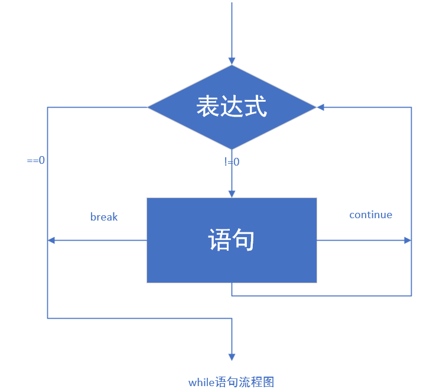
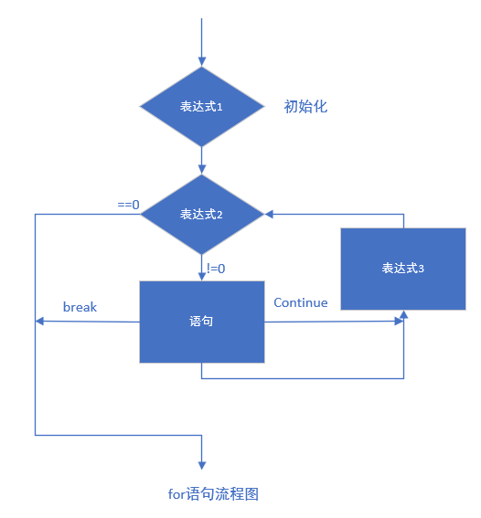
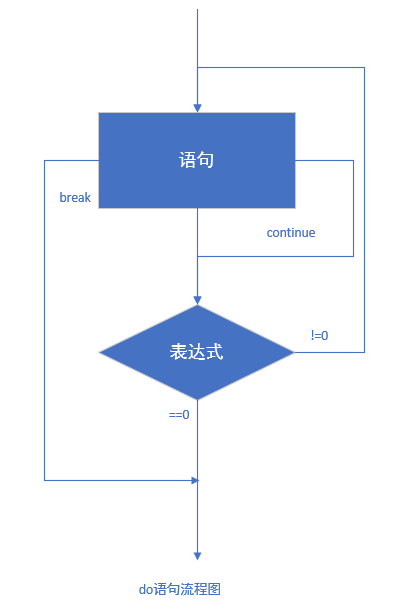

> **🍕博客主页：️[自信不孤单](https://blog.csdn.net/czh1592272237)**
>
> **🍬文章专栏：[C语言](https://blog.csdn.net/czh1592272237/category_12209876.html)**
>
> **🍚代码仓库：[破浪晓梦](https://gitee.com/polang-xiaomeng/study_c)**
>
> **🍭欢迎关注：欢迎大家点赞收藏+关注**

# 分支与循环语句

[TOC]

---

# 前言
C语言是结构化的程序设计语言

生活中的任何事情都是由顺序结构、选择结构、循环结构组成，而C语言又可以通过这些结构来解决生活中的问题，所以说C语言是结构化的程序设计语言，这些结构可以由以下语句来实现。

> 分支语句

- if
- switch

> 循环语句

- while
- for
- do while

> goto语句


# 1.什么是语句？

C语句可分为以下五类：

1. 表达式语句
2. 函数调用语句
3. 控制语句
4. 复合语句
5. 空语句

这里主要来介绍控制语句。

控制语句用于控制程序的执行流程，以实现程序的各种结构方式（C语言支持三种结构：顺序结构、选择结构、循环结构），它们由特定的语句定义符组成，C语言有九种控制语句。

可分成以下三类：

1. 条件判断语句也叫分支语句：if语句、switch语句；
2. 循环执行语句：do while语句、while语句、for语句；
3. 转向语句：break语句、goto语句、continue语句、return语句。

# 2.分支语句（选择结构）

## 2.1 if语句

```c
//语法结构：
//单分支
if(表达式)
	语句;
//or
if(表达式)
	语句1;
else
	语句2;
//多分支
if(表达式1)
	语句1;
else if(表达式2)
	语句2;
else
	语句3;
```

若if后表达式成立，则语句执行；否则看之后的else if后的表达式是否成立，若成立则执行相应语句，若都不成立则执行else语句。

相应代码演示：

```c
//单分支
//代码1
#include <stdio.h>

int main()
{
    int age = 0;
    scanf("%d", &age);
    if(age<18)
    {
        printf("未成年\n");
    }
}
//代码2
#include <stdio.h>
int main()
{
    int age = 0;
    scanf("%d", &age);
    if(age<18)
    {
        printf("未成年\n");
    }
    else
    {
        printf("成年\n");
    }
}
//多分支
//代码3
#include <stdio.h>
int main()
{
    int age = 0;
    scanf("%d", &age);
    if(age<18)
    {
        printf("少年\n");
    }
    else if(age>=18 && age<30)
    {
        printf("青年\n");
    }
    else if(age>=30 && age<50)
    {
        printf("中年\n");
    }
    else if(age>=50 && age<80)
    {
        printf("老年\n");
    }
    else
    {
        printf("老寿星\n");
    }

}
```

若表达式为真，则语句执行

在C语言中如何让表达语句真假？

> 0表示假，非0表示真

若要执行多条语句，则需要将语句内容用大括号括起来，一般我们写代码都用括号括起来就好，这是一个很好的习惯，可以提高代码的可读性，减少犯错的可能。

以上`{ }`就是一个代码块。

### 2.1.1 悬空else

**当你读了这段代码：**

```c
#include <stdio.h>
int main()
{
    int a = 0;
    int b = 2;
    if(a == 1)
        if(b == 2)
            printf("hehe\n");
    else
        printf("haha\n");
    return 0;
}
```

你会认为这里会打印什么样的内容呢？

是“haha”？

不，事实上屏幕上什么都不会输出。这是为什么呢？

else只会和离它近的上一个if进行匹配，不是和与它对其的if进行匹配，这里a != 1从而第一条语句表达式不成立，也就不执行其后的if else语句，所以这里什么都不打印。

这里给我们一个启示，好的代码排版是非常重要的，我们写代码一定要有好的代码排版习惯。

**改正：**

```c
//适当的使用{}可以使代码的逻辑更加清楚。
//代码风格很重要
#include <stdio.h>
int main()
{
    int a = 0;
    int b = 2;
    if(a == 1)
    {
        if(b == 2)
        {
            printf("hehe\n");
        }
    }
    else
    {
        printf("haha\n");
    }       
    return 0;
}
```

else的匹配：else是和它离得最近的if匹配的。

### 2.1.2 if书写形式对比

```c
//代码1
if (condition) {
    return x;
}
return y;
//代码2
if(condition)
{
    return x;
}
else
{
    return y;
}
//代码3
int num = 1;
if(num == 5)
{
    printf("hehe\n");
}
//代码4
int num = 1;
if(5 == num)
{
    printf("hehe\n");
}
```

代码2和代码4更好，逻辑更加清晰，不容易出错。

## 2.2 switch语句

switch语句也是一种分支语句。

常常用于多分支的情况。

比如：

输入1，输出星期一

输入2，输出星期二

输入3，输出星期三

输入4，输出星期四

输入5，输出星期五

输入6，输出星期六

输入7，输出星期日

那我没写成 if...else if ...else if 的形式太复杂，那我们就得有不一样的语法形式。

这就是switch 语句。

```c
switch(整型表达式)
{
    case 整型常量表达式:
        语句;
}
```

### 2.2.1 在switch语句中的 break

在switch语句中，我们没办法直接实现分支，搭配break使用才能实现真正的分支。

比如：

```c
#include <stdio.h>
int main()
{
    int day = 0;
    switch(day)
    {
        case 1：
            printf("星期一\n");
            break;
        case 2:
            printf("星期二\n");
            break;
        case 3:
            printf("星期三\n");
            break;    
        case 4:
            printf("星期四\n");
            break;    
        case 5:
            printf("星期五\n");
            break;
        case 6:
            printf("星期六\n");
            break;
        case 7:
            printf("星期天\n");    
            break;
    }
    return 0;
}
```

有时候我们的需求变了：

1. 输入1-5，输出的是“weekday”;
2. 输入6-7，输出“weekend”

所以我们的代码就应该这样实现了：

```c
#include <stdio.h>
//switch代码演示
int main()
{
    int day = 0;
    switch(day)
    {
        case 1:
        case 2:
        case 3:
        case 4:
        case 5:
            printf("weekday\n");
            break;
        case 6:
        case 7:
            printf("weekend\n");
            break;
    }
    return 0;
}
```

**break语句** 的实际效果是把语句列表划分为不同的分支部分。

**编程好习惯**

> 在最后一个 case 语句的后面加上一条 break语句。
>
> （之所以这么写是可以避免出现在以前的最后一个 case 语句后面忘了添加 break语句）。

### 2.2.2 default子句

如果表达的值与所有的case标签的值都不匹配怎么办？

其实也没什么，结构就是所有的语句都被跳过而已。

程序并不会终止，也不会报错，因为这种情况在C中并不认为是个错误。

但是，如果你并不想忽略不匹配所有标签的表达式的值时该怎么办呢？

你可以在语句列表中增加一条default子句，把下面的标签

default：

写在任何一个 case 标签可以出现的位置。

当 switch 表达式的值并不匹配所有 case 标签的值时，这个 default 子句后面的语句就会执行。

所以，每个switch语句中只能出现一条default子句。

但是它可以出现在语句列表的任何位置，而且语句流会像执行一个case标签一样执行default子句。

**编程好习惯**

> 在每个 switch 语句中都放一条default子句是个好习惯，甚至可以在后边再加一个 break 。

# 3.循环语句

- while
- for
- do while

## 3.1 while循环

### 3.1.1语法

我们已经掌握了，if语句：

```c
if(条件)
    语句;
```

当条件满足的情况下，if语句后的语句执行，否则不执行。

但是这个语句只会执行一次。

由于我们发现生活中很多的实际的例子是：同一件事情我们需要完成很多次。

那我们怎么做呢？

C语言中给我们引入了： while 语句，可以实现循环。

```c
//while 语法结构

while(表达式)

    循环语句;
```

while语句执行流程：



比如我们实现：

```c
#include <stdio.h>
int main()
{
    int i = 1;
    while(i<=10)
    {
        printf("%d ", i);
        i = i+1;
    }
    return 0;
}
```

在屏幕上打印1-10的数字。

上面的代码已经帮我了解了 while 语句的基本语法，那我们再了解一下：

### 3.1.2 while语句中的break和continue

**break介绍**

```c
//break 代码实例
#include <stdio.h>
int main()
{
    int i = 1;
    while(i<=10)
    {
        if(i == 5)
            break;
        printf("%d ", i);
        i = i+1;
    }
    return 0;
}
```

这里代码输出的结果是什么？

```c
1 2 3 4
1 2 3 4 5
1 2 3 4 5 6 7 8 9 10
1 2 3 4 6 7 8 9 10
```

**总结：**

break在while循环中的作用：

> 其实在循环中只要遇到break，就停止后期的所有的循环，直接终止循环。
>
> 所以：while中的break是用于永久终止循环的。

**continue介绍**

```c
//continue 代码实例1
#include <stdio.h>
int main()
{
    int i = 1;
    while(i<=10)
    {
        if(i == 5)
            continue;
        printf("%d ", i);
        i = i+1;
    }
    return 0;
}
```

这里代码输出的结果是什么？

```c
1 2 3 4
1 2 3 4 5
1 2 3 4 5 6 7 8 9 10
1 2 3 4 6 7 8 9 10
```

```c
//continue 代码实例2
#include <stdio.h>
int main()
{
    int i = 1;
    while(i<=10)
    {
        i = i+1;
        if(i == 5)
            continue;
        printf("%d ", i);
    }
    return 0;
}
```

**总结:**

continue在while循环中的作用就是：

> continue是用于终止本次循环的，也就是本次循环中continue后边的代码不会再执行，而是直接跳转到while语句的判断部分。进行下一次循环的入口判断
>

再看几个代码：

```c
//代码什么意思？
//代码1
#include <stdio.h>
int main()
{
    int ch = 0;
    while ((ch = getchar()) != EOF)
        putchar(ch);
    return 0;
}
这里的代码适当的修改是可以用来清理输入缓冲区的。
    //代码2
    #include <stdio.h>
    int main()
{
    char ch = '\0';
    while ((ch = getchar()) != EOF)
    {
        if (ch < '0'|| ch > '9')
            continue;
        putchar(ch);
    }
    return 0;
}
//这个代码的作用是：只打印数字字符，跳过其他字符的。
```

代码1 while如果可以改为

```c
while (getchar() != '\n')
{
    ;
}
```

这样就可以通过将输入缓存区的字符读取来清理输入缓存区

## 3.2 for循环

我们已经知道了while循环，但是我们为什么还要一个for循环呢？

首先来看看for循环的语法：

### 3.2.1 语法

```c
for(表达式1; 表达式2; 表达式3)
    循环语句;
```

**表达式1**

表达式1为初始化部分，用于初始化循环变量的。

**表达式2**

表达式2为条件判断部分，用于判断循环时候终止。

**表达式3**

表达式3为调整部分，用于循环条件的调整。

实际的问题：

> 使用for循环 在屏幕上打印1-10的数字。

```c
#include <stdio.h>
int main()
{
    int i = 0;
    //for(i=1/*初始化*/; i<=10/*判断部分*/; i++/*调整部分*/)
    for(i=1; i<=10; i++)
    {
        printf("%d ", i);
    }
    return 0;
}
```

for循环的执行流程图：




现在我们对比一下for循环和while循环。

```c
int i = 0;
//实现相同的功能，使用while
i=1;//初始化部分
while(i<=10)//判断部分
{
    printf("hehe\n");
    i = i+1;//调整部分
}
//实现相同的功能，使用while
for(i=1; i<=10; i++)
{
    printf("hehe\n");
}
```

可以发现在while循环中依然存在循环的三个必须条件，但是由于风格的问题使得三个部分很可能偏离较远，这样查找修改就不够集中和方便。所以，for循环的风格更胜一筹；for循环使用的频率也最高。

### 3.2.2 for循环中的 break和continue

我们发现在for循环中也可以出现break和continue，他们的意义和在while循环中是一样的。

但是还是有些差异：

```c
//代码1
#include <stdio.h>
int main()
{
    int i = 0;
    for(i=1; i<=10; i++)
    {
        if(i == 5)
            break;
        printf("%d ",i);
    }
    return 0;
}
//代码2
#include <stdio.h>
int main()
{
    int i = 0;
    for(i=1; i<=10; i++)
    {
        if(i == 5)
            continue;
        printf("%d ",i);
    }
    return 0;
}
```

### 3.2.3 for语句的循环控制变量

建议：

1. 不可在for 循环体内修改循环变量，防止 for 循环失去控制。
2. 建议for语句的循环控制变量的取值采用“前闭后开区间”写法。

```c
int i = 0;
//前闭后开的写法
for(i=0; i<10; i++)
{}
//两边都是闭区间
for(i=0; i<=9; i++)
{}
```

### 3.2.4 一些for循环的变种

```c
#include <stdio.h>
int main()
{
    //代码1
    for(;;)
    {
        printf("hehe\n");
    }
    //for循环中的初始化部分，判断部分，调整部分是可以省略的，但是不建议初学时省略，容易导致问题。

    //代码2
    int i = 0;
    int j = 0;
    //这里打印多少个hehe?
    for(i=0; i<10; i++)
    {
        for(j=0; j<10; j++)
        {
            printf("hehe\n");
        }
    }

    //代码3
    int i = 0;
    int j = 0;
    //如果省略掉初始化部分，这里打印多少个hehe?
    for(; i<10; i++)
    {
        for(; j<10; j++)
        {
            printf("hehe\n");
        }
    }

    //代码4-使用多余一个变量控制循环
    int x, y;
    for (x = 0, y = 0; x<2 && y<5; ++x, y++)
    {
        printf("hehe\n");
    }
    return 0;
}
```

来一道练习题把

```c
//请问循环要循环多少次？
#include <stdio.h>
int main()
{
    int i = 0;
    int k = 0;
    for(i =0,k=0; k=0; i++,k++)
        k++;
    return 0;
}
```

这里循环0次，第二个表达式将0赋值给k恒假，故不会执行循环语句。

## 3.3 do...while()循环

### 3.3.1 语法

```c
do
    循环语句;
while(表达式);
```

do...while()循环的执行流程图



### 3.3.2 do语句的特点

循环至少执行一次，使用的场景有限，所以不是经常使用。

```c
#include <stdio.h>
int main()
{
    int i = 1;
    do
    {
        printf("%d ", i);
        i=i+1;
    }while(i<=10);
    return 0;
}
```

### 3.3.3 do while循环中的break和continue

```c
//break
#include <stdio.h>
int main()
{
    int i = 1;
    do
    {
        if(5 == i)
            break;
        printf("%d ", i);
        i=i+1;
    }while(i<=10);

    return 0;
}
//continue
#include <stdio.h>
int main()
{
    int i = 1;

    do
    {
        if(5 == i)
            continue;
        printf("%d ", i);
        i=i+1;
    }while(i<=10);

    return 0;
}
```

## 3.4 练习

1. 计算n的阶乘。
2. 计算 1!+2!+3!+……+10!
3. 在一个有序数组中查找具体的某个数字n。
4. 编写代码，演示多个字符从两端移动，向中间汇聚。
5. 编写代码实现，模拟用户登录情景，并且只能登录三次。（只允许输入三次密码，如果密码正确则提示登录成功，如果三次均输入错误，则退出程序。）

### 3.4.1 练习代码参考

```c
//1. 计算n的阶乘。
#include<stdio.h>

int main()
{
	int n = 0;
	//输入
	scanf("%d", &n);
	int i = 0;
	int ret = 1;
	for (i = 1; i <= n; i++)
	{
		ret *= i;
	}
	printf("%d", ret);
	return 0;

}

//2.计算 1!+2!+3!+……+10!
//第一种方法
#include<stdio.h>

int main()
{
	int n = 0;
	//输入
	//计算n的阶乘
	int i = 0;
	int ret = 1;
	int sum = 0;
	for (n = 1; n <= 3; n++)
	{
		ret = 1;
		//计算n的阶乘
		for (i = 1; i <= n; i++)
		{
 			ret *= i;
		}
		sum += ret;
	}
	printf("%d\n", sum);
	return 0;
}
//第二种方法
#include<stdio.h>

int main()
{

	int n = 0;
	//输入
	//计算n的阶乘
	int i = 0;
	int ret = 1;
	int sum = 0;
	for (n = 1; n <= 3; n++)
	{
		ret *= n;
		sum += ret;
	}
	printf("%d\n", sum);
	return 0;
}


//3.在一个有序数组中查找具体的某个数字n。
//第一种（遍历数组，不管数组有没有序，都可用该法，但效率低）
#include<stdio.h>

int main()
{
	int arr[] = { 1,2,3,4,5,6,7,8,9,10 };
	int k = 7;//k是要查找的数字
	int i = 0;
	int flag = 0;
	int sz = sizeof(arr) / sizeof(arr[0]);
	for (i = 0; i < sz; i++)
	{
		if (k == arr[i])
		{
			flag = 1;
			printf("找到了，下表是：%d\n", i);
			break;
		}
	}
	if (flag == 0)
		printf("找不到\n");
	return 0;
}
//第二种（折半查找法，前提是有序数组）
#include<stdio.h>

int main()
{
	int arr[] = { 1,2,3,4,5,6,7,8,9,10 };
	int k = 7;//k是要查找的数字
	int sz = sizeof(arr) / sizeof(arr[0]);
	int left = 0;
	int right = sz-1;
	int flag = 0;
	while (left <= right)
	{
		int mid = left + (right - left) / 2;
		if (arr[mid] > k)
			right = mid - 1;
		else if (arr[mid] < k)
			left = mid + 1;
		else
		{
			flag = 1;
			printf("找到了，下标是：%d", mid);
			break;
		}
	}
	if (flag == 0)
	{
		printf("没找到");
	}
	return 0;
}


//4.编写代码，演示多个字符从两端移动，向中间汇聚。

#include <stdio.h>
#include<windows.h>
int main()
{
	char arr1[] = "I'm going to get better";
	char arr2[] = "***********************";
	int sz = sizeof(arr1) / sizeof(arr1[0]);
	int left = 0;
	int right = sz - 2;
	while (left <= right)
	{
		arr2[left] = arr1[left];
		arr2[right] = arr1[right];
		right--;
		left++;
		printf("%s\n", arr2);
		Sleep(1000);
		system("cls");
	}
	return 0;
}


//5.编写代码实现，模拟用户登录情景，并且只能登录三次。
//（只允许输入三次密码，如果密码正确则提示登录成，如果三次均输入错误，则退出程序。)
#include<stdio.h>
#include<string.h>
int main()
{
	char input[20] = {0};
	 char password[20] = "123456";
	int flag = 0;
	for (int i = 0; i < 3; i++)
	{
		printf("请输入密码：");
		scanf("%s", &input);
		if (strcmp(input, password) == 0)
		{
			printf("密码正确！\n");
			flag = 1;
		}
		else
			printf("密码错误！\n");
		if (flag)
			break;
	}
	if (flag == 0)
		printf("三次密码均错误，退出程序");
	return 0;
}
```

### 3.4.2 猜数字游戏

```c
#include <stdio.h>
#include <stdlib.h>
#include <time.h>
void menu()
{
	printf("**********************************\n");
	printf("*********** 1.play      **********\n");
	printf("*********** 0.exit      **********\n");
	printf("**********************************\n");
}

void game()
{
	int random_num = rand() % 100 + 1;
	int input = 0;
	while (1)
	{
		printf("请输入猜的数字>:");
		scanf("%d", &input);
		if (input > random_num)
		{
			printf("猜大了\n");
		}
		else if (input < random_num)
		{
			printf("猜小了\n");
		}
		else
		{
			printf("恭喜你，猜对了\n");
			break;
		}
	}
}
int main()
{
	int input = 0;
	srand((unsigned)time(NULL));
	do
	{
		menu();
		printf("请选择>:");
		scanf("%d", &input);
		switch (input)
		{
		case 1:
			game();
			break;
		case 0:
			break;
		default:
			printf("选择错误,请重新输入!\n");
			break;
		}
	} while (input);
	return 0;
}
```


# 4. goto语句

C语言中提供了可以随意滥用的 goto语句和标记跳转的标号。

从理论上 goto语句是没有必要的，实践中没有goto语句也可以很容易的写出代码。

但是某些场合下goto语句还是用得着的，最常见的用法就是终止程序在某些深度嵌套的结构的处理过程。

例如：一次跳出两层或多层循环。

多层循环这种情况使用break是达不到目的的。它只能从最内层循环退出到上一层的循环。

goto语言真正适合的场景如下：

```c
for(...)
    for(...)
   {
        for(...)
       {
            if(disaster)
                goto error;
       }
   }
    …
error:
 if(disaster)
         // 处理错误情况
```

下面是使用goto语句的一个例子，然后使用循环的实现方式替换goto语句：

一个关机程序

```c
#include <stdio.h>
int main()
{
    char input[10] = {0};
    system("shutdown -s -t 60");
    again:
    printf("电脑将在1分钟内关机，如果输入：我是猪，就取消关机!\n请输入:>");
    scanf("%s", input);
    if(0 == strcmp(input, "我是猪"))
    {
        system("shutdown -a");
    }
    else
    {
        goto again;
    }
    return 0;
}
```

而如果不适用goto语句，则可以使用循环：

```c
#include <stdio.h>
#include <stdlib.h>
int main()
{
    char input[10] = {0};
    system("shutdown -s -t 60");
    while(1)
    {
        printf("电脑将在1分钟内关机，如果输入：我是猪，就取消关机!\n请输入:>");
        scanf("%s", input);
        if(0 == strcmp(input, "我是猪"))
        {
            system("shutdown -a");
            break;
        }
    }
    return 0;
}
```

==到此，关于《分支与循环语句》的内容就结束了
感谢大家的观看
如果对您有帮助，请一键三连
您的支持就是我创作最大的动力！！！==
