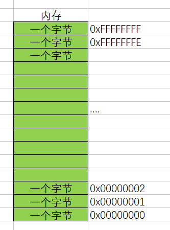
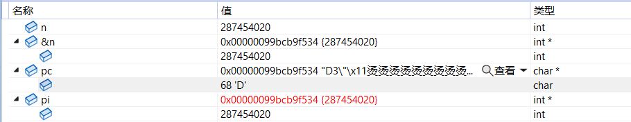
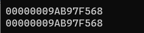
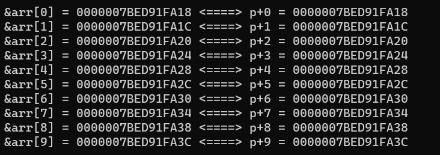
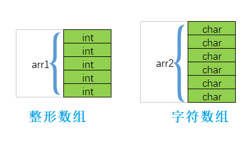
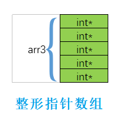

> **🍕博客主页：️[自信不孤单](https://blog.csdn.net/czh1592272237)**
>
> **🍬文章专栏：[C语言](https://blog.csdn.net/czh1592272237/category_12209876.html)**
>
> **🍚代码仓库：[破浪晓梦](https://gitee.com/polang-xiaomeng/study_c)**
>
> **🍭欢迎关注：欢迎大家点赞收藏+关注**

# 初阶指针

[toc]

---

# 1、指针是什么？

> 指针理解的2个要点：
> 1. 指针是内存中一个最小单元的编号，也就是地址
> 2. 平时口语中说的指针，通常指的是指针变量，是用来存放内存地址的变量
>
> **总结：**
> 指针就是地址，口语中说的指针通常指的是指针变量。

==那我们就可以这样理解：==

> 内存



>指针变量
>我们可以通过&（取地址操作符）取出变量的内存其实地址，把地址可以存放到一个变量中，这个变量就是指针变量

``` c
#include <stdio.h>
int main()
{
	int a = 10;//在内存中开辟一块空间
	int* p = &a;//这里我们对变量a，取出它的地址，可以使用&操作符。
	//a变量占用4个字节的空间，这里是将a的4个字节的第一个字节的地址存放在p变量中，p就是一个之指针变量。
	return 0;
}
```

> **总结：**
> 指针变量，用来存放地址的变量。（存放在指针中的值都被当成地址处理）

==那这里的问题是：==

> - 一个小的单元到底是多大？（1个字节）
>
> - 如何编址？
>
> 	经过仔细的计算和权衡我们发现一个字节给一个对应的地址是比较合适的。
>	对于32位的机器，假设有32根地址线，那么假设每根地址线在寻址的时候产生高电平（高电压）和低电平（低电压）就是（1或者0）；
> 	那么32根地址线产生的地址就会是：
> 
> 	00000000 00000000 00000000 00000000
>	00000000 00000000 00000000 00000001
> 	...
> 	11111111 11111111 11111111 11111111
> 
> 	这里就有2的32次方个地址。
>	每个地址标识一个字节，那我们就可以给`（2^32Byte == 2^32/1024KB == 2^32/1024/1024MB==2^32/1024/1024/1024GB == 4GB）`4G的空间进行编址。

==这里我们就明白：==

> 在32位的机器上，地址是32个0或者1组成二进制序列，那地址就得用4个字节的空间来存储，所以一个指针变量的大小就应该是4个字节。
> 那如果在64位机器上，如果有64个地址线，那一个指针变量的大小是8个字节，才能存放一个地址。

> **总结：**
>
> - 指针变量是用来存放地址的，地址是唯一标示一个内存单元的。
> - 指针的大小在32位平台是4个字节，在64位平台是8个字节。  

# 2、指针和指针类型

> 这里我们在讨论一下：指针的类型
> 我们都知道，变量有不同的类型，整形，浮点型等。那指针有没有类型呢？
> 准确的说：有的。

==当有这样的代码：==

```c
int num = 10;
p = &num;
```

> 要将`&num`（num的地址）保存到p中，我们知道p就是一个指针变量，那它的类型是怎样的呢？
> 我们给指针变量相应的类型。
>
> 这里可以看到，指针的定义方式是：`type + *`。
>
> **其实：**
> `char*`类型的指针是为了存放`char`类型变量的地址。
> `short*`类型的指针是为了存放`short`类型变量的地址。
> `int*`类型的指针是为了存放`int`类型变量的地址。

==那指针类型的意义是什么？==

## 2.1 指针+-整数

**首先我们来看**
==这段代码的结果是什么？==

```c
#include <stdio.h>
int main()
{
	int n = 10;
	char* pc = (char*)&n;
	int* pi = &n;
	printf("%p\n", &n);
	printf("%p\n", pc);
	printf("%p\n", pc + 1);
	printf("%p\n", pi);
	printf("%p\n", pi + 1);
	return 0;
}
```

==这里测试结果，输出如下：==

> `000000B8276FF5B4`
> `000000B8276FF5B4`
> `000000B8276FF5B5`
> `000000B8276FF5B4`
> `000000B8276FF5B8`

> 这里`pc+1`打印出的地址是n向后移动一位的地址，`pi+1`打印出的地址是n向后移动4位的地址
>
> 理由是
> pc是char类型指针变量，pi是Int类型指针变量。
> 所以`pc+1`就向后移动一个字节，地址加1；`pi+1`就向后移动四个字节，地址加4。
>
> **总结：**
> 指针的类型决定了指针向前或者向后走一步有多大（距离）。

## 2.2 指针的解引用

==首先我们来看这段代码==

```c
#include <stdio.h>
int main()
{
	int n = 0x11223344;
	char* pc = (char*)&n;
	int* pi = &n;
	*pc = 0;
	*pi = 0;
	return 0;
}
```



> 这里我是在小端编译器上测试的
>
> 当执行完`*pc = 0;`
> n的值从`0x11223344`变成了`0x11223300`
> 这是因为pc只是拿到了n的第一个字节的地址，所以解引用只能访问第一个字节，故只能将第一个字节改为0
>
> 而执行完`*pi = 0;`
> pi拿到了整个n的四个字节，所以n变为了0

> **总结：**
> 指针的类型决定了，对指针解引用的时候有多大的权限（能操作几个字节）。
> 比如：`char*`的指针解引用就只能访问一个字节，而`int*`的指针的解引用就能访问四个字节。

# 3、野指针

> 概念： 野指针就是指针指向的位置是不可知的（随机的、不正确的、没有明确限制的）

## 3.1 野指针成因

==1. 指针未初始化==

```c
#include <stdio.h>
int main()
{
	int* p;//局部变量指针未初始化，默认为随机值
	*p = 20;
	return 0;
}
```

==2. 指针越界访问==

```c
#include <stdio.h>
int main()
{
	int arr[10] = { 0 };
	int* p = arr;
	int i = 0;
	for (i = 0; i <= 11; i++)
	{
		//当指针指向的范围超出数组arr的范围时，p就是野指针
		*(p++) = i;
	}
	return 0;
}
```

==3. 指针指向的空间释放==

```c
#include <stdio.h>

char* test()
{
	char arr[] = "hello world";
	return arr;
}

int main()
{
	char* p = test();
	printf("%s", p);
}
```

> - 在上面的情况中，test函数内部的arr是个局部变量，因此当函数结束的时候，arr的地址就已经被回收了
> - 因此使用指针变量p来试图接受数组arr的首地址的时候，只能接受到一个被系统回收之后再分配的随机地址

## 3.2 如何规避野指针

==1. 指针初始化==
==2. 小心指针越界==
==3. 指针指向空间释放，及时置NULL==
==4. 避免返回局部变量的地址==
==5. 指针使用之前检查有效性==

**例如**

```c
#include <stdio.h>
int main()
{
	int* p = NULL;
	int a = 10;
	p = &a;
	if (p != NULL)
	{
		*p = 20;
	}
	return 0;
}
```

# 4、指针运算

> 指针+- 整数
>
> 指针-指针
>
> 指针的关系运算

## 4.1 指针+-整数

```c
#define N_VALUES 5
int main()
{
	float values[N_VALUES];
	float* vp;
	//指针+-整数；指针的关系运算
	for (vp = &values[0]; vp < &values[N_VALUES];)
	{
		*vp++ = 0;
	}
	return 0;
}
```

> 此代码是使用指针将values数组初始化为0
>
> `vp++`是将指针后向移动4个字节（float对应的字节数）

## 4.2 指针-指针

```c
int my_strlen(char* s)
{
	char* p = s;
	while (*p != '\0')
		p++;
	return p - s;
}
```

>  指针-指针这种运算必须满足，两种指针的类型一致
>
> 此代码旨在计算字符串长度
> 先将字符串首地址赋给p，然后将p移到‘\0’的位置
> `p - s`计算的是两个地址间的元素个数，即字符串的元素个数

## 4.3 指针的关系运算

```c
for (vp = &values[N_VALUES]; vp > &values[0];)
{
	*--vp = 0;
}
```

> 指针可以进行比较大小，规则是比较两个指针指向地址的数值大小

==现将代码简化, 这将代码修改如下：==

```c
for (vp = &values[N_VALUES - 1]; vp >= &values[0]; vp--)
{
	*vp = 0;
}
```

> 实际在绝大部分的编译器上是可以顺利完成任务的，然而我们还是应该避免这样写，因为标准并不保证它可行。

==**标准规定：**==

> 允许指向数组元素的指针与指向数组最后一个元素后面的那个内存位置的指针比较，但是不允许与指向第一个元素之前的那个内存位置的指针进行比较。

# 5、指针和数组

==我们来看一个栗子：==

```c
#include <stdio.h>
int main()
{
	int arr[10] = { 1,2,3,4,5,6,7,8,9,0 };
	printf("%p\n", arr);
	printf("%p\n", &arr[0]);
	return 0;
}
```

==运行结果：==



> 可见数组名和数组首元素的地址是一样的。
>
> **结论：**
> 数组名表示的是数组首元素的地址。

==那么这样写代码是可行的：==

```c
int arr[10] = { 1,2,3,4,5,6,7,8,9,0 };
int* p = arr;//p存放的是数组首元素的地址
```

> 既然可以把数组名当成地址存放到一个指针中，那么我们就可以通过只跟来访问数组元素。

**例如：**

```c
#include <stdio.h>
int main()
{
	int arr[] = { 1,2,3,4,5,6,7,8,9,0 };
	int* p = arr; //指针存放数组首元素的地址
	int sz = sizeof(arr) / sizeof(arr[0]);
	for (int i = 0; i < sz; i++)
	{
		printf("&arr[%d] = %p <====> p+%d = %p\n", i, &arr[i], i, p + i);
	}
	return 0;
}
```

==运行结果：==



> 所以`p+i`其实计算的是数组`arr`下标为`i`的地址。
> 那我们就可以直接通过指针来访问数组。

**如下：**

```c
int main()
{
	int arr[] = { 1, 2, 3, 4, 5, 6, 7, 8, 9, 0 };
	int* p = arr; //指针存放数组首元素的地址
	int sz = sizeof(arr) / sizeof(arr[0]);
	int i = 0;
	for (i = 0; i < sz; i++)
	{
		printf("%d ", *(p + i));
	}
	return 0;
}
```


# 6、二级指针

> 指针变量也是变量，是变量就有地址，那指针变量的地址存放在哪里？
> 这就是==二级指针==。

> 对于二级指针的运算有：
>
> - `*ppa` 通过对`ppa`中的地址进行解引用，这样找到的是`pa`，`*ppa`其实访问的就是`pa`。

```c
int b = 20;
*ppa = &b;
//等价于 pa = &b;
```

> - `**ppa`先通过`*ppa`找到`pa`，然后对`pa`进行解引用操作：`*pa`，找到`a`。

```c
** ppa = 30;
//等价于*pa = 30;
//等价于a = 30;
```

# 7、指针数组

> 指针数组是指针还是数组？
>
> 答案：是数组。是存放指针的数组。
>
> 数组我们已经知道整形数组，字符数组。

```c
int arr1[5];
char arr2[6];
```



> 那指针数组是怎样的？

```c 
int* arr3[5];//是什么？  
```

> arr3是一个数组，有五个元素，每个元素是一个整形指针。



==到此，《指针初阶》的学习就结束了
感谢大家的观看
你们的支持就是我学习进步的最大动力！！！==
