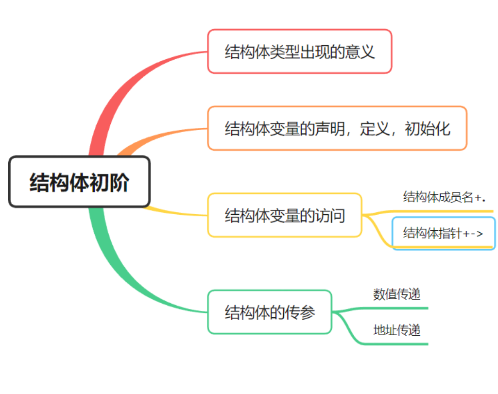
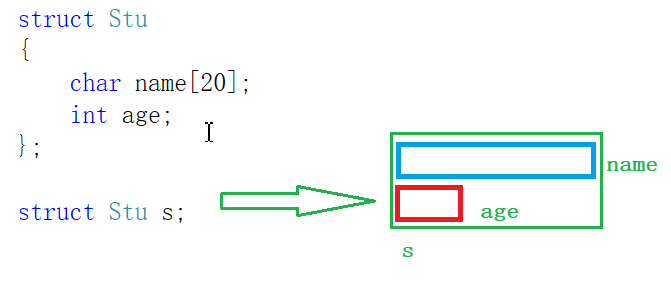

> **🍕博客主页：️[自信不孤单](https://blog.csdn.net/czh1592272237)**
>
> **🍬文章专栏：[C语言](https://blog.csdn.net/czh1592272237/category_12209876.html)**
>
> **🍚代码仓库：[破浪晓梦](https://gitee.com/polang-xiaomeng/study_c)**
>
> **🍭欢迎关注：欢迎大家点赞收藏+关注**

# 初阶结构体

[toc]

---

# 前言
> - 结构体类型的声明
>
> - 结构体初始化
> - 结构体成员访问
> - 结构体传参



> 在正式认识结构体之前，我们先来了解一下结构体这个类型出现的意义是什么？
>
> 假如你要定义一个变量来表示身高，你只要`float height;`就行了。
> 假如你要存一串字符你只要定义一个字符数组`char a[20];`就行了。
> 但是，当你要定义一个变量来表示一个学生的信息呢？这个学生的姓名、年龄、学号等都是一些不同类型的变量。在这时就需要一个能够表示各种不同类型的变量，所以结构体就出现了。

==我们再来看结构体变量的声明、定义、初始化==

# 1、结构体的声明、定义、初始化

## 1.1 结构的基础知识

> ==结构是一些值的集合，这些值称为成员变量。结构的每个成员可以是不同类型的变量。==

## 1.2 结构的声明

```c
//声明
struct tag
{
	member - list;
}variable - list;
```

==举个栗子：==

```c
typedef struct Stu
{
	char name[20];//名字
	int age;//年龄
	char sex[5];//性别
	char id[20];//学号
}Stu;//分号不能丢
```

> 这个例子表明我们声明了一个结构体类型`struct Stu`，typedef将`struct Stu`重命名为`Stu`，在结构体内部包含了名字、年龄、性别、学号。

## 1.3 结构成员的类型

> 结构的成员可以是标量、数组、指针，甚至是其他结构体。

> 小知识：在C语言中，枚举类型、字符型和各种整数的表示形式统一叫做标量类型。
> 当在C表达式中使用标量类型的值时，编译器就会自动将这些标识符转换为整数保存。
> 这种机制的作用是，在这些标量类型上执行的操作与整型上执行的操作完全一样。

## 1.4 结构体变量的定义和初始化

==有了结构体类型，那我们就可一使用结构体类型定义变量了。==

```c
struct Point
{
	int x;
	int y;
}p1; //声明类型的同时定义变量p1
struct Point p2; //定义结构体变量p2
//初始化：定义变量的同时赋初值。
struct Point p3 = { 10, 20 };
int main()
{
	struct Point p4; //定义局部变量
	return 0;
}
```

> 其中p1、p2、p3都是全局变量，p4是局部变量。

==除了上面的按顺序，还有一种初始化方式：`. + 成员名`==

```c
struct Stu //类型声明
{
	char name[15];//名字
	int age; //年龄
};
struct Stu s = { .name  = "zhangsan", .age = 20 };//初始化
```

==还有结构体嵌套初始化==

```c
struct Node
{
	int data;
	struct Point p;
	struct Node* next;
}n1 = { 10, {4,5}, NULL }; //结构体嵌套初始化
struct Node n2 = { 20, {5, 6}, NULL };//结构体嵌套初始化
```

# 2、结构体成员的访问

> - 结构体变量访问成员（`.`）
> - 结构体指针访问指向变量的成员（`->`）

==结构变量的成员是通过点操作符（.）访问的==

> 点操作符接受两个操作数

**例如**



> 我们可以看到s有成员name和age；
> 那我们如何访问s的成员？

```c
struct S s;
strcpy(s.name, "zhangsan");//使用.访问name成员
s.age = 20;//使用.访问age成员
```

==结构体指针访问指向变量的成员==

> 有时候我们得到的不是一个结构体变量，而是指向一个结构体的指针。 
> 那该如何访问成员。
> 如下：  

```c
#include <stdio.h>

struct Stu
{
	char name[20];
	int age;
};

void print(struct Stu* ps)
{
	printf("name = %s age = %d\n", (*ps).name, (*ps).age);
	//使用结构体指针访问指向对象的成员
	printf("name = %s age = %d\n", ps->name, ps->age);
}
int main()
{
	struct Stu s = { "zhangsan", 20 };
	print(&s);//结构体地址传参
	return 0;
}
```

> 运行发现两次打印结果一致，所以结构体指针访问成员可以通过==指针+->+成员名==来访问成员

# 3、结构体传参

==有了上面的学习，我们来看一段代码==

```c
struct S
{
	int data[1000];
	int num;
};
struct S s = { {1,2,3,4}, 1000 };
//结构体传参
void print1(struct S s)
{
	printf("%d\n", s.num);
}
//结构体地址传参
void print2(struct S* ps)
{
	printf("%d\n", ps->num);
}
int main()
{
	print1(s); //传结构体
	print2(&s); //传地址
	return 0;
}
```

> 上面的print1和print2函数哪个好些？
> 答案是：首选print2函数。

> **原因：**
> 函数传参的时候，参数是需要压栈的。
> 如果传递一个结构体对象的时候，结构体过大，参数压栈的的系统开销比较大，所以会导致性能的下降。
> **结论：**
> 结构体传参的时候，要传结构体的地址。

==到此，《初阶结构体》的学习就结束了
感谢大家的观看
你们的支持就是我学习进步的最大动力！！！==