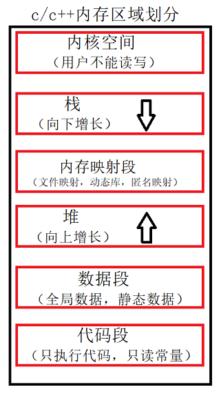
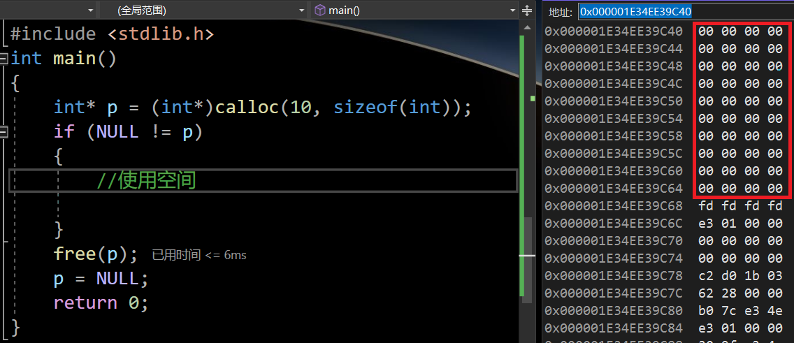
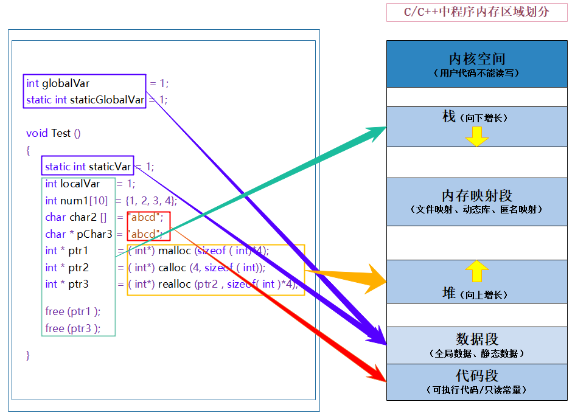

> **🍕博客主页：️[自信不孤单](https://blog.csdn.net/czh1592272237)**
>
> **🍬文章专栏：[C语言](https://blog.csdn.net/czh1592272237/category_12209876.html)**
>
> **🍚代码仓库：[破浪晓梦](https://gitee.com/polang-xiaomeng/study_c)**
>
> **🍭欢迎关注：欢迎大家点赞收藏+关注**

# 动态内存管理

[toc]

# 前言

> 在前面我们已经知道了一些使用内存的方式：
>
> 1. 创建一个变量
>   - 创建全局变量：在静态区开辟内存
>   - 创建局部变量：在栈区开辟内存
> 2. 创建一个数组
>   - 创建全局数组：在静态区开辟内存
>   - 创建局部数组：在栈区开辟内存
> 3. static修饰的变量
>   - 在静态区开辟内存
>

> 内存的区域划分如下：



# 1. 为什么存在动态内存分配

> 在之前我们已经掌握的内存开辟方式有：

```c
int val = 20;//在栈空间上开辟四个字节
char arr[10] = { 0 };//在栈空间上开辟10个字节的连续空间
```

> 但是上述的开辟空间的方式有两个特点：
> 1. 空间开辟大小是固定的。
> 2. 数组在申明的时候，必须指定数组的长度，它所需要的内存在编译时分配。
>

> 但是我们对于空间利用的需求，不仅仅是上述的情况。例如：有时候我们需要的空间大小在程序运行的时候才能知道，
> 那数组的编译时开辟空间的方式就不能满足了。这时候就只能试试动态存开辟了。

# 2. 动态内存函数的介绍

## 2.1 malloc和free函数

==C语言提供了一个动态内存开辟的函数：==

```c
void* malloc(size_t size);
```

> 1. 这个函数向内存申请一块连续可用的空间，并返回指向这块空间起始位置的指针。
>
> 	- 如果开辟成功，则返回一个指向开辟好空间的指针。
>
> 	- 如果开辟失败，则返回一个NULL指针，因此malloc的返回值一定要做检查。
>
> 2. 返回值的类型是void*，所以malloc函数并不知道开辟空间的类型，具体在使用的时候由使用者自己
> 	来决定。
>
> 3. 如果参数size为0时，malloc的行为是标准是未定义的，取决于编译器。  

==C语言提供了另外一个函数free，专门是用来做动态内存的释放和回收的，函数原型如下：==

```c
void free(void* ptr);
```

> free函数是用来释放动态开辟的内存的。
>
> - 如果参数ptr指向的空间不是动态开辟的，那free函数的行为是未定义的。
>
> - 如果参数ptr是NULL指针，则函数什么事都不做。

> malloc和free都声明在 stdlib.h 头文件中。  

==配合使用举例：==

```c
#include <stdio.h>
#include <stdlib.h>
int main()
{
	int num = 0;
	scanf("%d", &num);
	int* ptr = NULL;
	ptr = (int*)malloc(num * sizeof(int));
	if (NULL != ptr)//判断ptr指针是否为空
	{
		int i = 0;
		for (i = 0; i < num; i++)
		{
			*(ptr + i) = 0;
		}
	}
	free(ptr);//释放ptr所指向的动态内存
	ptr = NULL;//是否有必要？
	return 0;
}
```

> 这里因为ptr被释放掉了，所以ptr指向的空间没有了意义。而ptr在被free释放后还保留着原来这份空间的地址，变成了野指针，为了避免这块空间被错误的使用，我们将ptr置为NULL，赋成空指针，这样就ptr指针就真正的断开了与这块空间的联系。

## 2.2 calloc函数

> C语言还提供了一个函数叫calloc，calloc函数也用来动态内存分配。原型如下：

```c
void* calloc (size_t num, size_t size);
```

> 函数的功能是为num个大小为size的元素开辟一块空间，并且把空间的每个字节初始化为0。
> 与函数malloc的区别只在于calloc会在返回地址之前把申请的空间的每个字节初始化为全0。  

==用法举例：==

```c
#include <stdio.h>
#include <stdlib.h>
int main()
{
	int* p = (int*)calloc(10, sizeof(int));
	if (NULL != p)
	{
		//使用空间
		
	}
	free(p);
	p = NULL;
	return 0;
}
```



> 所以如果我们对申请的内存空间的内容要求初始化，那么可以很方便的使用calloc函数来完成任务。

## 2.3 realloc函数

> realloc函数的出现让动态内存管理更加灵活。
>
> 有时会我们发现过去申请的空间太小了，有时候我们又会觉得申请的空间过大了，那为了合理的使用内存，我们一定会对内存的大小做灵活的调整。那realloc函数就可以做到对动态开辟内存大小的调整。
>
> 函数原型如下：

```c
void* realloc(void* ptr, size_t size);
```

> - ptr是要调整的内存地址。
> - size是调整之后新大小。
> - 返回值为调整之后的内存起始位置的地址。
> - 这个函数在调整原内存空间大小的基础上，还会将原来内存中的数据移动到新的空间。
> - realloc在调整内存空间的是存在两种情况：
> 	- 情况1：原有空间之后有足够大的空间 
> 		- 要扩展内存就在原有内存之后直接追加空间，原来空间的数据不发生变化。
> 	- 情况2：原有空间之后没有足够大的空间
> 		- 我们想要在原来的内存位置改变内存大小，但是原内存块的后面并没有足够大的空间，那我们扩展的方法就是：在堆空间上另找一个合适大小的连续空间来使用，并且把原来内存中的数据拷贝过来，这样函数返回的是一个新的内存地址。注意在另找一个新空间的同时，原有开辟的内存直接被释放，我们不需要考虑内存泄漏的问题。

==用法举例：==

```c
#include <stdio.h>
#include <stdlib.h>
int main()
{
	int* ptr = (int*)malloc(100);
	if (ptr != NULL)
	{
		//业务处理
	}
	else
	{
		exit(EXIT_FAILURE);
	}
	//扩展容量
	//代码1
	ptr = (int*)realloc(ptr, 1000);//这样可以吗？(如果申请失败会如何？)
	//代码2
	int* p = NULL;
	p = realloc(ptr, 1000);
	if (p != NULL)
	{
		ptr = p;
	}
	//业务处理
	free(ptr);
	return 0;
}
```

> 这里代码1使用错误，原因是在重新申请内存失败后，realloc会返回空指针，如果用指向原来那份空间的指针来接收，那么指针的值会被改成NULL，原来那份空间的地址丢失，会造成内存泄漏。所以应该采用代码2的方式来操作。

# 3. 常见的动态内存错误

## 3.1 对NULL指针的解引用操作

```c
void test()
{
	int* p = (int*)malloc(INT_MAX / 4);
	*p = 20;//如果p的值是NULL，就会有问题
	free(p);
}
```

## 3.2 对动态开辟空间的越界访问

```c
void test()
{
	int i = 0;
	int* p = (int*)malloc(10 * sizeof(int));
	if (NULL == p)
	{
		exit(EXIT_FAILURE);
	}
	for (i = 0; i <= 10; i++)
	{
		*(p + i) = i;//当i是10的时候越界访问
	}
	free(p);
}
```

## 3.3 对非动态开辟内存使用free释放

```c
void test()
{
	int a = 10;
	int* p = &a;
	free(p);//ok?
}
```

==注意：free函数只能对我们开辟的动态内存进行释放操作！==

## 3.4 使用free释放一块动态开辟内存的一部分

```c
void test()
{
	int* p = (int*)malloc(100);
	p++;
	free(p);//p不再指向动态内存的起始位置
}
```

> p++指针后移，释放时只释放了原来的p+1之后的内存，导致原来p所指向的内存没有释放，造成内存泄漏。

## 3.5 对同一块动态内存多次释放

```c
void test()
{
	int* p = (int*)malloc(100);
	free(p);
	free(p);//重复释放
}
```

==注意：同一块内存空间只能释放一次。==

## 3.6 动态开辟内存忘记释放（内存泄漏）

```c
void test()
{
	int* p = (int*)malloc(100);
	if (NULL != p)
	{
		*p = 20;
	}
}
int main()
{
	test();
	while (1);
}
```

> 忘记释放不再使用的动态开辟的空间会造成内存泄漏。

==切记：
动态开辟的空间一定要释放，并且正确释放。==

# 4. 动态内存经典笔试题

## 4.1 题目1

```c
void GetMemory(char* p)
{
	p = (char*)malloc(100);
}
void Test(void)
{
	char* str = NULL;
	GetMemory(str);
	strcpy(str, "hello world");
	printf(str);
}
```
> 该代码有什么问题？
> 1. 程序代码运行会出现奔溃现象
> 2. 程序存在内存泄漏问题
>
> 原因：
>
> - str以值传递的形式传给p，p是GetMemory的形参，对p的改变，不会影响到str。在GetMemory函数结束后，动态开辟内存尚未释放，并且无法找到，所以会造成内存泄漏。
> - GetMemory函数结束之后str仍然为NULL，将`"hello world"`放入空指针指向的空间，最后程序必然会崩溃。

==代码改正：==

```c
#include <stdlib.h>

void GetMemory(char** p)
{
	*p = (char*)malloc(100);
}
void Test(void)
{
	char* str = NULL;
	GetMemory(&str);
	strcpy(str, "hello world");
	printf(str);
	free(str);
	str = NULL;
}
int main()
{
	Test();
	return 0;
}
```

## 4.2 题目2

```c
char* GetMemory(void)
{
	char p[] = "hello world";
	return p;
}
void Test(void)
{
	char* str = NULL;
	str = GetMemory();
	printf(str);
}
```

> 该代码有什么问题？
>
> - 内存非法访问
>
> 原因：
>
> - GetMemory函数内部创建p数组，并返回p的地址，在函数内部返回栈空间的地址是有问题的，局部变量出了函数之后自动销毁，出了函数后对局部变量p的访问就是非法的，所以之后在打印str的值时，打印的结果就成为了随机值。

## 4.3 题目3

```c
void GetMemory(char** p, int num)
{
	*p = (char*)malloc(num);
}
void Test(void)
{
	char* str = NULL;
	GetMemory(&str, 100);
	strcpy(str, "hello");
	printf(str);
}
```

> 该代码有什么问题？
>
> - 内存泄漏
>
> 原因：
>
> - 忘记释放malloc动态开辟的内存导致内存泄漏。

==代码改正：==

```c
#include <stdio.h>
#include <stdlib.h>

void GetMemory(char** p, int num)
{
    *p = (char*)malloc(num);
}
void Test(void)
{
    char* str = NULL;
    GetMemory(&str, 100);
    strcpy(str, "hello");
    printf(str);
    free(p);
    p = NULL;
}
int main()
{
    Test();
    return 0;
}

#include <stdio.h>
#include <stdlib.h>

void GetMemory(char** p, int num)
{
    *p = (char*)malloc(num);
}
void Test(void)
{
    char* str = NULL;
    GetMemory(&str, 100);
    strcpy(str, "hello");
    printf(str);
    free(p);
    p = NULL;
}
int main()
{
    Test();
    return 0;
}
```

## 4.4 题目4

```c
void Test(void)
{
	char* str = (char*)malloc(100);
	strcpy(str, "hello");
	free(str);
	if (str != NULL)
	{
		strcpy(str, "world");
		printf(str);
	}
}
```

> 该代码有什么问题？
>
> -  内存非法访问
>
> 原因：
>
> - free(str)后，我们将动态开辟的内存就已经释放掉，还给操作系统了，我们无法进行操作了。但是p并未置为NULL，所以str还记得指向的动态内存的地址，这块内存已经不属于我们了，我们还要将`"world"`拷贝进入这块内存，这就属于非法访问内存。

# 5. C/C++程序的内存开辟  




> C/C++程序内存分配的几个区域：
>
> **1. 栈区（stack）：在执行函数时，函数内局部变量的存储单元都可以在栈上创建，函数执行结束时这些存储单元自动被释放。栈内存分配运算内置于处理器的指令集中，效率很高，但是分配的内存容量有限。 栈区主要存放运行函数而分配的局部变量、函数参数、返回数据、返回地址等。**
> 
> **2. 堆区（heap）：一般由程序员分配释放， 若程序员不释放，程序结束时可能由OS回收 。分配方式类似于链表。**
>
> **3. 数据段（静态区）（static）存放全局变量、静态数据。程序结束后由系统释放。**
> 
>**4. 代码段：存放函数体（类成员函数和全局函数）的二进制代码。**  

==到此我们就能很好的理解static关键字的修饰局部变量的作用了==

> 实际上，普通的局部变量是在栈区分配空间的，栈区的特点是在上面创建的变量出了作用域就销毁。
> 但是，被static 修饰的变量存放在数据段（静态区），数据段的特点是在静态区创建的变量，直到程序结束才销毁，所以生命周期会变长。

# 6. 柔性数组

> 也许你从来没有听说过柔性数组（flexible array）这个概念，但是它确实是存在的。
> 在C99中，结构中的最后一个元素允许是未知大小的数组，这就叫做<u>『柔性数组』</u>成员。  

==例如：==

```c
typedef struct st_type
{
	int i;
	int a[0];//柔性数组成员
}type_a;
```

==有些编译器可能会报错无法编译，可以改成：==

```c
typedef struct st_type
{
	int i;
	int a[];//柔性数组成员
}type_a;
```

## 6.1 柔性数组的特点

> - 结构中的柔性数组成员前面必须至少一个其他成员。
> - sizeof返回的这种结构大小不包括柔性数组的内存。
> - 包含柔性数组成员的结构用malloc函数进行内存的动态分配，并且分配的内存应该大于结构的大小，以适应柔性数组的预期大小。  

```c
typedef struct st_type
{
	int i;
	int a[0];//柔性数组成员
}type_a;
printf("%d\n", sizeof(type_a));//输出的是4
```

## 6.2 柔性数组的使用

```c
//代码1
int i = 0;
type_a* p = (type_a*)malloc(sizeof(type_a) + 100 * sizeof(int));
//业务处理
p->i = 100;
for (i = 0; i < 100; i++)
{
    p->a[i] = i;
}
free(p);
```

> 这样的柔性数组成员a，相当于获得了一个100个整型元素的连续空间。

## 6.3 柔性数组的优势

==上述的type_a结构也可以设计为：==

```c
//代码2
typedef struct st_type
{
    int i;
    int* p_a;
}type_a;
type_a* p = malloc(sizeof(type_a));
p->i = 100;
p->p_a = (int*)malloc(p->i * sizeof(int));
//业务处理
for (i = 0; i < 100; i++)
{
    p->p_a[i] = i;
}
//释放空间
free(p->p_a);
p->p_a = NULL;
free(p);
p = NULL;
```

> 上述代码1和代码2可以完成同样的功能，但是方法1的实现有两个好处：
>
> **1. 方便内存释放**
>
> - 如果我们的代码是在一个给别人用的函数中，你在里面做了二次内存分配，并把整个结构体返回给
> 	用户。用户调用free可以释放结构体，但是用户并不知道这个结构体内的成员也需要free，所以你
> 	不能指望用户来发现这个事。所以，如果我们把结构体的内存以及其成员要的内存一次性分配好
> 	了，并返回给用户一个结构体指针，用户做一次free就可以把所有的内存也给释放掉。
>
> **2. 减少内存碎片，提高内存的使用率**
>
> - 代码2的malloc次数多，内存碎片增多，内存使用率低。并且代码2维护难度加大，容易出错，访问速度也相对较慢。

==到此，关于《动态内存管理》的内容就结束了
感谢大家的观看
创作不易，如果对您有帮助，请一键三连
您的支持就是我创作最大的动力！！！==