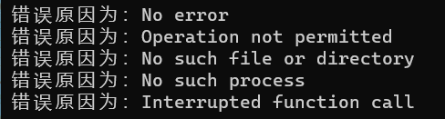
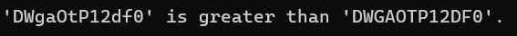
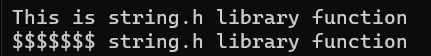

> **🍕博客主页：️[自信不孤单](https://blog.csdn.net/czh1592272237)**
>
> **🍬文章专栏：[C语言](https://blog.csdn.net/czh1592272237/category_12209876.html)**
>
> **🍚代码仓库：[破浪晓梦](https://gitee.com/polang-xiaomeng/study_c)**
>
> **🍭欢迎关注：欢迎大家点赞收藏+关注**

# 字符串函数和内存函数

[toc]

--- ---

# 前言

> C语言中对字符和字符串的处理很是频繁，但是C语言本身是没有字符串类型的，字符串通常放在常量字符串中或者字符数组中。其中字符串常量适用于那些对它不做修改的字符串函数。

# 1. 字符串函数介绍

> 字符串函数需要包含头文件

```c
#include <string.h>
```

## 1.1 strlen函数

```c
size_t strlen(const char* str);
```

> strlen函数（string length）的作用是计算返回字符串中结束标识符`'\0'`之前出现的的字符个数，因此，strlen函数所处理的字符串必须是以结束标识符`'\0'`结尾的字符串。其返回值类型为size_t 类型，该类型为无符号类型。

==strlen函数的应用：==

```c
#include <stdio.h>
int main()
{
	const char* str1 = "abcdef";
	const char* str2 = "bbb";
	if (strlen(str2) - strlen(str1) > 0)
	{
		printf("str2>str1\n");
	}
	else
	{
		printf("srt1>str2\n");
	}
	return 0;
}
```

==输出结果为：==

> str1>str2

> 这里strlen(str2)的返回值为6，strlen(str1)的返回值为3，但为什么输出的是str1>str2呢？
> 由于strlen()的返回值是无符号类型，故两个无符号数相减也是无符号数，相减后的无符号数大于0，所以输出str1>str2。
>
> 要想使用相减来比较字符串长度的大小，可以强制类型转换为有符号整型。
> 如：

```c
#include<stdio.h>
#include<string.h> 
int main()
{
	const char* str1 = "abcdef";
	const char* str2 = "bbb";

	if ((int)strlen(str2) - (int)strlen(str1) > 0)
	{
		printf("str2 > str1\n");
	}
	else
	{
		printf("srt1 < str2\n");
	}
	return 0;
}
```

## 1.2 strcpy函数

```c
char* strcpy(char* destination, const char* source);
```

> strcpy函数（string copy）的作用是，可以将字符串从源地址复制至目的地址，并返回目的空间的起始地址，并且它会将源地址内的结束标识符`'\0'`一并拷贝过去，因此源地址必须以`'\0'`结尾，且目的地址也将以`'\0'`结尾，通俗来讲就是用来实现字符串的复制和拷贝。并且，因为其作用为拷贝字符串，因此目标地址内的空间必须足够大，要有足够的空间容纳下源地址内的字符串，同时目的地址的空间必须是可修改的。

==strcpy函数的应用：==

```C
#include <stdio.h>
#include <string.h>
int main()
{
	char arr1[20];
	char arr2[15] = "hello world";
	printf("%s", strcpy(arr1, arr2));
	return 0;
}
```

==输出结果为：==

> hello world

> 这里要特别注意的是strcpy函数返回的是目标空间的起始地址，该函数设置返回值类型的目的是为了实现链式访问。

## 1.3 strcat函数

```C
char* strcat(char* destination, const char* source);
```

> strcat函数（string catenate）的作用是，将源地址的字符串追加补充至目的地址处，并返回目的空间的首地址。与字符串拷贝函数相同，它在进行补充追加时是从目的地址的结束标识符处`'\0'`开始追加的，追加至源地址的结束标识符处停止。且它同样要求目标地址内的空间必须足够大，要有足够的空间容纳下源地址内的字符串，同时目的地址的空间必须是可修改的。

==strcat函数的应用：==

```c
#include <stdio.h>
#include <string.h>
int main()
{
	char arr1[20] = "hello";
	char arr2[10] = " world";
	printf("%s\n", strcat(arr1, arr2));
	return 0;
}
```

==输出结果为：==

> hello world

## 1.4 strcmp函数

```C
int strcmp(const char* str1, const char* str2);
```

> strcmp函数（string compare）的作用为按照顺序依次比较两字符串对应位置字符的ASCII码值（注意不是比较两字符串的长度），直到结束标识符`'\0'`或对应位置的字符不同。若比较至结束标识符都没有不同则两字符串相等，若两字符串对应位置字符有不同，对应位置上字符ASCII码值小的字符串小于另一个字符串。
>
> 标准规定：
> 第一个字符串大于第二个字符串，则返回大于0的数字
> 第一个字符串等于第二个字符串，则返回0
> 第一个字符串小于第二个字符串，则返回小于0的数字  

==strcmp函数的应用：==

```c
#include<stdio.h>
#include<string.h>
int main()
{
	const char arr1[] = "abcd";
	const char arr2[] = "abz";
	int ret = strcmp(arr1, arr2);
	if (ret > 0)
	{
		printf("arr1 > arr2\n");
	}
	else if (ret == 0)
	{
		printf("arr1 = arr2\n");
	}
	else
	{
		printf("arr1 < arr2\n");
	}
	return 0;
}
```

==输出结果为：==

> arr1 < arr2

## 1.5 strncpy函数

```c
char* strncpy(char* destination, const char* source, size_t num);
```

> strncpy函数（string number copy）的作用为将指定长度的字符串复制到字符数组中，即表示把源地址中字符串开始的前n个字符拷贝到目的地址中，并返回目的空间的首地址。与strcpy相同，它同样会将源地址内的结束标识符`'\0'`一并拷贝过去，因此源地址必须以`'\0'`结尾，且目的地址也将以`'\0'`结尾。并且，因为其作用为拷贝字符串，因此目标地址内的空间必须足够大，要有足够的空间容纳下源地址内的字符串，同时目的地址的空间必须是可修改的。

==strncpy函数的应用：==

```c
#include <stdio.h>
#include <string.h>
int main()
{
	char arr1[20] = "xxxxxxxxxxxxxx";
	char arr2[12] = "hello world";
	printf("%s", strncpy(arr1, arr2, 10));
	return 0;
}
```

==输出结果为：==

> hello worlxxxx

## 1.6 strncat函数

```c
char* strncat(char* destination, const char* source, size_t num);
```

> strncat函数（string num catenate）的作用为从源地址处将指定长度的字符串追加补充到目的地址中与strcat函数类似，它在进行补充追加时也是从目的地址的结束标识符处`'\0'`开始追加的，不同的是追加至参数（单位是字节）限制的字符数处停止。但它同样要求目标地址内的空间必须足够大，要有足够的空间容纳下补充的字符串 ，同时目的地址的空间必须是可修改的。
>
> 返回值为目的空间的首地址

==strncat函数的应用：==

```C
#include <stdio.h>
#include <string.h>
int main()
{
	char arr1[20] = "hello";
	char arr2[10] = " world";
	printf("%s\n", strncat(arr1, arr2, 4));
	return 0;
}
```

==输出结果为：==

> hello wor

## 1.7 strncmp函数

```c
int strncmp(const char* str1, const char* str2, size_t num);
```

> strncmp函数（string number compare）的作用为有限制（单位是字节）的按照顺序依次比较两字符串对应位置字符的ASCII码值（注意不是比较两字符串的长度），直到参数限制位数位置上全部比较结束或对应位置的字符不同。若参数限制位数位置上的字符都比较结束且都没有不同则两字符串相等，若两字符串对应位置字符有不同，对应位置上字符ASCII码值小的字符串小于另一个字符串。
>
> 标准规定：
> 第一个字符串大于第二个字符串，则返回大于0的数字
> 第一个字符串等于第二个字符串，则返回0
> 第一个字符串小于第二个字符串，则返回小于0的数字

==strncmp函数的应用：==

```C
#include<stdio.h>
#include<string.h>
int main()
{
	const char arr1[] = "abcd";
	const char arr2[] = "abz";
	int ret = strncmp(arr1, arr2, 2);
	if (ret > 0)
	{
		printf("arr1 > arr2\n");
	}
	else if (ret == 0)
	{
		printf("arr1 = arr2\n");
	}
	else
	{
		printf("arr1 < arr2\n");
	}
	return 0;
}
```

==输出结果为：==

> arr1 = arr2

## 1.8 strstr函数

```c
char* strstr(const char* str1, const char* str2);
```

> strstr函数（string string）的作用为从一个字符串中寻找其字串，通俗来讲就是从一个字符串中寻找另一个字符串。若找到目标字串则返回指向目标字串的指针，若没有找到目标字串则返回空指针。

==strstr函数的应用：==

```c
#include<stdio.h>
#include<string.h>
int main()
{
	const char arr1[] = "abcdefg";
	const char arr2[] = "cde";
	char* ret = strstr(arr1, arr2);
	//从ar1中寻找arr2
	if (ret == NULL)
	{
		printf("找不到该字符串！\n");
	}
	else
	{
		printf("成功找到该字符串\"%s\"！\n", ret);
	}
	return 0;
}
```

==输出结果为：==

> 成功找到该字符串"cdefg"！

## 1.9 strtok函数

```C
char* strtok(char* str, const char* sep);
```

> strtok函数（string token）的作用为将字符串分解为一组字符串。该函数有两个数组作为参数，它的实际作用便是将其中一个数组为分割数组，在另一个数组中寻找这些分割符，并在分割符处将这个数组内的字符串加上结束标识符`'\0'`，将其分割成一组（多个）字符串。若第一个参数不为NULL，将找到字符数组中的第一个标记并保存它在字符串中的位置；若第一个参数为NULL，将在同一个字符串中被保存的位置开始，查找下一个标记。
>
> 返回值：该函数返回被分解的第一个子字符串，如果没有可检索的字符串，则返回一个空指针。

==strtok函数的应用：==

```c
#include<stdio.h>
#include<string.h>
int main()
{
	char arr1[] = "1592272237@qq.com";
	char arr2[30] = { 0 };
	strcpy(arr2, arr1);
	const char* arr3 = "@.";
	printf("账号：%s\n", strtok(arr2, arr3));
	//找到第一个标记停止
	printf("域名前缀：%s\n", strtok(NULL, arr3));
	//从保存好的位置开始往后找
	printf("域名后缀：%s\n", strtok(NULL, arr3));
	//从保存好的位置开始往后找
	return 0;
}
```

==输出结果为：==

> 账号：1592272237
> 域名前缀：qq
> 域名后缀：com

> 1. strtok函数是会对数组本身进行操作的，所以我们为了保护原始数据，在定义并初始化好字符数组之后，又定义了一个新的数组并将原始数据拷贝过去，作为临时拷贝供我们进行操作。
> 2. 接着我们定义并初始化了分割符数组，函数将根据分割符数组arr3对临时拷贝arr2进行分割。第一次执行函数时之前没有标记，于是直接进行操作找到第一个标记并分割打印。
> 3. 此时就已经存在标记了，再连续两次找到前一次执行作下的标记按照分割符将数组分割完毕并打印。

==我们可以将上述代码优化为：==

```c
#include<stdio.h>
#include<string.h>
int main()
{
	char arr1[] = "1592272237@qq.com";
	char arr2[30] = { 0 };
	strcpy(arr2, arr1);
	const char* arr3 = "@.";
	char* str = NULL;
	for (str = strtok(arr2, arr3); str != NULL; str = strtok(NULL, arr3))
	{
		printf("%s\n", str);
	}
	return 0;
}
```

## 1.10 strerror函数

```c
char* strerror(int errnum);
```

> strerror函数（string error）的作用为返回错误码对应的信息。即根据接收到的错误码（错误码errno为全局变量），返回错误原因的详细信息。

==strerror函数的应用：==

```c
#include<stdio.h>
#include<string.h>
int main()
{
	int i = 0;
	for (i = 0; i <= 4; i++)
	{
		printf("错误原因为：%s\n", strerror(i));
	}
	return 0;
}
```

==输出结果为：==



## 1.11 字符分类函数

| 函数    | 如果他的参数符合下列条件就返回真                             |
| ------- | ------------------------------------------------------------ |
| iscntrl | 任何控制字符                                                 |
| isspace | 空白字符：空格`' '`，换页`'\f'`，换行`'\n'`，回车`'\r'`，制表符`'\t'`或者垂直制表符`'\v'` |
| isdigit | 十进制数字`0~9`                                              |
| isxdigi | 十六进制数字，包括所有十进制数字，小写字母`a~f`，大写字母`A~F` |
| islower | 小写字母`a~z`                                                |
| isupper | 大写字母`A~Z`                                                |
| isalpha | 字母`a~z`或`A~Z`                                             |
| isalnum | 字母或者数字，`a~z`，`A~Z`，`0~9`                            |
| ispunct | 标点符号，任何不属于数字或者字母的图形字符（可打印）         |
| isgraph | 任何图形字符                                                 |
| isprint | 任何可打印字符，包括图形字符和空白字符                       |

==字符转换：==

```c
int tolower(int c);
int toupper(int c);
```

==举个栗子：==

> 此代码的作用是将大写字符转换为小写字符

```c
/* isupper example */
#include <stdio.h>
#include <ctype.h>
int main()
{
	int i = 0;
	char str[] = "Test String.\n";
	char c;
	while (str[i])
	{
		c = str[i];
		if (isupper(c))
			c = tolower(c);
		putchar(c);
		i++;
	}
	return 0;
}
```

==输出结果为：==

> test string.


# 2. 内存函数的介绍

## 2.1 memcpy

```c
void* memcpy(void* destination, const void* source, size_t num);
```

> memcpy函数（memory copy）的作用为从源内存空间向目的内存空间拷贝限制数量（单位是字节）的数据。它与strcpy函数类似，作用均为拷贝数据，不同的是strcpy仅仅只操作字符串故会在结束标识符`'\0'`处停止，而memcpy函数操作的是内存，内存中的数据是相邻的，故不会在结束标识符处停止。
> 返回值：该函数返回一个指向目标存储区destination的指针。

==memcpy函数的应用：==


```c
#include <stdio.h>
#include <string.h>
struct {
	char name[40];
	int age;
} person, person_copy;
int main()
{
	char myname[] = "Pierre de Fermat";
	/* using memcpy to copy string: */
	memcpy(person.name, myname, strlen(myname) + 1);
	person.age = 46;
	/* using memcpy to copy structure: */
	memcpy(&person_copy, &person, sizeof(person));
	printf("person_copy: %s, %d \n", person_copy.name, person_copy.age);
	return 0;
}
```

==输出结果为：==


==注：如果源内存空间和目标内存空间有重叠时，memcpy是无法保证内存复制的正确性的。==

## 2.2 memmove

```c
void* memmove(void* destination, const void* source, size_t num);
```

> memmove函数（memory move）和memcpy函数都是内存复制函数，他们在用法上也一样。但是如果目标区域和源区域有重叠的话，memmove是比memcpy更安全的方法，memmove能够保证源串在被覆盖之前将重叠区域的字节拷贝到目标区域中，复制后源区域的内容会被更改。如果目标区域与源区域没有重叠，则和memcpy函数功能是完全相同的。

==memmove函数的应用：==

```c
#include <stdio.h>
#include <string.h>
int main()
{
	char str[] = "memmove can be very useful......";
	memmove(str + 20, str + 15, 11);
	puts(str);
	return 0;
}
```

==输出结果为：==


## 2.3 memcmp

```c
int memcmp(const void* ptr1,
	const void* ptr2,
	size_t num);
```

> memcmp函数（memory compare）的作用与 strcmp 函数的作用类似，不过 memcmp 函数是从内存的角度以字节为单位进行处理，故 memcmp 函数同样需要第三个参数进行限制，而不会在结束标识符 ’ \0 ’ 处停止比较。

==memcmp函数的应用：==

```c
#include <stdio.h>
#include <string.h>
int main()
{
	char buffer1[] = "DWgaOtP12df0";
	char buffer2[] = "DWGAOTP12DF0";
	int n;
	n = memcmp(buffer1, buffer2, sizeof(buffer1));
	if (n > 0) printf("'%s' is greater than '%s'.\n", buffer1, buffer2);
	else if (n < 0) printf("'%s' is less than '%s'.\n", buffer1, buffer2);
	else printf("'%s' is the same as '%s'.\n", buffer1, buffer2);
	return 0;
}
```

==输出结果为：==



## 2.4 memset

```c
void* memset(void* dest, int c, size_t count);
```

> memset函数（memory set）的作用是复制字符c（一个无符号字符）到参数dest所指向的字符串的前n个字符。
>
> 返回值是：该值返回一个指向存储区dest的指针。

==memset函数的应用：==

```c
#include <stdio.h>
#include <string.h>

int main()
{
	char str[50];
	strcpy(str, "This is string.h library function");
	puts(str);
	memset(str, '$', 7);
	puts(str);
	return(0);
}
```

==输出结果为：==



# 3. 模拟库函数的实现

## 3.1 模拟strlen函数

```c
//1.计数器
size_t my_strlen1(const char* str)
{
	assert(str);
	int count = 0;
	while (*str)
	{
		count++;
		str++;
	}
	return count;
}

//2.递归调用
size_t my_strlen2(const char* str)
{
	assert(str);
	if (*str)
		return sim_strlen2(str + 1) + 1;
	else
		return 0;
}

//3.指针相减
size_t my_strlen3(const char* str)
{
	assert(str);
	const char* p = str;
	while (*p++)
	{
		;
	}
	return (p - str - 1);
}
```

## 3.2 模拟strcpy函数

```c
char* my_strcpy(char* destination, const char* source)
{
	char* ret = destination;
	assert(destination && source);
	while (*destination++ = *source++)
	{
		;
	}
	return ret;
}
```

## 3.3 模拟strcat函数

```c
char* my_strcat(char* destination, const char* source)
{
	char* ret = destination;
	while (*destination)
	{
		destination++;
	}
	while (*destination++ = *source++)
	{
		;
	}
	return ret;
}
```

## 3.4 模拟strcmp函数

```c
int my_strcmp(const char* s1, const char* s2)
{
	assert(s1 && s2);

	while (*s1 == *s2 && *s1 != '\0' && *s2 != '\0')
	{
		s1++;
		s2++;
	}
	return *s1 - *s2;
}
```

## 3.5 模拟strstr函数

```c
char* my_strstr(const char* s1, const char* s2)
{
	assert(s1 && s2);
	if (*s2 == '\0')
	{
		return (char*)s1;
	}
	const char* p1 = s1;
	const char* p2 = s2;
	const char* start = s1; //用于记录开始比较的位置
	while (*p1)
	{	//以防主串可能小于子串，循环条件不能只为*p1 == *p2
		while (*p1 == *p2 && *p1 != '\0' && *p2 != '\0') //单字符匹配成功则匹配下一个字符
		{
			p1++;
			p2++;
		}
		if (*p2 == '\0') //匹配成功，返回开始比较的位置
			return (char*)start;
		//单趟匹配失败，子串退回到第一个字符，进行从主串的下一个字符开始与主串匹配
		p1 = start + 1;
		start = p1;
		p2 = s2;
	}
	return NULL; //跳出外层循环说明匹配失败
}
```

## 3.6 模拟memcpy函数

```c
void* my_memcpy(void* dest, const void* src, size_t nums)
{
	assert(src && dest);
	int i = 0;
	for (i = 0; i < nums; i++)
	{
		*((char*)dest + i) = *((char*)src + i);
	}
	return (char*)dest;
}
```

## 3.7 模拟memmove函数

```c
void* my_memmove(void* dest, const void* src, size_t nums)
{
	assert(src && dest);
	void* ret = dest;
	int i = 0;
	if (dest < src)//从前向后
	{
		for (i = 0; i < nums; i++)
		{
			*((char*)dest + i) = *((char*)src + i);
		}
	}
	else//从后向前
	{
		for (i = nums - 1; i >= 0; i--)
		{
			*((char*)dest + i) = *((char*)src + i);
		}
	}
	return ret;
}
```

==到此，关于《字符串函数和内存函数》的内容就结束了
感谢大家的观看
创作不易，如果对您有帮助，请一键三连
您的支持就是我创作最大的动力！！！==