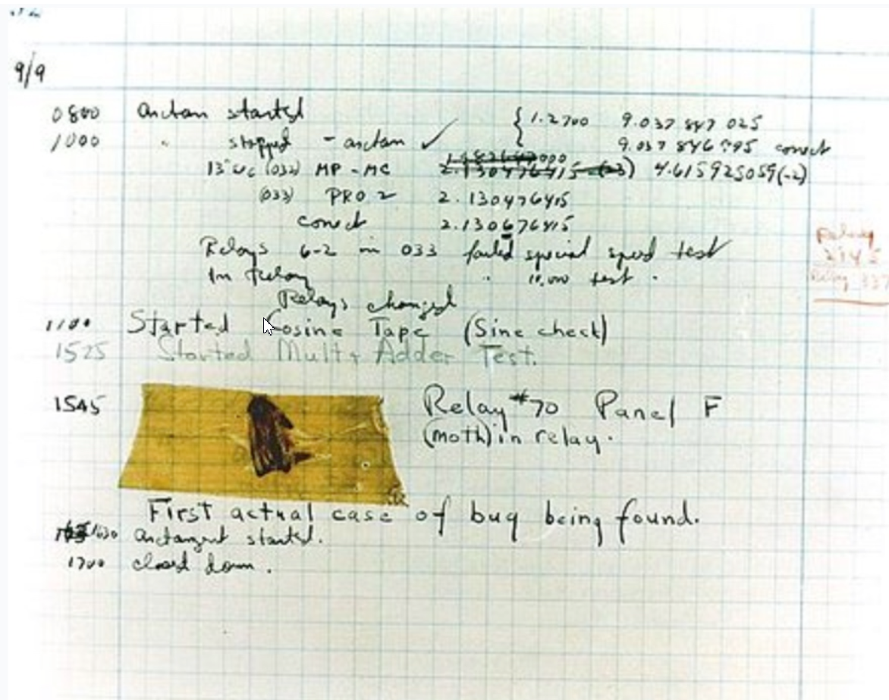

> **🍕博客主页：️[自信不孤单](https://blog.csdn.net/czh1592272237)**
>
> **🍬文章专栏：[C语言](https://blog.csdn.net/czh1592272237/category_12209876.html)**
>
> **🍚代码仓库：[破浪晓梦](https://gitee.com/polang-xiaomeng/study_c)**
>
> **🍭欢迎关注：欢迎大家点赞收藏+关注**

# 实用调试技巧

[toc]

---

# 1、什么是bug？




> 第一次被发现的导致计算机错误的飞蛾，也是第一个计算机程序错误。

# 2、调试是什么？有多重要？

> 所有发生的事情都一定有迹可循，如果问心无愧，就不需要掩盖也就没有迹象了，如果问心有愧，就必然需要掩盖，那就一定会有迹象，迹象越多就越容易顺藤而上，这就是推理的途径。
>
> 顺着这条途径顺流而下就是犯罪，逆流而上，就是真相。  

==一名优秀的程序员是一名出色的侦探。==

> 每一次调试都是尝试破案的过程。

==我们是如何写代码的？==


==又是如何排查出现的问题的呢？==


==拒绝-迷信式调试！！！！==

## 2.1 调试是什么？

> 调试（英语：Debugging / Debug），又称除错，是发现和减少计算机程序或电子仪器设备中程序错误的一个过程。

## 2.2 调试的基本步骤

> - 发现程序错误的存在
> - 以隔离、消除等方式对错误进行定位
> - 确定错误产生的原因
> - 提出纠正错误的解决办法
> - 对程序错误予以改正，重新测试

## 2.3 Debug和Release的介绍

> Debug 通常称为调试版本，它包含调试信息，并且不作任何优化，便于程序员调试程序。
> Release 称为发布版本，它往往是进行了各种优化，使得程序在代码大小和运行速度上都是最优的，以便用户很好地使用。

**代码：**

```c
#include <stdio.h>
int main()
{
	char* p = "hello world";
	printf("%s\n", p);
	return 0;
}
```

==上述代码在Debug环境的结果展示：==


==上述代码在Release环境的结果展示：==


==Debug和Release反汇编展示对比：==


> 所以我们说调试就是在Debug版本的环境中，找代码中潜伏的问题的一个过程。
> 那编译器进行了哪些优化呢？

==请看如下代码：==

```c
#include <stdio.h>
int main()
{
	int i = 0;
	int arr[10] = { 0 };
	for (i = 0; i <= 12; i++)
	{
		arr[i] = 0;
		printf("hehe\n");
	}
	return 0;
}
```

> 这里arr[12]和i共用同一块地址，所以会循环的打印“呵呵”。
> 如果是 debug 模式去编译，程序的结果是死循环。
> 如果是 release 模式去编译，程序没有死循环。
>
> 那他们之间有什么区别呢？
> 就是因为优化导致的。(release模式下先给arr数组开辟了空间然后给i开辟了空间，所以对arr[i]的修改不会影响到i)

==变量在内存中开辟的顺序发生了变化，影响到了程序执行的结果。==

# 3、Windows环境调试介绍

## 3.1 调试环境的准备


==在环境中选择 debug 选项，才能使代码正常调试。==

## 3.2 学会快捷键


==最常使用的几个快捷键：==

**F5**

> 启动调试，经常用来直接跳到下一个断点处。

**F9**

> 创建断点和取消断点
> 断点的重要作用：可以在程序的任意位置设置断点，这样就可以使得程序在想要的位置随意停止执行，继而一步步执行下去。

**F10**

> 逐过程，通常用来处理一个过程，一个过程可以是一次函数调用，或者是一条语句。

**F11**

> 逐语句，就是每次都执行一条语句，但是这个快捷键可以使我们的执行逻辑进入函数内部（这是最长用的）。

**CTRL + F5**

> 开始执行不调试，如果你想让程序直接运行起来而不调试就可以直接使用。

## 3.3 调试的时候查看程序当前信息

### 3.3.1 查看临时变量的值

> 在调试开始之后，用于观察变量的值。


### 3.3.2 查看内存信息

> 在调试开始之后，用于观察内存信息。


### 3.3.3 查看调用堆栈

> 通过调用堆栈，可以清晰的反应函数的调用关系以及当前调用所处的位置。


### 3.3.4 查看汇编信息

> 在调试开始之后，有两种方式转到汇编：

**（1）第一种方式：右击鼠标，选择【转到反汇编】：**


**（2)第二种方式：**


### 3.3.5 查看寄存器信息

> 可以查看当前运行环境的寄存器的使用信息。


# 4、调试的重要性

> 我们程序员一定要熟练掌握调试技巧。
> 初学者可能80%的时间在写代码，20%的时间在调试。但是一个程序员可能20%的时间在写程序，但是80%的时间在调试。
>
> 在出现很复杂的调试场景（多线程程序的调试等）时，更需要我们的调试的熟练操作，因此我们要多多使用快捷键，提升效率。

# 5、举例说明

> 下面举例说明在程序中应用调试找出代码中隐藏的bug
>
> 调试环境是vs2022

```c
#include <stdio.h>
int main()
{
	int i = 0;
	int arr[] = { 1,2,3,4,5,6,7,8,9,10 };
	for (i = 0; i <= 12; i++)
	{
		arr[i] = 0;
		printf("hello bit\n");
	}
	return 0;
}
```


# 6、如何写出好（易于调试）的代码？

## 6.1 优秀的代码：

> 1. 代码运行正常
> 2. bug很少
> 3. 效率高
> 4. 可读性高
> 5. 可维护性高
> 6. 注释清晰
> 7. 文档齐全

==常见的coding技巧：==

> 1. 使用assert
> 2. 尽量使用const
> 3. 养成良好的编码风格
> 4. 添加必要的注释
> 5. 避免编码的陷阱

## 6.2 示范：

> 模拟实现库函数：strcpy

```c
/***
*char *strcpy(dst, src) - copy one string over another
*
*Purpose:
* Copies the string src into the spot specified by
* dest; assumes enough room.
*
*Entry:
* char * dst - string over which "src" is to be copied
* const char * src - string to be copied over "dst"
*
*Exit:
* The address of "dst"
*
*Exceptions:
*******************************************************************************/
char* strcpy(char* dst, const char* src)
{
	char* cp = dst;
	assert(dst && src);
	while (*cp++ = *src++)
		; /* Copy src over dst */
	return(dst);
}
```

> 注意：
> 1. 分析参数的设计（命名，类型），返回值类型的设计
> 2. 这里讲解野指针，空指针的危害。
> 3. assert的使用，这里介绍assert的作用
> 4. 参数部分 const 的使用，这里讲解const修饰指针的作用
> 5. 注释的添加

## 6.3 const的作用

```c
#include <stdio.h>
//代码1
void test1()
{
	int n = 10;
	int m = 20;
	int* p = &n;
	*p = 20;//ok?
	p = &m; //ok?
}
void test2()
{
	//代码2
	int n = 10;
	int m = 20;
	const int* p = &n;
	*p = 20;//ok?
	p = &m; //ok?
}
void test3()
{
	int n = 10;
	int m = 20;
	int* const p = &n;
	*p = 20; //ok?
	p = &m; //ok?
}
int main()
{
	//测试无cosnt的
	test1();
	//测试const放在*的左边
	test2();
	//测试const放在*的右边
	test3();
	return 0;
}
```

> **结论：**
> const修饰指针变量的时候：
>
> 1. const如果放在*的左边，修饰的是指针指向的内容，保证指针指向的内容不能通过指针来改变，但是指针变量本身的内容可变。
> 	
>2. const如果放在*的右边，修饰的是指针变量本身，保证了指针变量的内容不能修改，但是指针指向的内容，可以通过指针改变。

> 注:
> 介绍《高质量C/C++编程》一书中最后章节试卷中有关 strcpy 模拟实现的题目。
> 练习：
> 模拟实现一个strlen函数
> 参考代码：

```c
#include <stdio.h>
int my_strlen(const char* str)
{
	int count = 0;
	assert(str != NULL);
	while (*str)//判断字符串是否结束
	{
		count++;
		str++;
	}
	return count;
}
int main()
{
	const char* p = "abcdef";
	//测试
	int len = my_strlen(p);
	printf("len = %d\n", len);
	return 0;
}
```

# 7、编程常见的错误

## 7.1 编译型错误

> 直接看错误提示信息（双击），解决问题。或者凭借经验就可以搞定。相对来说简单。

## 7.2 链接型错误

> 看错误提示信息，主要在代码中找到错误信息中的标识符，然后定位问题所在。一般是标识符名不存在或者拼写错误。

## 7.3 运行时错误

> 借助调试，逐步定位问题。最难搞。
> ==温馨提示：==
> 做一个有心人，积累排错经验。

==**写比较长的代码时，每当完成一个小功能时，就需要调试了，而不应该整个都写完了再去调试。这样程序有问题，排查难度大大提升了。**==

==学好语言很重要，学好调试就是锦上添花。==

==到此，关于《实用调试技巧》的内容就结束了
感谢大家的观看
如果对您有帮助，请一键三连
您的支持就是我创作最大的动力！！！==
