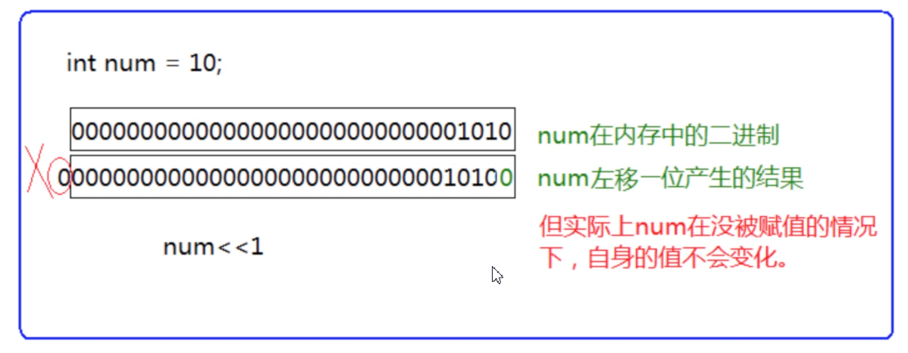
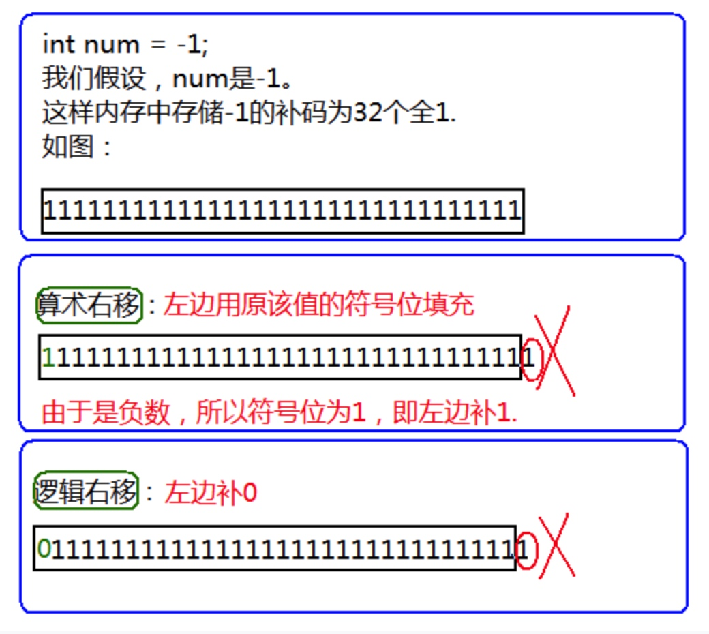

# **操作符详解**

## 1. 操作符分类：

> 算术操作符
> 移位操作符
> 位操作符
> 赋值操作符
> 单目操作符
> 关系操作符
> 逻辑操作符
> 条件操作符
> 逗号表达式
> 下标引用、函数调用和结构成员  

## 2. 算术操作符

```c 
+ - * / %  
```

1. 除了` %` 操作符之外，其他的几个操作符可以作用于整数和浮点数。

2. 对于 `/ `操作符如果两个操作数都为整数，执行整数除法。而只要有浮点数执行的就是浮点数除法。
3. `%` 操作符的两个操作数必须为整数。返回的是整除之后的余数。  

## 3. 移位操作符

> `<< `左移操作符
> `\>> `右移操作符
> 注：移位操作符的操作数只能是整数。

### 3.1 左移操作符

移位规则：

> 左边抛弃、右边补`0` 



### 3.2 右移操作符

移位规则：
> 首先右移运算分两种：
> 
> 1. 逻辑移位
>     左边用0填充，右边丢弃
> 2. 算术移位
>     左边用原该值的符号位填充，右边丢弃  



警告⚠：
对于移位运算符，不要移动负数位，这个是标准未定义的。
例如：  

```c
int num = 10;
num >> -1;//error
```

## 4. 位操作符

位操作符有：  

```c
&		//按位与
|		//按位或
^		//按位异或
```

## 5. 赋值操作符

赋值操作符是一个很棒的操作符，他可以让你得到一个你之前不满意的值。也就是你可以给自己重新赋值。

```c
int weight = 120;//体重
weight = 89;//不满意就赋值
double salary = 10000.0;
salary = 20000.0;//使用赋值操作符赋值。
//赋值操作符可以连续使用，比如：
int a = 10;
int x = 0;
int y = 20;
a = x = y + 1;//连续赋值
//这样的代码感觉怎么样？
//那同样的语义，你看看：
x = y + 1;
a = x;
//这样的写法是不是更加清晰爽朗而且易于调试。
```

复合赋值符

> `+=`
> `*=`
> `/=`
> `%=`
> `>>=`
> `<<=`
> `&=`
> `|=`
> `^=` 

这些运算符都可以写成复合的效果。
比如：  

```c
int x = 10;
x = x + 10;
x += 10;//复合赋值
//其他运算符一样的道理。这样写更加简洁。  
```

## 6. 单目操作符

### 6.1 单目操作符介绍

```c
!		逻辑反操作
-		负值
+		正值
&		取地址
sizeof	操作数的类型长度（以字节为单位）
~		对一个数的二进制按位取反
--		前置、后置--
++		前置、后置++
*		间接访问操作符(解引用操作符)
()		强制类型转换
```

演示代码：

```c
#include <stdio.h>
int main()
{
    int a = -10;
    int* p = NULL;
    printf("%d\n", !2);
    printf("%d\n", !0);
    a = -a;
    p = &a;
    printf("%d\n", sizeof(a));
    printf("%d\n", sizeof(int));
    printf("%d\n", sizeof a);//这样写可以
    printf("%d\n", sizeof int);//这样写不行
    //sizeof后可以直接跟变量名，但不能跟类型名
    return 0;
}
```

`sizeof`可以求变量（类型）所占空间的大小  

### 6.2 `sizeof `和 数组

```c
#include <stdio.h>
void test1(int arr[])
{
    printf("%d\n", sizeof(arr));//(2)
}
void test2(char ch[])
{
    printf("%d\n", sizeof(ch));//(4)
}
int main()
{
    int arr[10] = { 0 };
    char ch[10] = { 0 };
    printf("%d\n", sizeof(arr));//(1)
    printf("%d\n", sizeof(ch));//(3)
    test1(arr);
    test2(ch);
    return 0;
}
/*
问：
（1）、（2）两个地方分别输出多少？
（3）、（4）两个地方分别输出多少？
答：
40	4/8（32位/64位）
10	4/8（32位/64位）
*/
```

```c
//++和--运算符
//前置++和--
#include <stdio.h>
int main()
{
    int a = 10;
    int x = ++a;
    //先对a进行自增，然后对使用a，也就是表达式的值是a自增之后的值。x为11。
    int y = --a;
    //先对a进行自减，然后对使用a，也就是表达式的值是a自减之后的值。y为10;
    return 0;
}
//后置++和--
#include <stdio.h>
int main()
{
    int a = 10;
    int x = a++;
    //先对a先使用，再增加，这样x的值是10；之后a变成11；
    int y = a--;
    //先对a先使用，再自减，这样y的值是11；之后a变成10；
    return 0;
}
```

## 7. 关系操作符

关系操作符  

```c
>
>=
<
<=
!=	用于测试“不相等”
==	用于测试“相等”
```

警告：
在编程的过程中== 和=不小心写错，导致的错误。

## 8. 逻辑操作符

逻辑操作符有哪些：

```c
&&	逻辑与
||	逻辑或
```

区分逻辑与和按位与
区分逻辑或和按位或  

```c
1&2----->0
1&&2---->1
1|2----->3
1||2---->1
```

逻辑与和或的特点：

```c
#include <stdio.h>
int main()
{
    int i = 0, a = 0, b = 2, c = 3, d = 4;
    i = a++ && ++b && d++;
    //i = a++||++b||d++;
    printf("a = %d\nb = %d\nc = %d\nd = %d\n", a, b, c, d);
    return 0;
}
//程序输出的结果是什么？
```

答案是：

```c
a = 1
b = 2
c = 3
d = 4
```

从而得出

- `&&`操作符左边为假，右边不再执行
- `||`操作符左边为真，右边不再执行

## 9. 条件操作符

```c
exp1 ? exp2 : exp3
```

`exp1`为真，则结果`exp2`；反之，结果为`exp3`。

## 10. 逗号表达式

```c
exp1, exp2, exp3, …expN
```

逗号表达式，就是用逗号隔开的多个表达式。
逗号表达式，从左向右依次执行。整个表达式的结果是最后一个表达式的结果。  

## 11. 下标引用、函数调用和结构成员

1. [ ] 下标引用操作符
	操作数：一个数组名 + 一个索引值

```c
int arr[10];//创建数组
arr[9] = 10;//实用下标引用操作符。
//[ ]的两个操作数是arr和9。
```

2. ( ) 函数调用操作符
	接受一个或者多个操作数：第一个操作数是函数名，剩余的操作数就是传递给函数的参数。

```c
#include <stdio.h>
void test1()
{
    printf("hehe\n");
}
void test2(const char* str)
{
    printf("%s\n", str);
}
int main()
{
    test1(); //实用（）作为函数调用操作符。
    test2("hello bit.");//实用（）作为函数调用操作符。
    return 0;
}
```

3. 访问一个结构的成员

> `. `          结构体.成员名
> `-> `        结构体指针->成员名

```c
#include <stdio.h>
struct Stu
{
    char name[10];
    int age;
    char sex[5];
    double score;
};

void set_age1(struct Stu stu)
{
    stu.age = 18;
}
void set_age2(struct Stu* pStu)
{
    pStu->age = 18;//结构成员访问
}
int main()
{
    struct Stu stu;
    struct Stu* pStu = &stu;//结构成员访问
    stu.age = 20;//结构成员访问
    set_age1(stu);
    pStu->age = 20;//结构成员访问
    set_age2(pStu);
    return 0;
}
```

## 12. 表达式求值

表达式求值的顺序一部分是由操作符的优先级和结合性决定。
同样，有些表达式的操作数在求值的过程中可能需要转换为其他类型。 

C的整型算术运算总是至少以缺省整型类型的精度来进行的。
为了获得这个精度，表达式中的字符和短整型操作数在使用之前被转换为普通整型，这种转换称为整型
提升。
整型提升的意义：  

> 表达式的整型运算要在CPU的相应运算器件内执行，CPU内整型运算器(ALU)的操作数的字节长度一般就是int的字节长度，同时也是CPU的通用寄存器的长度。因此，即使两个char类型的相加，在CPU执行时实际上也要先转换为CPU内整型操作数的标准长度。
> 通用CPU（general-purpose CPU）是难以直接实现两个8比特字节直接相加运算（虽然机器指令中可能有这种字节相加指令）。所以，表达式中各种长度可能小于int长度的整型值，都必须先转换为int或unsigned int，然后才能送入CPU去执行运算。

### 12.1 隐式类型转换

```c
//实例1
char a,b,c;
...
a = b + c;
```

b和c的值被提升为普通整型，然后再执行加法运算。

加法运算完成之后，结果将被截断，然后再存储于a中。

如何进行整体提升呢？

> 整形提升是按照变量的数据类型的符号位来提升的  

```c
//负数的整形提升
char c1 = -1;
变量c1的二进制位(补码)中只有8个比特位：
11111111
因为 char 为有符号的 char
所以整形提升的时候，高位补充符号位，即为1
提升之后的结果是：
11111111111111111111111111111111
//正数的整形提升
char c2 = 1;
变量c2的二进制位(补码)中只有8个比特位：
00000001
因为 char 为有符号的 char
所以整形提升的时候，高位补充符号位，即为0
提升之后的结果是：
00000000000000000000000000000001
//无符号整形提升，高位补0
```

整形提升的例子：

```c
//实例1
int main()
{
    char a = 0xb6;
    short b = 0xb600;
    int c = 0xb6000000;
    if (a == 0xb6)
        printf("a");
    if (b == 0xb600)
        printf("b");
    if (c == 0xb6000000)
        printf("c");
    return 0;
}
```

实例1中的a,b要进行整形提升,但是`c`不需要整形提升
`a,b`整形提升之后,变成了负数,所以表达式` a==0xb6 , b==0xb600 `的结果是假,但是c不发生整形提升,则表
达式` c==0xb6000000 `的结果是真.
所程序输出的结果是:  

> `c`

```c
//实例2
int main()
{
    char c = 1;
    printf("%u\n", sizeof(c));
    printf("%u\n", sizeof(+c));
    printf("%u\n", sizeof(-c));
    return 0;
}
```

实例2中的，`c`只要参与表达式运算，就会发生整形提升，表达式 `+c` ，就会发生提升，所以` sizeof(+c) `是4个字节。
表达式 `-c` 也会发生整形提升，所以` sizeof(-c) `是4个字节，但是` sizeof(c) `就是1个字节。

### 12.2 算术转换

如果某个操作符的各个操作数属于不同的类型，那么除非其中一个操作数的转换为另一个操作数的类型，否则操作就无法进行。下面的层次体系称为寻常算术转换。

```c
long double
double
float
unsigned long int
long
unsigned int
int
```

如果某个操作数的类型在上面这个列表中排名较低，那么首先要转换为另外一个操作数的类型后执行运算。
警告：
但是算术转换要合理，要不然会有一些潜在的问题。

```c
float f = 3.14;
int num = f;//隐式转换，会有精度丢失
```

### 12.3 操作符的属性

复杂表达式的求值有三个影响的因素。

1. 操作符的优先级
2. 操作符的结合性
3. 是否控制求值顺序

两个相邻的操作符先执行哪个？取决于他们的优先级。如果两者的优先级相同，取决于他们的结合性。

操作符优先级  
<table>
<tbody>
<tr>
<th>
<p>
优先级</p>
</th>
<th>
<p>
运算符</p>
</th>
<th>
<p>
名称或含义</p>
</th>
<th>
<p>
使用形式</p>
</th>
<th>
<p>
结合方向</p>
</th>
<th>
<p>
说明</p>
</th>
</tr>
<tr>
<td rowspan="4">
<p>
1</p>
</td>
<td>
<p>
[]</p>
</td>
<td>
<p>
数组下标</p>
</td>
<td>
<p>
数组名[常量表达式]</p>
</td>
<td rowspan="4">
<p>
左到右</p>
</td>
<td>
&nbsp;</td>
</tr>
<tr>
<td>
<p>
()</p>
</td>
<td>
<p>
圆括号</p>
</td>
<td>
<p>
(表达式)<br>
函数名(形参表)</p>
</td>
<td>
&nbsp;</td>
</tr>
<tr>
<td>
<p>
.</p>
</td>
<td>
<p>
成员选择（对象）</p>
</td>
<td>
<p>
对象.成员名</p>
</td>
<td>
&nbsp;</td>
</tr>
<tr>
<td>
<p>
-&gt;</p>
</td>
<td>
<p>
成员选择（指针）</p>
</td>
<td>
<p>
对象指针-&gt;成员名</p>
</td>
<td>
&nbsp;</td>
</tr>
<tr>
<td rowspan="9">
<p>
2</p>
</td>
<td>
<p>
-</p>
</td>
<td>
<p>
负号运算符</p>
</td>
<td>
<p>
-表达式</p>
</td>
<td rowspan="9">
<p>
右到左</p>
</td>
<td>
<p>
单目运算符</p>
</td>
</tr>
<tr>
<td>
<p>
(类型)</p>
</td>
<td>
<p>
强制类型转换</p>
</td>
<td>
<p>
(数据类型)表达式</p>
</td>
<td>
&nbsp;</td>
</tr>
<tr>
<td>
<p>
++</p>
</td>
<td>
<p>
自增运算符</p>
</td>
<td>
<p>
++变量名<br>
变量名++</p>
</td>
<td>
<p>
单目运算符</p>
</td>
</tr>
<tr>
<td>
<p>
--</p>
</td>
<td>
<p>
自减运算符</p>
</td>
<td>
<p>
--变量名<br>
变量名--</p>
</td>
<td>
<p>
单目运算符</p>
</td>
</tr>
<tr>
<td>
<p>
*</p>
</td>
<td>
<p>
取值运算符</p>
</td>
<td>
<p>
*指针变量</p>
</td>
<td>
<p>
单目运算符</p>
</td>
</tr>
<tr>
<td>
<p>
&amp;</p>
</td>
<td>
<p>
取地址运算符</p>
</td>
<td>
<p>
&amp;变量名</p>
</td>
<td>
<p>
单目运算符</p>
</td>
</tr>
<tr>
<td>
<p>
!</p>
</td>
<td>
<p>
逻辑非运算符</p>
</td>
<td>
<p>
!表达式</p>
</td>
<td>
<p>
单目运算符</p>
</td>
</tr>
<tr>
<td>
<p>
~</p>
</td>
<td>
<p>
按位取反运算符</p>
</td>
<td>
<p>
~表达式</p>
</td>
<td>
<p>
单目运算符</p>
</td>
</tr>
<tr>
<td>
<p>
sizeof</p>
</td>
<td>
<p>
长度运算符</p>
</td>
<td>
<p>
sizeof(表达式)</p>
</td>
<td>
&nbsp;</td>
</tr>
<tr>
<td rowspan="3">
<p>
3</p>
</td>
<td>
<p>
/</p>
</td>
<td>
<p>
除</p>
</td>
<td>
<p>
表达式 / 表达式</p>
</td>
<td rowspan="3">
<p>
左到右</p>
</td>
<td>
<p>
双目运算符</p>
</td>
</tr>
<tr>
<td>
<p>
*</p>
</td>
<td>
<p>
乘</p>
</td>
<td>
<p>
表达式*表达式</p>
</td>
<td>
<p>
双目运算符</p>
</td>
</tr>
<tr>
<td>
<p>
%</p>
</td>
<td>
<p>
余数（取模）</p>
</td>
<td>
<p>
整型表达式%整型表达式</p>
</td>
<td>
<p>
双目运算符</p>
</td>
</tr>
<tr>
<td rowspan="2">
<p>
4</p>
</td>
<td>
<p>
+</p>
</td>
<td>
<p>
加</p>
</td>
<td>
<p>
表达式+表达式</p>
</td>
<td rowspan="2">
<p>
左到右</p>
</td>
<td>
<p>
双目运算符</p>
</td>
</tr>
<tr>
<td>
<p>
-</p>
</td>
<td>
<p>
减</p>
</td>
<td>
<p>
表达式-表达式</p>
</td>
<td>
<p>
双目运算符</p>
</td>
</tr>
<tr>
<td rowspan="2">
<p>
5</p>
</td>
<td>
<p>
&lt;&lt;</p>
</td>
<td>
<p>
左移</p>
</td>
<td>
<p>
变量&lt;&lt;表达式</p>
</td>
<td rowspan="2">
<p>
左到右</p>
</td>
<td>
<p>
双目运算符</p>
</td>
</tr>
<tr>
<td>
<p>
&gt;&gt;</p>
</td>
<td>
<p>
右移</p>
</td>
<td>
<p>
变量&gt;&gt;表达式</p>
</td>
<td>
<p>
双目运算符</p>
</td>
</tr>
<tr>
<td rowspan="4">
<p>
6</p>
</td>
<td>
<p>
&gt;</p>
</td>
<td>
<p>
大于</p>
</td>
<td>
<p>
表达式&gt;表达式</p>
</td>
<td rowspan="4">
<p>
左到右</p>
</td>
<td>
<p>
双目运算符</p>
</td>
</tr>
<tr>
<td>
<p>
&gt;=</p>
</td>
<td>
<p>
大于等于</p>
</td>
<td>
<p>
表达式&gt;=表达式</p>
</td>
<td>
<p>
双目运算符</p>
</td>
</tr>
<tr>
<td>
<p>
&lt;</p>
</td>
<td>
<p>
小于</p>
</td>
<td>
<p>
表达式&lt;表达式</p>
</td>
<td>
<p>
双目运算符</p>
</td>
</tr>
<tr>
<td>
<p>
&lt;=</p>
</td>
<td>
<p>
小于等于</p>
</td>
<td>
<p>
表达式&lt;=表达式</p>
</td>
<td>
<p>
双目运算符</p>
</td>
</tr>
<tr>
<td rowspan="2">
<p>
7</p>
</td>
<td>
<p>
==</p>
</td>
<td>
<p>
等于</p>
</td>
<td>
<p>
表达式==表达式</p>
</td>
<td rowspan="2">
<p>
左到右</p>
</td>
<td>
<p>
双目运算符</p>
</td>
</tr>
<tr>
<td>
<p>
!=</p>
</td>
<td>
<p>
不等于</p>
</td>
<td>
<p>
表达式!= 表达式</p>
</td>
<td>
<p>
双目运算符</p>
</td>
</tr>
<tr>
<td>
<p>
8</p>
</td>
<td>
<p>
&amp;</p>
</td>
<td>
<p>
按位与</p>
</td>
<td>
<p>
表达式&amp;表达式</p>
</td>
<td>
<p>
左到右</p>
</td>
<td>
<p>
双目运算符</p>
</td>
</tr>
<tr>
<td>
<p>
9</p>
</td>
<td>
<p>
^</p>
</td>
<td>
<p>
按位异或</p>
</td>
<td>
<p>
表达式^表达式</p>
</td>
<td>
<p>
左到右</p>
</td>
<td>
<p>
双目运算符</p>
</td>
</tr>
<tr>
<td>
<p>
10</p>
</td>
<td>
<p>
|</p>
</td>
<td>
<p>
按位或</p>
</td>
<td>
<p>
表达式|表达式</p>
</td>
<td>
<p>
左到右</p>
</td>
<td>
<p>
双目运算符</p>
</td>
</tr>
<tr>
<td>
<p>
11</p>
</td>
<td>
<p>
&amp;&amp;</p>
</td>
<td>
<p>
逻辑与</p>
</td>
<td>
<p>
表达式&amp;&amp;表达式</p>
</td>
<td>
<p>
左到右</p>
</td>
<td>
<p>
双目运算符</p>
</td>
</tr>
<tr>
<td>
<p>
12</p>
</td>
<td>
<p>
||</p>
</td>
<td>
<p>
逻辑或</p>
</td>
<td>
<p>
表达式||表达式</p>
</td>
<td>
<p>
左到右</p>
</td>
<td>
<p>
双目运算符</p>
</td>
</tr>
<tr>
<td>
<p>
13</p>
</td>
<td>
<p>
?:</p>
</td>
<td>
<p>
条件运算符</p>
</td>
<td>
<p>
表达式1? 表达式2: 表达式3</p>
</td>
<td>
<p>
右到左</p>
</td>
<td>
<p>
三目运算符</p>
</td>
</tr>
<tr>
<td rowspan="11">
<p>
14</p>
</td>
<td>
<p>
=</p>
</td>
<td>
<p>
赋值运算符</p>
</td>
<td>
<p>
变量=表达式</p>
</td>
<td rowspan="11">
<p>
右到左</p>
</td>
<td>
&nbsp;</td>
</tr>
<tr>
<td>
<p>
/=</p>
</td>
<td>
<p>
除后赋值</p>
</td>
<td>
<p>
变量/=表达式</p>
</td>
<td>
&nbsp;</td>
</tr>
<tr>
<td>
<p>
*=</p>
</td>
<td>
<p>
乘后赋值</p>
</td>
<td>
<p>
变量*=表达式</p>
</td>
<td>
&nbsp;</td>
</tr>
<tr>
<td>
<p>
%=</p>
</td>
<td>
<p>
取模后赋值</p>
</td>
<td>
<p>
变量%=表达式</p>
</td>
<td>
&nbsp;</td>
</tr>
<tr>
<td>
<p>
+=</p>
</td>
<td>
<p>
加后赋值</p>
</td>
<td>
<p>
变量+=表达式</p>
</td>
<td>
&nbsp;</td>
</tr>
<tr>
<td>
<p>
-=</p>
</td>
<td>
<p>
减后赋值</p>
</td>
<td>
<p>
变量-=表达式</p>
</td>
<td>
&nbsp;</td>
</tr>
<tr>
<td>
<p>
&lt;&lt;=</p>
</td>
<td>
<p>
左移后赋值</p>
</td>
<td>
<p>
变量&lt;&lt;=表达式</p>
</td>
<td>
&nbsp;</td>
</tr>
<tr>
<td>
<p>
&gt;&gt;=</p>
</td>
<td>
<p>
右移后赋值</p>
</td>
<td>
<p>
变量&gt;&gt;=表达式</p>
</td>
<td>
&nbsp;</td>
</tr>
<tr>
<td>
<p>
&amp;=</p>
</td>
<td>
<p>
按位与后赋值</p>
</td>
<td>
<p>
变量&amp;=表达式</p>
</td>
<td>
&nbsp;</td>
</tr>
<tr>
<td>
<p>
^=</p>
</td>
<td>
<p>
按位异或后赋值</p>
</td>
<td>
<p>
变量^=表达式</p>
</td>
<td>
&nbsp;</td>
</tr>
<tr>
<td>
<p>
|=</p>
</td>
<td>
<p>
按位或后赋值</p>
</td>
<td>
<p>
变量|=表达式</p>
</td>
<td>
&nbsp;</td>
</tr>
<tr>
<td>
<p>
15</p>
</td>
<td>
<p>
,</p>
</td>
<td>
<p>
逗号运算符</p>
</td>
<td>
<p>
表达式,表达式,…</p>
</td>
<td>
<p>
左到右</p>
</td>
<td>
<p>
&nbsp;</p>
</td>
</tr>
</tbody>
</table>

其中只有`&&`、`||`、`?:`和`,`控制求值顺序

一些问题表达式

```c
//表达式的求值部分由操作符的优先级决定。
//表达式1
a*b + c*d + e*f
```

> 注释：代码`1`在计算的时候，由于`*` 比`+`的优先级高，只能保证，*的计算是比`+`早，但是优先级并不能决定第三个`*`比第一个`+`早执行。

所以表达式的计算机顺序就可能是：

```c
a*b
c*d
a*b + c*d
e*f
a*b + c*d + e*f
或者：
a*b
c*d
e*f
a*b + c*d
a*b + c*d + e*f
```

```c
//表达式2
c + --c;
```

> 注释：同上，操作符的优先级只能决定自减`--`的运算在`+`的运算的前面，但是我们并没有办法得知，`+`操作符的左操作数的获取在右操作数之前还是之后求值，所以结果是不可预测的，是有歧义的。

```c
//代码3-非法表达式
int main()
{
    int i = 10;
    i = i-- - --i * (i = -3) * i++ + ++i;
    printf("i = %d\n", i);
    return 0;
}
```

表达式3在不同编译器中测试结果：非法表达式程序的结果  

| 值   | 编译器                          |
| ---- | ------------------------------- |
| —128 | `Tandy 6000 Xenix 3.2`          |
| —95  | `Think C 5.02(Macintosh)`       |
| —86  | `IBM PowerPC AIX 3.2.5`         |
| —85  | `Sun Sparc cc(K&C编译器)`       |
| —63  | `gcc，HP_UX 9.0，Power C 2.0.0` |
| 4    | `Sun Sparc acc(K&C编译器)`      |
| 21   | `Turbo C/C++ 4.5`               |
| 22   | `FreeBSD 2.1 R`                 |
| 30   | `Dec Alpha OSF1 2.0`            |
| 36   | `Dec VAX/VMS`                   |
| 42   | `Microsoft C 5.1`               |

```c
//代码4
int fun()
{
    static int count = 1;
    return ++count;
}
int main()
{
    int answer;
    answer = fun() - fun() * fun();
    printf("%d\n", answer);//输出多少？
    return 0;
}
```

这个代码有没有实际的问题？

有问题！
虽然在大多数的编译器上求得结果都是相同的。
但是上述代码 `answer = fun() - fun() * fun();` 中我们只能通过操作符的优先级得知：先算乘法，再算减法。

函数的调用先后顺序无法通过操作符的优先级确定。

```c
//代码5
#include <stdio.h>
int main()
{
    int i = 1;
    int ret = (++i) + (++i) + (++i);
    printf("%d\n", ret);
    printf("%d\n", i);
    return 0;
}
//尝试在linux 环境gcc编译器，VS2022环境下都执行，看结果。
```

`Linux`环境的结果：  

```c
10
4
```

`VS2013`环境的结果：

```c
12
4
```

简单看一下汇编代码，就可以分析发现问题。
这段代码中的第一个` + `在执行的时候，第三个`++`是否执行，这个是不确定的，因为依靠操作符的优先级和结合性是无法决定第一个` + `和第三个前置 `++ `的先后顺序。  

总结：我们写出的表达式如果不能通过操作符的属性确定唯一的计算路径，那这个表达式就是存在问题的。  