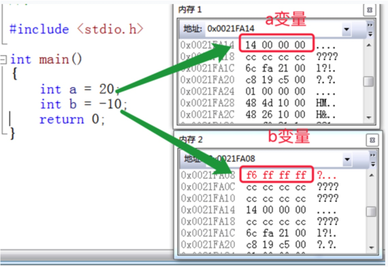
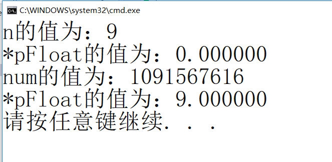
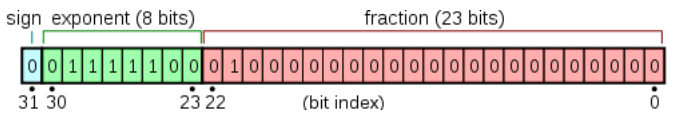
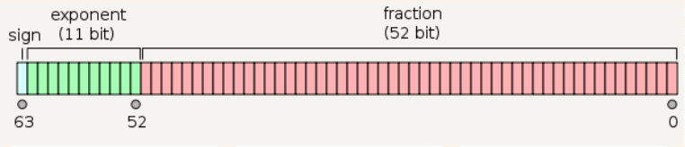

> **🍕博客主页：️[自信不孤单](https://blog.csdn.net/czh1592272237)**
>
> **🍬文章专栏：[C语言](https://blog.csdn.net/czh1592272237/category_12209876.html)**
>
> **🍚代码仓库：[破浪晓梦](https://gitee.com/polang-xiaomeng/study_c)**
>
> **🍭欢迎关注：欢迎大家点赞收藏+关注**

# 深度剖析数据在内存中的存储

[toc]

---

# 前言

==重点分析==

> 1. 数据类型详细介绍
> 2. 整形在内存中的存储：原码、反码、补码
> 3. 大小端字节序介绍及判断
> 4. 浮点型在内存中的存储解析
>

# 1、数据类型介绍

==基本的内置类型：==

```c
char //字符数据类型
short //短整型
int //整形
long //长整型
long long //更长的整形
float //单精度浮点数
double //双精度浮点数
//C语言没有字符串类型
```

==类型的意义：==

> 1. 使用这个类型开辟内存空间的大小（大小决定了使用范围）。
> 2. 如何看待内存空间的视角。

## 1.1 类型的基本归类：

==整形家族：==

```c
char
    unsigned char
    signed char
short
    unsigned short [int]
    signed short [int]
int
    unsigned int
    signed int
long
    unsigned long [int]
    signed long [int]
```

==浮点数家族：==

```c
float
double
```

==构造类型：==

```c
> 数组类型
> 结构体类型 struct
> 枚举类型 enum
> 联合类型 union
```

==指针类型：==

```c
int *pi;
char *pc;
float* pf;
void* pv;
```

==空类型：==

> void 表示空类型（无类型）
> 通常应用于函数的返回类型、函数的参数、指针类型。

# 2、整形在内存中的存储

> 一个变量的创建是要在内存中开辟空间的。空间的大小是根据不同的类型而决定的。

==那接下来我们谈谈数据在所开辟内存中到底是如何存储的？==

> 比如：

```c
int a = 20;
int b = -10;
```

> 我们知道为 a 分配四个字节的空间。
> 那如何存储？

==下来了解下面的概念：==

## 2.1 原码、反码、补码

> 计算机中的整数有三种2进制表示方法，即原码、反码和补码。
> 三种表示方法均有符号位和数值位两部分，符号位都是用0表示“正”，用1表示“负”，而数值位：
> 正数的原、反、补码都相同。
> 负整数的三种表示方法各不相同。

> 原码
> 直接将数值按照正负数的形式翻译成二进制就可以得到原码。

>反码
>将原码的符号位不变，其他位依次按位取反就可以得到反码。

> 补码
> 反码+1就得到补码。

==对于整形来说：数据存放内存中其实存放的是补码。==

> 为什么呢？
> 在计算机系统中，数值一律用补码来表示和存储。原因在于，使用补码，可以将符号位和数值域统一处理；
> 同时，加法和减法也可以统一处理（CPU只有加法器）此外，补码与原码相互转换，其运算过程是相同的，不需要额外的硬件电路。



> 我们看看在内存中的存储：
> 我们可以看到对于a和b分别存储的是补码。但是我们发现顺序有点不对劲。
> 这是又为什么？

## 2.2 大小端介绍

> 什么大端小端：
> 大端（存储）模式，是指数据的低位保存在内存的高地址中，而数据的高位，保存在内存的低地址中；
> 小端（存储）模式，是指数据的低位保存在内存的低地址中，而数据的高位,，保存在内存的高地址中。

==为什么会有大小端模式之分呢？==

> 这是因为在计算机系统中，我们是以字节为单位的，每个地址单元都对应着一个字节，一个字节为`8bit`。但是在C语言中除了`8bit`的`char`之外，还有`16bit`的`short`型，`32bit`的`long`型（要看具体的编译器），另外，对于位数大于8位的处理器，例如16位或者32位的处理器，由于寄存器宽度大于一个字节，那么必然存在着一个如何将多个字节安排的问题。因此就导致了大端存储模式和小端存储模式。
> 例如：一个`16bit`的`short`型`x`，在内存中的地址为`0x0010`，`x`的值为`0x1122`，那么`0x11`为高字节，`0x22`为低字节。对于大端模式，就将`0x11`放在低地址中，即`0x0010`中，`0x22`放在高地址中，即`0x0011`中。小端模式，刚好相反。我们常用的`X86`结构是小端模式，而`KEIL C51`则为大端模式。很多的`ARM，DSP`都为小端模式。有些`ARM`处理器还可以由硬件来选择是大端模式还是小端模式。

==接下来我们进行一个练习==

> 设计一个小程序来判断当前机器的字节序。

```c
#include <stdio.h>
int check_sys()
{
	int i = 1;
	return (*(char*)&i);
}
int main()
{
	int ret = check_sys();
	if (ret == 1)
	{
		printf("小端\n");
	}
	else
	{
		printf("大端\n");
	}
	return 0;
}
```

# 3、浮点型在内存中的存储

> 常见的浮点数：
> `3.14159`
> `1E10`
>
> 浮点数家族包括：`float`、`double`、`long double`类型。
> 浮点数表示的范围：`float.h`中定义

## 3.1 一个例子

==浮点数存储的例子：==

```c
int main()
{
	int n = 9;
	float* pFloat = (float*)&n;
	printf("n的值为：%d\n", n);
	printf("*pFloat的值为：%f\n", *pFloat);
	*pFloat = 9.0;
	printf("num的值为：%d\n", n);
	printf("*pFloat的值为：%f\n", *pFloat);
	return 0;
}
```

==输出的结果是什么呢？==



##   3.2 浮点数存储规则

> `num`和`*pFloat`在内存中明明是同一个数，为什么浮点数和整数的解读结果会差别这么大？
> 要理解这个结果，一定要搞懂浮点数在计算机内部的表示方法。
>
> 详细解读：
> 根据国际标准IEEE（电气和电子工程协会） 754，任意一个二进制浮点数`V`可以表示成下面的形式：
>
> - `(-1)^S * M * 2^E`
> - `(-1)^S`表示符号位，当`S=0`，`V`为正数；当`S=1`，`V`为负数。
> - `M`表示有效数字，大于等于`1`，小于`2`。
> - `2^E`表示指数位。

> 举例来说：
> 十进制的`5.0`，写成二进制是`101.0`，相当于`1.01×2^2`。
> 那么，按照上面V的格式，可以得出`S=0，M=1.01，E=2`。
> 十进制的`-5.0`，写成二进制是 `-101.0` ，相当于`-1.01×2^2`。那么`S=1，M=1.01，E=2`。

> IEEE 754规定：
> 对于32位的浮点数，最高的1位是符号位`s`，接着的8位是指数`E`，剩下的23位为有效数字`M`。

==单精度浮点数存储模式==  



> 对于`64`位的浮点数，最高的`1`位是符号位`S`，接着的`11`位是指数`E`，剩下的`52`位为有效数字`M`。

==双精度浮点数存储模式==



> IEEE 754对有效数字`M`和指数`E`，还有一些特别规定。
> 前面说过，`1≤M<2`，也就是说，`M`可以写成`1.xxxxxx`的形式，其中`xxxxxx`表示小数部分。
> IEEE 754规定，在计算机内部保存M时，默认这个数的第一位总是`1`，因此可以被舍去，只保存后面的`xxxxxx`部分。比如保存`1.01`的时候，只保存`01`，等到读取的时候，再把第一位的`1`加上去。这样做的目的，是节省1位有效数字。以32位浮点数为例，留给`M`只有23位，将第一位的`1`舍去以后，等于可以保存24位有效数字。

> 至于指数`E`，情况就比较复杂。
> 首先，`E`为一个无符号整数（unsigned int）这意味着，如果`E`为8位，它的取值范围为`0~255`；如果`E`为11位，它的取值范围为`0~2047`。但是，我们知道，科学计数法中的`E`是可以出现负数的，所以IEEE 754规定，存入内存时`E`的真实值必须再加上一个中间数，对于8位的`E`，这个中间数是`127`；对于11位的`E`，这个中间数是`1023`。比如，`2^10`的`E`是`10`，所以保存成32位浮点数时，必须保存成`10+127=137`，即`10001001`。
> 然后，指数`E`从内存中取出还可以再分成三种情况：

==E不全为0或不全为1==

> 这时，浮点数就采用下面的规则表示，即指数E的计算值减去`127`（或`1023`），得到真实值，再将有效数字`M`前加上第一位的`1`。
> 比如：
> `0.5（1/2）`的二进制形式为`0.1`，由于规定正数部分必须为`1`，即将小数点右移1位，则为`1.0*2^(-1)`，其阶码为`-1+127=126`，表示为`01111110`，而尾数`1.0`去掉整数部分为`0`，补齐`0`到23位`00000000000000000000000`，则其二进制表示形式为

```c
0 01111110 00000000000000000000000
```

==E全为0==

> 这时，浮点数的指数`E`等于`1-127`（或者`1-1023`）即为真实值，有效数字`M`不再加上第一位的`1`，而是还原为`0.xxxxxx`的小数。这样做是为了表示`±0`，以及接近于`0`的很小的数字。

==E全为1==

> 这时，如果有效数字`M`全为`0`，表示`±`无穷大（正负取决于符号位`s`）；

## 3.3 例子解释

==了解完这些，现在我们就可以解释上面的例子了==

> 让我们回到一开始的问题：为什么`0x00000009`还原成浮点数，就成了`0.000000`？
>
> 首先，将`0x00000009`拆分，得到第一位符号位`s=0`，后面8位的指数`E=00000000`， 最后23位的有效数字`M=000 0000 0000 0000 0000 1001`。
>
> 由于指数`E`全为`0`，所以符合上面讲的第二种情况。因此，浮点数V就写成：`V=(-1)^0 × 0.00000000000000000001001×2^(-126)=1.001×2^(-146)`。显然，`V`是一个很小的接近于`0`的正数，所以用十进制小数表示就是`0.000000`。

==再看例子的第二部分==

> 请问浮点数`9.0`，如何用二进制表示？还原成十进制又是多少？
> 首先，浮点数`9.0`等于二进制的`1001.0`，即`1.001×2^3`。

```c
9.0 -> 1001.0 ->(-1)^01.0012^3 -> s=0，M=1.001，E=3+127=130  
```

> 那么，第一位的符号位`s=0`，有效数字`M`等于`001`后面再加20个`0`，凑满23位，指数E等于`3+127=130`，即`10000010`。
> 所以，写成二进制形式，应该是`s+E+M`，即这个32位的二进制数，还原成十进制，正是`1091567616`。

==到此，关于《深度剖析数据在内存中的存储》的内容就结束了
感谢大家的观看
如果对您有帮助，请一键三连
您的支持就是对我创作最大的激励！！！==
