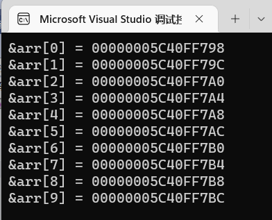
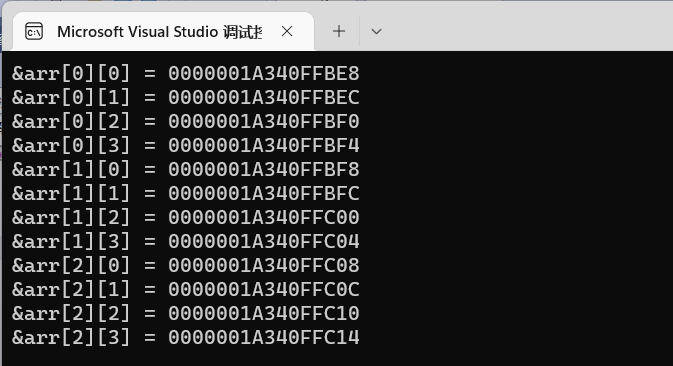

> **🍕博客主页：️[自信不孤单](https://blog.csdn.net/czh1592272237)**
>
> **🍬文章专栏：[C语言](https://blog.csdn.net/czh1592272237/category_12209876.html)**
>
> **🍚代码仓库：[破浪晓梦](https://gitee.com/polang-xiaomeng/study_c)**
>
> **🍭欢迎关注：欢迎大家点赞收藏+关注**

# 数组

[TOC]

---

# 1. 一维数组的创建和初始化。

## 1.1 数组的创建

数组是一组相同类型元素的集合。
数组的创建方式：

```c
type_t arr_name [const_n];

//type_t 是指数组的元素类型

//const_n 是一个常量表达式，用来指定数组的大小

```

数组创建的实例：

```c
//代码1
int arr1[10];

//代码2
int count = 10;
int arr2[count];//数组时候可以正常创建？

//代码3
char arr3[10];
float arr4[1];
double arr5[20]; 

```

注：数组创建，在C99标准之前， [] 中要给一个常量才可以，不能使用变量。在C99标准支持了变长数组的概念，数组的大小可以使用变量指定，但是数组不能初始化。

## 1.2 数组的初始化

数组的初始化是指，在创建数组的同时给数组的内容一些合理初始值（初始化）。
看代码：

```c
int arr1[10] = {1,2,3};
int arr2[] = {1,2,3,4};
int arr3[5] = {1, 2, 3, 4, 5};
char arr4[3] = {'a',98, 'c'};
char arr5[] = {'a','b','c'};
char arr6[] = "abcdef";
char arr1[] = "abc";
char arr2[3] = {'a','b','c'}; 
```

数组在创建的时候如果想不指定数组的确定的大小就得初始化。数组的元素个数根据初始化的内容来确定。
但是对于下面的代码要区分，内存中如何分配。

```
char arr1[] = "abc";
char arr2[3] = {'a','b','c'};
```

## 1.3 一维数组的使用

对于数组的使用我们之前介绍了一个操作符： [] ，下标引用操作符。它其实就数组访问的操作符。我们来看代码：

```c
#include <stdio.h>
int main()
{
	int arr[10] = { 0 };//数组的不完全初始化
	//计算数组的元素个数
	int sz = sizeof(arr) / sizeof(arr[0]);
	//对数组内容赋值,数组是使用下标来访问的，下标从0开始。所以：
	int i = 0;//做下标
	for (i = 0; i < 10; i++)//这里写10，好不好？
	{
		arr[i] = i;
	}
	//输出数组的内容
	for (i = 0; i < 10; ++i)
	{
		printf("%d ", arr[i]);
	}
	return 0;
}
```

**总结:**

1. 数组是使用下标来访问的，下标是从0开始。
2. 数组的大小可以通过计算得到。

```c
int arr[10];
int sz = sizeof(arr)/sizeof(arr[0]);
```

## 1.4 一维数组在内存中的存储

接下来我们探讨数组在内存中的存储。
看代码：

```c
#include <stdio.h>
int main()
{
	int arr[10] = { 0 };
	int i = 0;
	int sz = sizeof(arr) / sizeof(arr[0]);
	for (i = 0; i < sz; ++i)
	{
		printf("&arr[%d] = %p\n", i, &arr[i]);
	}
	return 0;
}
```

输出的结果如下：



仔细观察输出的结果，我们知道，随着数组下标的增长，元素的地址，也在有规律的递增。
由此可以得出结论：数组在内存中是连续存放的。 

# 2. 二维数组的创建和初始化

## 2.1 二维数组的创建 

```c
//数组创建
int arr[3][4];
char arr[3][5];
double arr[2][4];
```

## 2.2 二维数组的初始化

```c
//数组初始化
int arr[3][4] = {1,2,3,4};
int arr[3][4] = {{1,2},{4,5}};
int arr[][4] = {{2,3},{4,5}};//二维数组如果有初始化，行可以省略，列不能省略
```

## 2.3 二维数组的使用 

二维数组的使用也是通过下标的方式。 

看代码： 

```c
#include <stdio.h>
int main()
{
	int arr[3][4] = { 0 };
	int i = 0;
	for (i = 0; i < 3; i++)
	{
		int j = 0;
		for (j = 0; j < 4; j++)
		{
			arr[i][j] = i * 4 + j;
		}
	}
	for (i = 0; i < 3; i++)
	{
		int j = 0;
		for (j = 0; j < 4; j++)
		{
			printf("%d ", arr[i][j]);
		}
	}
	return 0;
}
```

## 2.4 二维数组在内存中的存储  

像一维数组一样，这里我们尝试打印二维数组的每个元素。 

```c
#include <stdio.h>
int main()
{
	int arr[3][4];
	int i = 0;
	for (i = 0; i < 3; i++)
	{
		int j = 0;
		for (j = 0; j < 4; j++)
		{
			printf("&arr[%d][%d] = %p\n", i, j, &arr[i][j]);
		}
	}
	return 0;
}
```



通过结果我们可以分析到，其实二维数组在内存中也是连续存储的。 

# 3. 数组越界

数组的下标是有范围限制的。
数组的下规定是从0开始的，如果数组有n个元素，最后一个元素的下标就是n-1。
所以数组的下标如果小于0，或者大于n-1，就是数组越界访问了，超出了数组合法空间的访问。
C语言本身是不做数组下标的越界检查，编译器也不一定报错，但是编译器不报错，并不意味着程就是正确的，所以程序员写代码时，最好自己做越界的检查 。

```
#include <stdio.h>
int main()
{
	int arr[10] = { 1,2,3,4,5,6,7,8,9,10 };
	int i = 0;
	for (i = 0; i <= 10; i++)
	{
		printf("%d\n", arr[i]);//当i等于10的时候，越界访问了
	}
	return 0;
}
```

二维数组的行和列也可能存在越界。 

# 4. 数组作为函数参数

往往我们在写代码的时候，会将数组作为参数传个函数，比如：我要实现一个冒泡排序（这里要讲算法思想）函数将一个整型数组排序。 

那我们将会这样使用该函数：

## 4.1 冒泡排序函数的错误设计 

```
//方法1：
#include <stdio.h>
void bubble_sort(int arr[])
{
	int sz = sizeof(arr) / sizeof(arr[0]);//这样对吗？
	int i = 0;
	for (i = 0; i < sz - 1; i++)
	{
		int j = 0;
		for (j = 0; j < sz - i - 1; j++)
		{
			if (arr[j] > arr[j + 1])
			{
				int tmp = arr[j];
				arr[j] = arr[j + 1];
				arr[j + 1] = tmp;
			}
		}
	}
}
int main()
{
	int arr[] = { 3,1,7,5,8,9,0,2,4,6 };
	bubble_sort(arr);//是否可以正常排序？
	for (int i = 0; i < sizeof(arr) / sizeof(arr[0]); i++)
	{
		printf("%d ", arr[i]);
	}
	return 0;
}
```

方法1，那我们找一下问题，调试之后可以看到 bubble_sort 函数内部的 sz ，是1。
难道数组作为函数参数的时候，不是把整个数组的传递过去？ 

## 4.2 数组名是什么？

```c
#include <stdio.h>
int main()
{
	int arr[10] = { 1, 2, 3, 4, 5 };
	printf("%p\n", arr);
	printf("%p\n", &arr[0]);
	printf("%d\n", *arr);
	//输出结果
	return 0;
}
```

结论： 

> 数组名是数组首元素的地址。（有两个例外）

如果数组名是首元素地址，那么： 

```c
int arr[10] = {0};
printf("%d\n", sizeof(arr));
```

为什么输出的结果是：40？ 

补充： 

> 1. sizeof(数组名)，计算整个数组的大小，sizeof内部单独放一个数组名，数组名表示整个数组。
> 2. &数组名，取出的是数组的地址。&数组名，数组名表示整个数组。

除此1,2两种情况之外，所有的数组名都表示数组首元素的地址。 

## 4.3 冒泡排序函数的正确设计

当数组传参的时候，实际上只是把数组的首元素的地址传递过去了。
所以即使在函数参数部分写成数组的形式： int arr[] 表示的依然是一个指针： int *arr 。那么，函数内部的 sizeof(arr) 结果是4。
如果方法1错了，该怎么设计？ 

```c
//方法2
void bubble_sort(int arr[], int sz)//参数接收数组元素个数
{
	//代码同上面函数
}
int main()
{
	int arr[] = { 3,1,7,5,8,9,0,2,4,6 };
	int sz = sizeof(arr) / sizeof(arr[0]);
	bubble_sort(arr, sz);//是否可以正常排序？
	for (int i = 0; i < sz; i++)
	{
		printf("%d ", arr[i]);
	}
	return 0;
}
```

==到此，关于《数组》的内容就结束了
感谢大家的观看
如果对您有帮助，请一键三连
您的支持就是我创作最大的动力！！！==