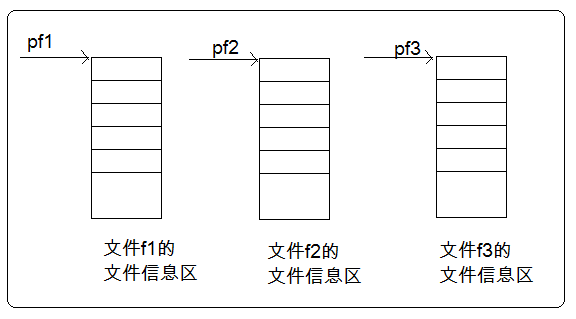
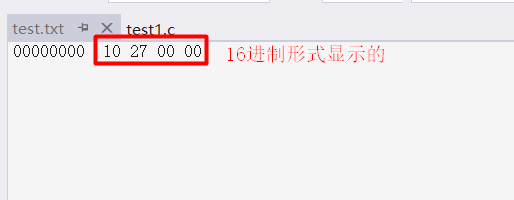
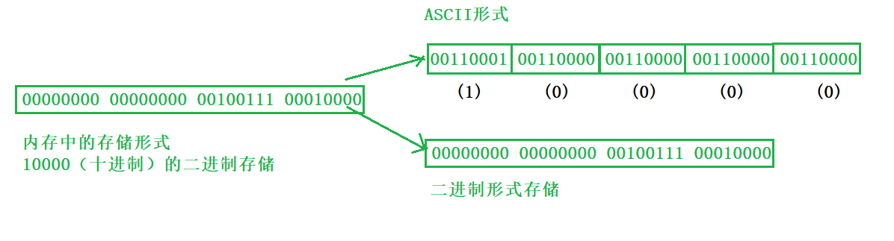
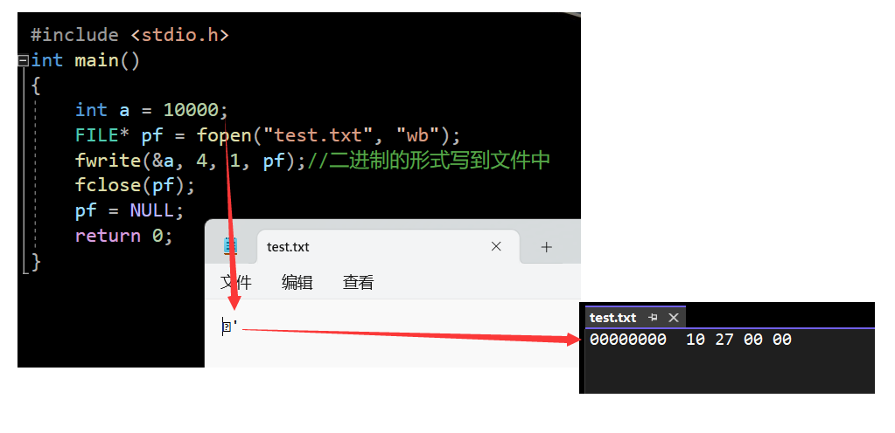
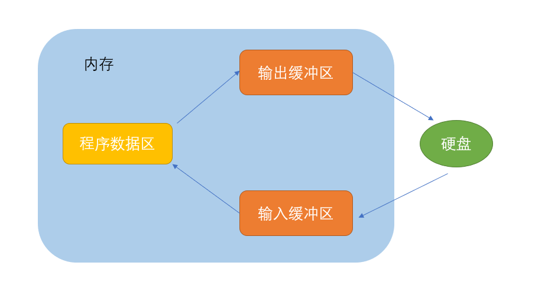

> **🍕博客主页：️[自信不孤单](https://blog.csdn.net/czh1592272237)**
>
> **🍬文章专栏：[C语言](https://blog.csdn.net/czh1592272237/category_12209876.html)**
>
> **🍚代码仓库：[破浪晓梦](https://gitee.com/polang-xiaomeng/study_c)**
>
> **🍭欢迎关注：欢迎大家点赞收藏+关注**

# 文件操作

[toc]

---

# 前言

> 本文主要介绍C语言中文件操作的相关内容（例:文件读、写等相关函数）。

# 1. 什么是文件

>  文件是以计算机硬盘为载体存储在计算机上的信息集合。是数据源的一种，最主要的作用是保存数据。
>
>将数据放入文件中，相比代码程序中堆栈上的数据，其优点在于可以随时做到需要时添加、舍弃时删除，数据可以持久化。

在程序设计中，我们一般谈的文件有两种：**程序文件**和**数据文件**（从文件功能的角度来分类的）。

## 1.1 程序文件

> 包括源程序文件（后缀为.c）,目标文件（windows环境后缀为.obj）,可执行程序（windows环境后缀为.exe）等。

## 1.2 数据文件

> 文件的内容不一定是程序，而是程序运行时读写的数据，比如程序运行需要从中读取数据的文件，或者输出内容的文件。

## 1.3 文件名

> 文件名是文件存在的标识，操作系统根据文件名来对其进行控制和管理。每个文件都被设定一个指定的名称，由文件主名和扩展名组成。

> 一个文件要有一个唯一的文件标识，以便用户识别和引用。
>
> 文件名包含3部分：**文件路径+文件名主干+文件后缀**。
> 例如： c:\code\test.txt

# 2. 文件的打开和关闭  

## 2.1 文件指针

> 缓冲文件系统中，关键的概念是“文件类型指针”，简称”文件指针“。
> 每个被使用的文件都在内存中开辟了一个相应的文件信息区，用来存放文件的相关信息（如文件的名字，文件状态及文件当前的位置等）。这些信息是保存在一个结构体变量中的。该结构体类型是由系统声明的，取名 FILE。

> 例如，VS编译环境提供的 stdio.h 头文件中有以下的文件类型申明：  

```c
struct _iobuf {
	char* _ptr;
	int _cnt;
	char* _base;
	int _flag;
	int _file;
	int _charbuf;
	int _bufsiz;
	char* _tmpfname;
};
```

> 不同的C编译器的 FILE 类型包含的内容不完全相同，但是大同小异。
>
> 每当打开一个文件的时候，系统会根据文件的情况自动创建一个 FILE 结构的变量，并填充其中的信息，使用者不必关心细节。
> 一般都是通过一个 FILE 的指针来维护这个 FILE 结构的变量，这样使用起来更加方便。
>
> 下面我们可以创建一个 FILE* 的指针变量:  

```c
FILE* pf;//文件指针变量
```

> 定义 pf 是一个指向 FILE 类型数据的指针变量。可以使 pf 指向某个文件的文件信息区（是一个结构体变量）。通过该文件信息区中的信息就能够访问该文件。也就是说，通过文件指针变量能够找到与它关联的文件。

==比如：==



## 2.2 文件的打开和关闭

> 文件在读写之前应该先打开文件，在使用结束之后应该关闭文件。
>
> 在编写程序的时候，在打开文件的同时，都会返回一个 FILE* 的指针变量指向该文件，也相当于建立了指针和文件的关系。
>
> ANSIC 规定使用 fopen 函数来打开文件，fclose 来关闭文件。

```c
//打开文件
FILE* fopen(const char* filename, const char* mode);
//关闭文件
int fclose(FILE* stream);
```

**==打开方式如下：==**

| 文件使用方式  | 含义                                     | 如果指定文件不存在 |
| ------------- | ---------------------------------------- | ------------------ |
| “r”（只读）   | 为了输入数据，打开一个已经存在的文本文件 | 出错               |
| “w”（只写）   | 为了输出数据，打开一个文本文件           | 建立一个新的文件   |
| “a”（追加）   | 向文本文件尾添加数据                     | 建立一个新的文件   |
| “rb”（只读）  | 为了输入数据，打开一个二进制文件         | 出错               |
| “wb”（只写）  | 为了输出数据，打开一个二进制文件         | 建立一个新的文件   |
| “ab”（追加）  | 向一个二进制文件尾添加数据               | 出错               |
| “r+”（读写）  | 为了读和写，打开一个文本文件             | 出错               |
| “w+”（读写）  | 为了读和写，建议一个新的文件             | 建立一个新的文件   |
| “a+”（读写）  | 打开一个文件，在文件尾进行读写           | 建立一个新的文件   |
| “rb+”（读写） | 为了读和写打开一个二进制文件             | 出错               |
| “wb+”（读写） | 为了读和写，新建一个新的二进制文件       | 建立一个新的文件   |
| “ab+”（读写） | 打开一个二进制文件，在文件尾进行读和写   | 建立一个新的文件   |

==实例代码：==

```c
/* fopen fclose example */
#include <stdio.h>
int main()
{
	FILE* pFile;
	//打开文件
	pFile = fopen("myfile.txt", "w");
	//文件操作
	if (pFile != NULL)
	{
		fputs("fopen example", pFile);
		//关闭文件
		fclose(pFile);
	}
	return 0;
}
```

# 3. 文件的顺序读写

| 功能           | 函数名  | 适用于     |
| -------------- | ------- | ---------- |
| 字符输入函数   | fgetc   | 所有输入流 |
| 字符输出函数   | fputc   | 所有输出流 |
| 文本行输入函数 | fgets   | 所有输入流 |
| 文本行输出函数 | fputs   | 所有输出流 |
| 格式化输入函数 | fscanf  | 所有输入流 |
| 格式化输出函数 | fprintf | 所有输出流 |
| 二进制输入     | fread   | 文件       |
| 二进制输出     | fwrite  | 文件       |

## 3.1 fputc

```c
int fputc(int char, FILE *stream)
```

==说明==

> 把参数 **char** 指定的字符（一个无符号字符）写入到指定的流 stream 中，并把位置标识符往前移动。

==参数==

> - **char** -- 这是要被写入的字符。该字符以其对应的 int 值进行传递。
> - **stream** -- 这是指向 FILE 对象的指针，该 FILE 对象标识了要被写入字符的流。

==返回值==

> 如果没有发生错误，则返回被写入的字符。如果发生错误，则返回 EOF，并设置错误标识符。

```c
//pf指向文件
fputc('a', pf);
```

## 3.2 fgetc

```c
int fgetc(FILE *stream)
```

==说明==

> 从指定的流 stream 获取下一个字符（一个无符号字符），并把位置标识符往前移动。

==参数==

> - **stream** -- 这是指向 FILE 对象的指针，该 FILE 对象标识了要在上面执行操作的流。

==返回值==

> 该函数以无符号 char 强制转换为 int 的形式返回读取的字符，如果到达文件末尾或发生读错误，则返回 EOF。


```c
//pf指向的文件中有abcdefg
int ch = fgetc(pf);
printf("%c\n", ch);    //a
ch = fgetc(pf);
printf("%c\n", ch);    //b
ch = fgetc(pf);
printf("%c\n", ch);    //c
ch = fgetc(pf);
printf("%c\n", ch);    //d
```

## 3.3 fputs

```c
int fputs(const char *str, FILE *stream)
```

==说明==

>  把字符串写入到指定的流 stream 中，但不包括空字符。

==参数==

> - **str** -- 这是一个数组，包含了要写入的以空字符终止的字符序列。
> - **stream** -- 这是指向 FILE 对象的指针，该 FILE 对象标识了要被写入字符串的流。

==返回值==

> 该函数返回一个非负值，如果发生错误则返回 EOF。

```c
//pf指向文件
fputs("hello world", pf);
```

==注意：这里如果是以”w”形式打开的文件，则使用fputs函数会覆盖掉原始数据。==

## 3.4 fgets

```c
char *fgets(char *str, int n, FILE *stream)
```

==说明==

> 从指定的流 stream 读取一行，并把它存储在 str 所指向的字符串内。当读取了 (n-1) 个字符时，或者读取到换行符时，或者到达文件末尾时，它会停止。

==参数==

> - **str** -- 这是指向一个字符数组的指针，该数组存储了要读取的字符串。
> - **n** -- 这是要读取的最大字符数（包括最后的空字符）。通常是使用以 str 传递的数组长度。
> - **stream** -- 这是指向 FILE 对象的指针，该 FILE 对象标识了要从中读取字符的流。

==返回值==

> 如果成功，该函数返回相同的 str 参数。如果到达文件末尾或者没有读取到任何字符，str 的内容保持不变，并返回一个空指针。
>
> 如果发生错误，返回一个空指针。

```c
//pf指向的文件中有hello world
//定义一个数组
char arr[10] = { 0 };
fgets(arr, 5, pf);    //将所读取的数据放入arr中
printf("%s\n", arr);	//输出hell
```

## 3.5 fprintf

```c
int fprintf(FILE *stream, const char *format, ...)
```

==说明==

> 发送格式化输出到流 stream 中。

==参数==

> - **stream** -- 这是指向 FILE 对象的指针，该 FILE 对象标识了流。
> - **format** -- 这是 C 字符串，包含了要被写入到流 stream 中的文本。
> - **附加参数** -- 根据不同的 format 字符串，函数可能需要一系列的附加参数，每个参数包含了一个要被插入的值，替换了 format 参数中指定的每个 % 标签。参数的个数应与 % 标签的个数相同。

==返回值==

> 如果成功，则返回写入的字符总数，否则返回一个负数。

```c
#include<stdio.h>

typedef struct S
{
	char name[10];
	int age;

}Peo;

int main()
{
    //打开文件
	FILE* pf = fopen("test.txt", "w");
	if (pf != NULL)
	{
        //写入文件
		Peo p = { "zhangsan", 18 };
		fprintf(pf, "%s %d\n", p.name, p.age);
        //关闭文件
		fclose(pf);
		pf = NULL;
	}
	return 0;
}
```

## 3.6 fscanf

```c
int fscanf(FILE *stream, const char *format, ...)
```

==说明==

> 从流 stream 读取格式化输入。

==参数==

> - **stream** -- 这是指向 FILE 对象的指针，该 FILE 对象标识了流。
> - **format** -- 这是 C 字符串，包含了以下各项中的一个或多个：*空格字符、非空格字符* 和 *format 说明符*。
> - **附加参数** -- 根据不同的 format 字符串，函数可能需要一系列的附加参数，每个参数包含了一个要被插入的值，替换了 format 参数中指定的每个 % 标签。参数的个数应与 % 标签的个数相同。

==返回值==

> 如果成功，该函数返回成功匹配和赋值的个数。如果到达文件末尾或发生读错误，则返回 EOF。

```c
#include<stdio.h>

typedef struct S
{
	char name[10];
	int age;

}Peo;

int main()
{
	//打开文件
	FILE* pf = fopen("test.txt", "r");
	if (pf != NULL)
	{
		//读取文件
		Peo p = { 0 };
		fscanf(pf, "%s %d", p.name, &p.age);
		printf("%s %d", p.name, p.age);
		//关闭文件
		fclose(pf);
		pf = NULL;
	}
	return 0;
}
```

## 3.7 fwrite


```c
size_t fwrite(const void *ptr, size_t size, size_t nmemb, FILE *stream)
```

==说明==

>  把 **ptr** 所指向的数组中的数据写入到给定流 **stream** 中。

==参数==

> - **ptr** -- 这是指向要被写入的元素数组的指针。
> - **size** -- 这是要被写入的每个元素的大小，以字节为单位。
> - **nmemb** -- 这是元素的个数，每个元素的大小为 size 字节。
> - **stream** -- 这是指向 FILE 对象的指针，该 FILE 对象指定了一个输出流。

==返回值==

> 如果成功，该函数返回一个 size_t 对象，表示元素的总数，该对象是一个整型数据类型。如果该数字与 nmemb 参数不同，则会显示一个错误。

```c
#include<stdio.h>

typedef struct S
{
	char name[10];
	int age;

}Peo;

int main()
{
	//打开文件
	FILE* pf = fopen("test.txt", "wb+");
	if (pf != NULL)
	{
		//写入文件
		Peo p = { "lisi", 19 };
		fwrite(&p, sizeof(Peo), 1, pf);
		//关闭文件
		fclose(pf);
		pf = NULL;
	}
	return 0;
}
```

## 3.8 fread


```c
size_t fread(void *ptr, size_t size, size_t nmemb, FILE *stream)
```

==说明==

> 从给定流 **stream** 读取数据到 **ptr** 所指向的数组中。

==参数==

> - **ptr** -- 这是指向带有最小尺寸 *size\*nmemb* 字节的内存块的指针。
> - **size** -- 这是要读取的每个元素的大小，以字节为单位。
> - **nmemb** -- 这是元素的个数，每个元素的大小为 size 字节。
> - **stream** -- 这是指向 FILE 对象的指针，该 FILE 对象指定了一个输入流。

==返回值==

> 成功读取的元素总数会以 size_t 对象返回，size_t 对象是一个整型数据类型。如果总数与 nmemb 参数不同，则可能发生了一个错误或者到达了文件末尾。

```c
#include<stdio.h>

typedef struct S
{
	char name[10];
	int age;

}Peo;

int main()
{
	//打开文件
	FILE* pf = fopen("test.txt", "rb+");
	if (pf != NULL)
	{
		//读取文件
		Peo p = { 0 };
		fread(&p, sizeof(Peo), 1, pf);
		printf("%s %d\n", p.name, p.age);
		//关闭文件
		fclose(pf);
		pf = NULL;
	}
	return 0;
}
```

## 3.9 sscanf、sprintf 函数

- ==**sscanf 函数**==

```c
int sscanf(const char *str, const char *format, ...)
```

==说明==

> 从字符串读取格式化输入。

==参数==

> - **str** -- 这是 C 字符串，是函数检索数据的源。
> - **format** -- 这是 C 字符串，包含了以下各项中的一个或多个：*空格字符、非空格字符* 和 *format 说明符*。
> - **附加参数** -- 这个函数接受一系列的指针作为附加参数，每一个指针都指向一个对象，对象类型由 format 字符串中相应的 % 标签指定，参数与 % 标签的顺序相同。

==返回值==

> 如果成功，该函数返回成功匹配和赋值的个数。如果到达文件末尾或发生读错误，则返回 EOF。

```c
#include<stdio.h>

typedef struct S
{
	char name[10];
	int age;

}Peo;

int main()
{
	//定义一个字符串
	char buffer[] = { "zhansan 19" };
	//定义一个结构但不赋值
	Peo p = { 0 };
	sscanf(buffer, "%s %d", p.name, &p.age);
	printf("%s %d", p.name, p.age);    //zhangsan 19
	return 0;
}
```

- ==**sprintf 函数**==

```c
int sprintf(char *str, const char *format, ...)
```

==说明==

> 发送格式化输出到 **str** 所指向的字符串。

==参数==

> - **str** -- 这是指向一个字符数组的指针，该数组存储了 C 字符串。
> - **format** -- 这是字符串，包含了要被写入到字符串 str 的文本。它可以包含嵌入的 format 标签，format 标签可被随后的附加参数中指定的值替换，并按需求进行格式化。
> - **附加参数** -- 根据不同的 format 字符串，函数可能需要一系列的附加参数，每个参数包含了一个要被插入的值，替换了 format 参数中指定的每个 % 标签。参数的个数应与 % 标签的个数相同。

==返回值==

> 如果成功，则返回写入的字符总数，不包括字符串追加在字符串末尾的空字符。如果失败，则返回一个负数。

```c
#include<stdio.h>

typedef struct S
{
	char name[10];
	int age;

}Peo;

int main()
{
	//定义一个结构
	Peo p = { "zhangsan",19 };
	//定义一个字符串
	char buffer[50] = { 0 };
	sprintf(buffer, "%s %d\n", p.name, p.age);
	printf("%s", buffer);    //zangsan 19
	return 0;
}
```

## 3.10 对比一组函数

> scanf/fscanf/sscanf
> printf/fprintf/sprintf

==这些函数有什么不同之处？==

> - scanf 针对标准输入流（stdin）的格式化的输入函数
> - printf 针对标准输出流（stdout）的格式化的输出函数
>
> 
>
> - fscanf 针对所有输入流（文件流/stdin）的格式化输入函数
> - fprintf 针对所有输出流（文件流/stdout）的格式化输出函数
>
> 
>
> - sscanf 把字符串转换成格式化的数据
> - sprintf 把格式化的数据转换成字符串

# 4. 文件的随机读写

## 4.1 fseek

```c
int fseek(FILE *stream, long int offset, int whence)
```

==说明==

> 设置流 **stream** 的文件位置为给定的偏移 **offset**，参数 offset 意味着从给定的 **whence** 位置查找的字节数。

==参数==

> - **stream** -- 这是指向 FILE 对象的指针，该 FILE 对象标识了流。
> - **offset** -- 这是相对 whence 的偏移量，以字节为单位。
> - **whence** -- 这是表示开始添加偏移 offset 的位置。它一般指定为下列常量之一：

| 常量     | 描述               |
| :------- | :----------------- |
| SEEK_SET | 文件的开头         |
| SEEK_CUR | 文件指针的当前位置 |
| SEEK_END | 文件的末尾         |

==返回值==

> 如果成功，则该函数返回零，否则返回非零值。

```c
/* fseek example */
#include <stdio.h>
int main()
{
	FILE* pFile;
	pFile = fopen("example.txt", "wb");
	fputs("This is an apple.", pFile);
	fseek(pFile, 9, SEEK_SET);
	fputs(" sam", pFile);    //文件内容被改为This is a sample.
	fclose(pFile);
	return 0;
}
```

## 4.2 ftell

```c
long int ftell(FILE *stream)
```

==说明==

> 返回给定流 stream 相对于起始位置的偏移量  

==参数==

> - **stream** -- 这是指向 FILE 对象的指针，该 FILE 对象标识了流。

==返回值==

> 该函数返回位置标识符的当前值。如果发生错误，则返回 -1L，全局变量 errno 被设置为一个正值。

```c
/* ftell example : getting size of a file */
#include <stdio.h>
int main()
{
	FILE* pFile;
	long size;
	pFile = fopen("myfile.txt", "rb");
	if (pFile == NULL) perror("Error opening file");
	else
	{
		fseek(pFile, 0, SEEK_END); // non-portable
		size = ftell(pFile);
		fclose(pFile);
		printf("Size of myfile.txt: %ld bytes.\n", size);
	}
	return 0;
}
```

## 4.3 rewind

```c
void rewind(FILE *stream)
```

==说明==

> 设置文件位置为给定流 **stream** 的文件的开头。

==参数==

> - **stream** -- 这是指向 FILE 对象的指针，该 FILE 对象标识了流。

==返回值==

> 无

```c
/* rewind example */
#include <stdio.h>
int main()
{
	int n;
	FILE* pFile;
	char buffer[27];
	pFile = fopen("myfile.txt", "w+");
	for (n = 'A'; n <= 'Z'; n++)
		fputc(n, pFile);
	rewind(pFile);
	fread(buffer, 1, 26, pFile);
	fclose(pFile);
	buffer[26] = '\0';
	puts(buffer);
	return 0;
}
```

# 5. 文本文件和二进制文件

> 根据数据的组织形式，数据文件被称为**文本文件**或者**二进制文件**。
>
> 数据在内存中以二进制的形式存储，如果不加转换的输出到外存，就是**二进制文件**。如果要求在外存上以ASCII码的形式存储，则需要在存储前转换。以ASCII字符的形式存储的文件就是**文本文件**。

==一个数据在内存中是怎么存储的呢？==

> 字符一律以ASCII形式存储，数值型数据既可以用ASCII形式存储，也可以使用二进制形式存储。
> 如有整数10000，如果以ASCII码的形式输出到磁盘，则磁盘中占用5个字节（每个字符一个字节），而二进制形式输出，则在磁盘上只占4个字节（VS测试）。





==测试代码==

```C
#include <stdio.h>
int main()
{
    int a = 10000;
    FILE* pf = fopen("test.txt", "wb");
    fwrite(&a, 4, 1, pf);//二进制的形式写到文件中
    fclose(pf);
    pf = NULL;
    return 0;
}
```



# 6. 文件读取结束的判定  

## feof函数

```c
int feof(FILE *stream)
```

==说明==

> 测试给定流 stream 的文件结束标识符。

==参数==

> - **stream** -- 这是指向 FILE 对象的指针，该 FILE 对象标识了流。

==返回值==

> 当设置了与流关联的文件结束标识符时，该函数返回一个非零值，否则返回零。

## ferror函数

```c
int ferror(FILE *stream)
```

==说明==

> 测试给定流 stream 的错误标识符。

==参数==

> - **stream** -- 这是指向 FILE 对象的指针，该 FILE 对象标识了流。

==返回值==

> 如果设置了与流关联的错误标识符，该函数返回一个非零值，否则返回一个零值。

**==注：==**

> 前面讲到，fgetc（或者getc）函数返回 EOF 并不一定就表示文件结束，读取文件出错时也会返回 EOF。即 EOF 宏不但能够表示读到了文件结尾这一状态，而且还能表示 I/O 操作中的读、写错误以及其他一些关联操作的错误状态。很显然，仅凭返回 EOF(-1) 就认为文件结束显然是不正确的。
>
> 也正因为如此，我们需要使用 feof 函数来判断返回 EOF 的原因，当 feof 函数返回为真时就表式读到了文件末尾。当然，在用 feof 函数检测文件结束原因的同时，也需要使用 ferror 函数来检测文件读取操作是否出错，当 ferror 函数返回为真时就表示有错误发生。在实际的程序中，应该每执行一次文件操作，就用 ferror 函数检测是否出错。

**==牢记：在文件读取过程中，不能用feof函数的返回值直接用来判断文件是否结束。而是应用于当文件读取结束的时候，判断是读取失败结束，还是遇到文件尾结束。==**

> 文件读取结束有两种情况：1. 读取过程中出现异常； 2. 读取到文件末尾；
> 要找出文件读取结束是哪个原因，就分为以下情况：

1. 文本文件读取结束，判断返回值是否为 EOF （ fgetc ），或者 NULL （ fgets ）

	> 例如：
	> fgetc 判断是否为 EOF。
	> fgets 判断返回值是否为 NULL。

2. 二进制文件读取结束，判断返回值是否小于实际要读的个数。

	> 例如：
	> fread判断返回值是否小于实际要读的个数。 

> 对于读取异常的判断，我们考虑判断 `ferror()` 函数的返回值：

1. 若`ferrror()`为真——异常读取而结束；
2. 若`feof()`为真——正常读取到末尾而结束；

==文本文件的例子==

```c
#include <stdio.h>
#include <stdlib.h>
int main(void)
{
	int c; // 注意：int，非char，要求处理EOF
	FILE* fp = fopen("test.txt", "r");
	if (!fp) {
		perror("File opening failed");
		return EXIT_FAILURE;
	}
	//fgetc 当读取失败的时候或者遇到文件结束的时候，都会返回EOF
	while ((c = fgetc(fp)) != EOF) // 标准C I/O读取文件循环
	{
		putchar(c);
	}
	//判断是什么原因结束的
	if (ferror(fp))
		puts("I/O error when reading");
	else if (feof(fp))
		puts("End of file reached successfully");
	fclose(fp);
}
```

==二进制文件的例子==

```c
#include <stdio.h>
enum { SIZE = 5 };
int main()
{
	double a[SIZE] = { 1.,2.,3.,4.,5. };
	FILE* fp = fopen("test.bin", "wb"); // 必须用二进制模式
	fwrite(a, sizeof * a, SIZE, fp); // 写 double 的数组
	fclose(fp);
	double b[SIZE];
	fp = fopen("test.bin", "rb");
	size_t ret_code = fread(b, sizeof * b, SIZE, fp); // 读 double 的数组
	if (ret_code == SIZE) {
		puts("Array read successfully, contents: ");
		for (int n = 0; n < SIZE; ++n) printf("%f ", b[n]);
		putchar('\n');
	}
	else { // error handling
		if (feof(fp))
			printf("Error reading test.bin: unexpected end of file\n");
		else if (ferror(fp)) {
			perror("Error reading test.bin");
		}
	}
	fclose(fp);
}
```

# 7. 文件缓冲区  

> ANSIC 标准采用“缓冲文件系统”处理的数据文件的，所谓缓冲文件系统是指系统自动地在内存中为程序中每一个正在使用的文件开辟一块“文件缓冲区”。从内存向磁盘输出数据会先送到内存中的缓冲区，装满缓冲区后才一起送到磁盘上。如果从磁盘向计算机读入数据，则从磁盘文件中读取数据输入到内存缓冲区（充满缓冲区），然后再从缓冲区逐个地将数据送到程序数据区（程序变量等）。缓冲区的大小根据C编译系统决定的。



```c
#include <stdio.h>
#include <windows.h>
int main()
{
	FILE* pf = fopen("test.txt", "w");
	fputs("abcdef", pf);//先将代码放在输出缓冲区
	printf("睡眠10秒-已经写数据了，打开test.txt文件，发现文件没有内容\n");
	Sleep(10000);
	printf("刷新缓冲区\n");
	fflush(pf);//刷新缓冲区时，才将输出缓冲区的数据写到文件（磁盘）
	//注：fflush 在高版本的VS上不能使用了
	printf("再睡眠10秒-此时，再次打开test.txt文件，文件有内容了\n");
	Sleep(10000);
	fclose(pf);
	//注：fclose在关闭文件的时候，也会刷新缓冲区
	pf = NULL;
	return 0;
}
```

> 这里可以得出一个结论：
> 因为有缓冲区的存在，C语言在操作文件的时候，需要做刷新缓冲区或者在文件操作结束的时候关闭文件。
> 如果不做，可能导致读写文件的问题。  

==到此，关于《文件操作》的内容就结束了
感谢大家的观看
创作不易，如果对您有帮助，请一键三连
您的支持就是我创作最大的动力！！！==

