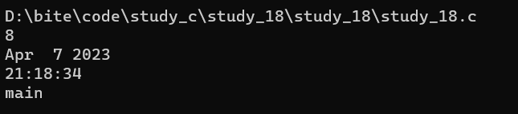

> **🍕博客主页：️[自信不孤单](https://blog.csdn.net/czh1592272237)**
>
> **🍬文章专栏：[C语言](https://blog.csdn.net/czh1592272237/category_12209876.html)**
>
> **🍚代码仓库：[破浪晓梦](https://gitee.com/polang-xiaomeng/study_c)**
>
> **🍭欢迎关注：欢迎大家点赞收藏+关注**

# 程序环境和预处理

[toc]

---

# 前言

**本文重点**

- 代码编译链接变成可执行程序程序的过程
- 掌握学习各种预处理知识

# 程序翻译环境和执行环境

> 在ANSI C的任何一种实现中，存在两个不同的环境：
>
> 1. 翻译环境，在这个环境中源代码被转换为可执行的机器指令。
>
> 2. 执行环境，它用于实际执行代码。  

## 1. 翻译环境

- 编译

> 组成一个程序的每个源文件（.c文件）通过编译过程分别转换成目标代码（.obj文件）。

- 链接

> 每个目标文件由链接器（linker）捆绑在一起，形成一个单一而完整的可执行程序（.exe文件）。
>
> 链接器同时也会引入标准C函数库中任何被该程序所用到的函数，而且它可以搜索程序员个人的程序库，将其需要的函数也链接到程序中。

==其过程如图所示==


- 链接库

> 是一个二进制文件,包含了各种源程序可能用到的函数或类等。

==例如：==

> printf函数需要的库是


### 1.1 编译

> 编译可以分为三个阶段：预编译（预处理），编译，汇编。

#### 预编译

> 该阶段执行的操作是：
>
> 1.  头文件的展开（#include）
> 2.  执行预处理指令（如宏替换（#define），条件编译处理（#if，#endif）等）
> 3.  去注释（//）

==测试代码：==

```c
#include <stdio.h>

#define X 10
#define Y 20

int main()
{
    //This is a add.
    int sum = X + Y;
    printf("%d\n", sum);
    return 0;
}
```

> 这里我们使用 gcc 来测试上述代码预编译阶段执行后的结果。
>
> 在终端输入选项`gcc -E test.c -o test.i`
> 预处理完成之后就停下来，预处理之后产生的结果都放在 test.i 文件中。  
>
> 如图：


#### 编译

> 该阶段执行的操作是：
>
> 1. 词法分析
> 	词法分析的任务是对由字符组成的单词进行处理，从左至右逐个字符地对源程序进行扫描，产生一个个的单词符号，把作为字符串的源程序改造成为单词符号串的中间程序。
> 2. 语义分析
> 	语义分析是编译过程的一个逻辑阶段， 语义分析的任务是对结构上正确的源程序进行上下文有关性质的审查，进行类型审查。语义分析是审查源程序有无语义错误，为代码生成阶段收集类型信息。
> 3. 语法分析
> 	编译程序的语法分析器以单词符号作为输入，分析单词符号串是否形成符合语法规则的语法单位，如表达式、赋值、循环等，最后看是否构成一个符合要求的程序，按该语言使用的语法规则分析检查每条语句是否有正确的逻辑结构，程序是最终的一个语法单位。
> 4. 符号汇总
> 	在这个环节中，会将每个源文件的全局范围的变量符号进行汇总。
>
> 执行完以上步骤就会把C语言代码翻译成汇编代码。

> 测试代码同上。
>
> 在终端输入选项`gcc -S test.c`
> 编译完成之后就停下来，结果保存在 test.s 文件中。
>
> 如图：  


#### 汇编

> 该阶段执行的操作是：
>
> 1. 将汇编代码转换成二进制指令
> 2. 形成符号表
> 3. 生成目标文件（二进制文件）

==测试代码==

add.c 文件

```c
int Add(int x, int y)
{
    return x + y;
}
```

test.c 文件

```c
#include <stdio.h>

extern int Add(int, int);

int main()
{
    int sum = Add(10, 20);
    printf("%d\n", sum);
    return 0;
}
```

> 在终端输入选项`gcc -c test.c`
> 汇编完成之后就停下来，结果保存在 test.o 文件中。

**符号表**

> 只对全局变量生成符号表


### 1.2 链接

> 此阶段执行的操作是：
>
> 1. 合成段表
> 2. 符号表的合并和重定位

==解释==

> 1. 合并段表。 其实，汇编结束后所生成的 obj 文件内部会被划分为几个段，在链接过程中就会把每个 obj 文件对应的段通过某种规则合并起来，最后形成可执行程序（.exe 为后缀）。
> 2. 符号表的合并和重定位。 在链接期间会将每个源文件的符号表进行合并，若不同源文件的符号表中出现了相同的符号，则取合法的地址为合并后的地址（重定位）。
> 	注：符号表并非无意义。例如，当要调用某一函数时，编译器会在符号表中查找该符号，若有，则调用成功；否则，调用失败。

## 2. 执行环境（运行环境）

> 1. 程序首先载入内存中。 在有操作系统的环境中，该操作一般由操作系统来完成。在独立的环境中，程序的载入可以由手工完成，也可以通过可执行代码置入只读内存来完成。
> 2. 程序的执行开始。 接着便调用 main 函数。
> 3. 开始执行程序代码。 这个时候程序将使用一个运行时堆栈(stack)，存储函数的局部变量和返回地址。程序同时也可以使用静态(static)内存，存储于静态内存中的变量在程序的整个执行过程一直保留它们的值。
> 4. 终止程序。 正常终止main函数，也可能是意外终止。

==有关这一部分内容的理解可以参照[《函数栈帧的创建和销毁》](https://blog.csdn.net/czh1592272237/article/details/128782681?spm=1001.2014.3001.5501)==

# 预编译（预处理）

## 1. 预定义符号

```c
__FILE__        //进行编译的源文件
__LINE__        //文件当前的行号
__DATE__        //文件被编译的日期
__TIME__        //文件被编译的时间
__FUNCTION__    //进行编译的函数
__STDC__        //如果编译器遵循ANSI C，其值为1，否则未定义
//这些预定义符号都是语言内置的
```

==测试代码==

```c
#include <stdio.h>

int main()
{
	printf("%s\n", __FILE__);
	printf("%d\n", __LINE__);
	printf("%s\n", __DATE__);
	printf("%s\n", __TIME__);
	printf("%s\n", __FUNCTION__);
	return 0;
}
```



## 2. #define

### 2.1 #define定义的标识符

> 语法：
>          #define name stuff

==举个例子：==

```c
#define MAX 1000
#define reg register //为 register这个关键字，创建一个简短的名字
#define do_forever for(;;) //用更形象的符号来替换一种实现
#define CASE break;case //在写case语句的时候自动把 break写上。
// 如果定义的 stuff过长，可以分成几行写，除了最后一行外，每行的后面都加一个反斜杠(续行符)。
#define DEBUG_PRINT printf("file:%s\tline:%d\t \
date:%s\ttime:%s\n" ,\
__FILE__,__LINE__ , \
__DATE__,__TIME__ )
```

> 这些被#define定义的标识符都将在预处理阶段被编译器替换成对应的内容。
>
> ==注意：在define定义标识符的时候，不要在最后加上`;`==
>
> 如果要是加上`;`，则会发生以下情况：

```c
#define MAX 1000;
#define MAX 1000
...
if(condition)
	max = MAX;
else
	max = 0;
```

> 这里会出现语法错误。

### 2.2 #define定义宏

> \#define 机制包括了一个规定，允许把参数替换到文本中，这种实现通常称为宏（macro）或定义宏（define macro）。

**下面是宏的申明方式：**

> \#define name( parament-list ) stuff
> 其中的 parament-list 是一个由逗号隔开的符号表，它们可能出现在stuff中。

==注意==

> 参数列表的左括号必须与name紧邻。
> 如果两者之间有任何空白存在，参数列表就会被解释为stuff的一部分。  

**例如使用宏求一个数的平方：**

```c
#include <stdio.h>
#define SQUARE(x) x*x

int main()
{
	int ret = SQUARE(5);
	//相当于int ret = 5*5;
	printf("%d\n", ret);//结果为25
	return 0;
}
```

> 下面我们来看看这样使用参数

```c
#include <stdio.h>
#define SQUARE(x) x*x

int main()
{
	int ret = SQUARE(1+3);
	printf("%d\n", ret);
	return 0;
}
```

> 这时会输出多少？
>
> 答案是7。
>
> 原因在于宏的参数是直接替换进去的而不是计算好再进行替换。所以替换后就变成了`ret = 1+3*1+3`。

> 所以在用于对数值表达式进行求值的宏定义都应该加上括号，避免在使用宏时由于参数中的操作符或邻近操作符之间不可预料的相互作用。  

==上述宏就可优化为==

```c
#define SQUARE(x) ((x)*(x))
```

### 2.3 #define替换的规则

> 在程序中扩展 #define 定义符号和宏时，需要涉及几个步骤。
>
> 1. 在调用宏时，首先对参数进行检查，看看是否包含任何由 #define 定义的符号。如果是，它们首先被替换。
> 	
>2. 替换文本随后被插入到程序中原来文本的位置。对于宏，参数名被他们的值所替换。
> 
>3. 最后，再次对结果文件进行扫描，看看它是否包含任何由 #define 定义的符号。如果是，就重复上述处理过程。  

==注意==

> 1. 宏参数和 #define 定义中可以出现其他 #define 定义的符号。但是对于宏，不能出现递归。
>
> 2. 当预处理器搜索 #define 定义的符号的时候，字符串常量的内容并不被搜索。  

- 注意1的反例：

```c
#define FAC(x) (x)*FAC(x-1)//error
```

- 注意2的例子：

```c
#include <stdio.h>
#define M "abcd"

int main()
{
	printf("%s\n", M);//M不会被搜素
	return 0;
}
```

### 2.4 #和##的用法

> 如何把参数插入到字符串中？

==首先我们看看这样的代码：==

```c
char* p = "hello ""world\n";
printf("hello"" world\n");
printf("%s", p);
```

> 这里输出的是不是`hello world`？
> 答案是：YES.
>
> 我们发现字符串是有自动连接的特点的。
>
> 那么我们是不是可以写以下这样的代码了？

```c
#define PRINT(FORMAT, VALUE)\
printf("the value is "FORMAT"\n", VALUE)
...
PRINT("%d", 10);
```

> 这里只有当字符串作为宏参数的时候，才可以这样写。

**这里我们可以使用 # ，把一个宏参数变成对应的字符串** 

==比如：==

```c
int i = 10;
#define PRINT(FORMAT, VALUE)\
printf("the value of " #VALUE "is "FORMAT "\n", VALUE)
...
PRINT("%d", i+3);//产生了什么效果？
```

> 代码中的 #VALUE 会预处理器处理为：
> "VALUE" .
> 最终的输出的结果应该是：

`the value of i+3 is 13  `

**##的作用**

> \##可以把位于它两边的符号合成一个符号。
> 它允许宏定义从分离的文本片段创建标识符。  

```cc
#define ADD_TO_SUM(num, value) \
sum##num += value
...
ADD_TO_SUM(5, 10);//作用是：给sum5增加10.
```

> 注：
> 这样的连接必须产生一个合法的标识符。否则其结果就是未定义的。

> 例如：如果上述代码中未定义 sum5 则会报错。

### 2.5 带副作用的宏参数

> 当宏参数在宏的定义中出现超过一次的时候，如果参数带有副作用，那么你在使用这个宏的时候就可能出现危险，导致不可预测的后果。副作用就是表达式求值的时候出现的永久性效果。
> 
>例如：

```c
x+1;//不带副作用
x++;//带有副作用
```

> MAX宏可以证明具有副作用的参数所引起的问题。

```c
#define MAX(a, b) ( (a) > (b) ? (a) : (b) )
...
x = 5;
y = 8;
z = MAX(x++, y++);
printf("x=%d y=%d z=%d\n", x, y, z);//输出的结果是什么？
```

> 这里我们得知道预处理器处理之后的结果是什么：

`z = ( (x++) > (y++) ? (x++) : (y++));`

> 所以输出的结果是：

`x=6 y=10 z=9`

### 2.6 宏与函数对比

> 宏通常被应用于执行简单的运算。
> 比如在两个数中找出较大的一个。

```c
#define MAX(a, b) ((a)>(b)?(a):(b))
```

==那为什么不用函数来完成这个任务？==

> 原因有二：
>
> 1. 用于调用函数和从函数返回的代码可能比实际执行这个小型计算工作所需要的时间更多。
> 	所以宏比函数在程序的规模和速度方面更胜一筹。
>
> 2. 更为重要的是函数的参数必须声明为特定的类型。
> 	所以函数只能在类型合适的表达式上使用。反之这个宏则可以适用于整形、长整型、浮点型等可以用于>来比较的类型。
> 	宏是与类型无关的。

**宏的缺点**

> 宏的缺点：当然和函数相比宏也有劣势的地方：
>
> 1. 每次使用宏的时候，一份宏定义的代码将插入到程序中。除非宏比较短，否则可能大幅度增加程序的长度。
>
> 2. 宏是没法调试的。
>
> 3. 宏由于类型无关，也就不够严谨。
>
> 4. 宏可能会带来运算符优先级的问题，导致程容易出现错。

> 宏有时候可以做函数做不到的事情。比如：宏的参数可以出现类型，但是函数做不到。

==如：==

```c
#define MALLOC(num, type)\
(type *)malloc(num * sizeof(type))
...
//使用
MALLOC(10, int);//类型作为参数
//预处理器替换之后：
(int *)malloc(10 * sizeof(int));
```

**宏和函数的一个对比**

| 属 性                   | #define定义宏                                                | 函数                                                         |
| ----------------------- | ------------------------------------------------------------ | ------------------------------------------------------------ |
| 代 码 长 度             | 每次使用时，宏代码都会被插入到程序中。除了非常小的宏之外，程序的长度会大幅度增长 | 函数代码只出现于一个地方；每次使用这个函数时，都调用那个地方的同一份代码 |
| 执 行 速 度             | 更快                                                         | 存在函数的调用和返回的额外开销，所以相对慢一些               |
| 操 作 符 优 先 级       | 宏参数的求值是在所有周围表达式的上下文环境里， 除非加上括号，否则邻近操作符的优先级可能会产生不可预料的后果，所以建议宏在书写的时候多些括 号。 | 函数参数只在函数调用的时候求值一次，它的结果值传递给函 数。表达式的求值结果更容易预测。 |
| 带 有 副 作 用 的 参 数 | 参数可能被替换到宏体中的多个位置，所以带有副作用的参数求值可能会产生不可预料的结果。 | 函数参数只在传参的时候求值一 次，结果更容易控制。            |
| 参 数 类 型             | 宏的参数与类型无关，只要对参数的操作是合法的， 它就可以使用于任何参数类型。 | 函数的参数是与类型有关的，如果参数的类型不同，就需要不同的函数，即使他们执行的任务是相同的。 |
| 调 试                   | 宏是不方便调试的                                             | 函数是可以逐语句调试的                                       |
| 递 归                   | 宏是不能递归的                                               | 函数是可以递归的                                             |

### 2.7 命名约定

> 一般来讲函数的宏的使用语法很相似。所以语言本身没法帮我们区分二者。

**那我们平时的一个习惯是：**

> 把宏名全部大写
> 函数名不要全部大写

## 3. #undef

> 这条指令用于移除一个宏定义。

```C
#undef NAME
//如果现存的一个名字需要被重新定义，那么它的旧名字首先要被移除。
```

## 4. 命令行定义

> 许多 C 的编译器提供了一种能力，允许在命令行中定义符号。用于启动编译过程。
> 例如：当我们根据同一个源文件要编译出一个程序的不同版本的时候，这个特性有点用处。（假定某个程序中声明了一个某个长度的数组，如果机器内存有限，我们需要一个很小的数组，但是另外一个机器内存大些，我们需要一个数组能够大些。）

```c
#include <stdio.h>
int main()
{
	int array[ARRAY_SIZE];
	int i = 0;
	for (i = 0; i < ARRAY_SIZE; i++)
	{
		array[i] = i;
	}
	for (i = 0; i < ARRAY_SIZE; i++)
	{
		printf("%d ", array[i]);
	}
	printf("\n");
	return 0;
}
```

> 编译指令：  

`//linux 环境演示`
`gcc -D ARRAY_SIZE=10 programe.c`

## 5. 条件编译

> 在编译一个程序的时候我们如果要将一条语句（一组语句）编译或者放弃是很方便的。因为我们有条件编译指令。

==比如说：==

> 调试性的代码，删除可惜，保留又碍事，所以我们可以选择性的编译。

```c
int main()
{
	int i = 0;
	int arr[10] = { 0 };
	for (i = 0; i < 10; i++)
	{
		arr[i] = i;
		#ifdef __DEBUG__
		printf("%d\n", arr[i]);//为了观察数组是否赋值成功。
		#endif //__DEBUG__
	}
	return 0;
}
```

==常见的条件编译指令：==

```c
1.
#if 常量表达式
//...
#endif
//常量表达式由预处理器求值。
如：
#define __DEBUG__ 1
#if __DEBUG__
//..
#endif
2.多个分支的条件编译
#if 常量表达式
//...
#elif 常量表达式
//...
#else
//...
#endif
3.判断是否被定义
#if defined(symbol)
#ifdef symbol
#if !defined(symbol)
#ifndef symbol
4.嵌套指令
#if defined(OS_UNIX)
	#ifdef OPTION1
		unix_version_option1();
	#endif
	#ifdef OPTION2
		unix_version_option2();
	#endif
#elif defined(OS_MSDOS)
	#ifdef OPTION2
		msdos_version_option2();
	#endif
#endif
```

## 6. 文件包含

> 我们已经知道， #include 指令可以使另外一个文件被编译。就像它实际出现于 #include 指令的地方一样。
>
> 这种替换的方式很简单：
> 预处理器先删除这条指令，并用包含文件的内容替换。
> 这样一个源文件被包含10次，那就实际被编译10次。

### 6.1 头文件被包含的方式：

- 本地文件包含

```c
#include "filename"
```

> 查找策略：先在源文件所在目录下查找，如果该头文件未找到，编译器就像查找库函数头文件一样在标准位置查找头文件。如果找不到就提示编译错误。

Linux环境的标准头文件的路径：

```c
/usr/include
```

VS环境的标准头文件的路径：

```c
C:\Program Files (x86)\Microsoft Visual Studio 12.0\VC\include
//这是VS的默认路径
```

==要按照自己的安装路径去找。==

- 库文件包含

```c
#include <filename.h>
```

> 查找头文件直接去标准路径下去查找，如果找不到就提示编译错误。
>
> 这样是不是可以说，对于库文件也可以使用 “” 的形式包含？
> 答案是肯定的，可以。
>
> 但是这样做查找的效率就低些，当然这样也不容易区分是库文件还是本地文件了。

### 6.2 嵌套文件包含

> 如果出现这样的场景：
> comm.h 和 comm.c 是公共模块。
> test1.h 和 test1.c 使用了公共模块。
> test2.h 和 test2.c 使用了公共模块。
> test.h 和 test.c 使用了 test1 模块和 test2 模块。
> 这样最终程序中就会出现两份 comm.h 的内容。这样就造成了文件内容的重复。

> 如何解决这个问题？
> 答案：条件编译。

==每个头文件的开头写：==

```c
#ifndef __TEST_H__
#define __TEST_H__
//头文件的内容
#endif //__TEST_H__
```

==或者==

```c
#pragma once
```

==这样就可以避免头文件的重复引入。==

---


==到此，关于《程序环境和预处理》的内容就结束了
感谢大家的观看
创作不易，如果对您有帮助，请一键三连
您的支持就是我创作最大的动力！！！==