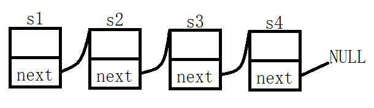
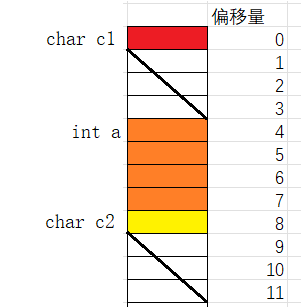
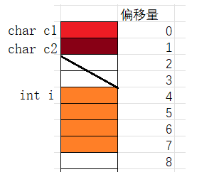
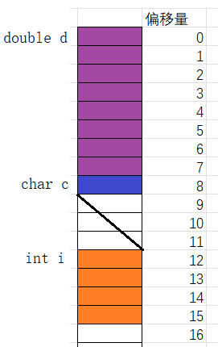
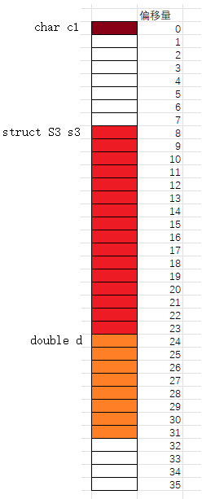
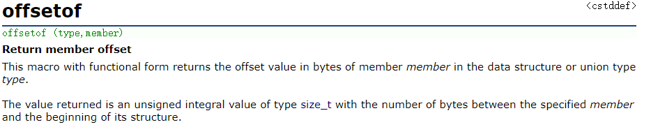
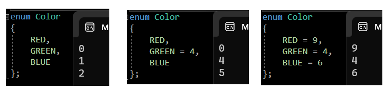
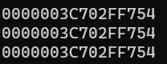
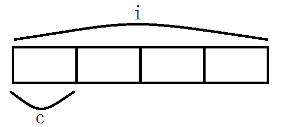

> **🍕博客主页：️[自信不孤单](https://blog.csdn.net/czh1592272237)**
>
> **🍬文章专栏：[C语言](https://blog.csdn.net/czh1592272237/category_12209876.html)**
>
> **🍚代码仓库：[破浪晓梦](https://gitee.com/polang-xiaomeng/study_c)**
>
> **🍭欢迎关注：点赞收藏+关注**

# 自定义类型

[toc]

---

# 前言

> C语言本身具有的内置类型如`int, float, double...`，同时也提供可自定义的自定义类型或构造类型如结构体，枚举，联合体。

# 1. 结构体

## 1.1 了解结构体

> 结构是一些值的集合，这些值被统称为成员变量。结构的每个成员可以是不同类型的变量。所以结构可以用来描述一个复杂的对象，其中成员即是对象的各种属性。

## 1.2 结构体的声明

```c
struct tag
{
	member - list;
}variable - list;
```

- `struct`是结构体的关键词，`tag`是结构体的标签名。
- `member_list`是定义成员变量的列表，`value_list`是用该结构体类型创建的全局变量的列表，可缺省。

==例如描述一个学生==

```c
struct Stu
{
	char name[20];//名字
	int age;//年龄
	char sex[5];//性别
	char id[20];//学号
}; //分号不能丢
```

## 1.3 匿名声明

```c
struct
{
	int a;
	char c;
	double d;
}s1, s2;
```

> 定义匿名结构体类型，省去标签名，所以只能在成员列表处创建变量。

==我们来看这个代码：==

```c
struct
{
	int a;
	char c;
	double d;
}s1, s2;

struct
{
	int a;
	char c;
	double d;
}*ps;

int main()
{
	ps = &s1;//指针类型不兼容
	return 0;
}
```

> 虽然两个结构体中的成员一致，但是编译器会把上面的两个声明当成完全不同的两个类型。因此指针类型不兼容，这样是非法的。

## 1.4 结构体的自引用

> 在结构中包含一个类型为该结构本身的成员是否可以呢？

==来思考一下以下代码是否正确？==

```c
struct Node
{
	int data;
	struct Node next;
};
```

> 如果正确，那sizeof(struct Node)是多少？自身嵌套一个同类型的结构体变量，如果一直嵌套下去是无法计算出大小的。所以显然是错误的。故结构中不能包含一个类型为该结构本身的成员。

==正确的自引用方式：==

```c
struct Node
{
	int data;
	struct Node* next;
};
```

> 类似于数据结构中链表的思路，使用指针存入下一个节点的地址。



> `data`被称为数据域，结构体指针`next`被称为指针域。

==注：==

```c
typedef struct
{
	int data;
	Node* next;
}Node;
```

`typedef`将结构体重命名为`Node`，但这在定义结构体之后才能生效，所以在结构体定义中，编译器无法识别该类型名。

## 1.5 结构体变量的定义和初始化

```c
struct Point
{
	int x;
	int y;
}p1; //声明类型的同时定义变量p1
struct Point p2; //定义结构体变量p2
//初始化：定义变量的同时赋初值。
struct Point p3 = { x, y };
struct Stu //类型声明
{
	char name[15];//名字
	int age; //年龄
};
struct Stu s = { "zhangsan", 20 };//初始化
struct Node
{
	int data;
	struct Point p;
	struct Node* next;
}n1 = { 10, {4,5}, NULL }; //结构体嵌套初始化
struct Node n2 = { 20, {5, 6}, NULL };//结构体嵌套初始化
```

## 1.6 结构体内存对齐

> 在掌握结构体的基础使用后，我们要进一步深入探讨结构体的大小。为此我们需要掌握结构体内存对齐。

==下面这段代码的输出结果是什么？==

```c
#include<stdio.h>
struct S1
{
	char c1;
	int i;
	char c2;
};
struct S2
{
	char c1;
	char c2;
	int i;
};
struct S3
{
	double d;
	char c;
	int i;
};
struct S4
{
	char c1;
	struct S3 s3;
	double d;
};
int main()
{
	printf("%d %d %d %d", sizeof(struct S1), sizeof(struct S2), sizeof(struct S3), sizeof(struct S4));
	return 0;
}
```

==输出结果为：==

> 12 8 16 32

==这是为什么呢？==

> 我们先来看看结构体的对齐规则：
> 1. 第一个成员在与结构体变量偏移量为0的地址处。
>
> 2. 其他成员变量要对齐到对齐数的整数倍的地址处。 对齐数等于编译器默认对齐数与该成员大小的较小值。 VS编译器下默认对齐数为8，GCC没有默认对齐数（成员的大小就是对齐数）。
>
> 3. 结构体总大小为最大对齐数（每个成员变量都有一个对齐数）的整数倍。
>
> 4. 如果嵌套了结构体的情况，嵌套的结构体对齐到自己的最大对齐数的整数倍处，结构体的整体大小就是所有对齐数中最大对齐数（含嵌套结构体的对齐数）的整数倍。

> 接下来我们来分析一下上面的代码



> 解析：
>
> 首先char c1在与结构体偏移量为0的地址处。
> 存放int a时要考虑对齐数，int所占字节数为4，编译器默认的对齐数为8，4更小，所以对齐数应为4，所以a存储时要从偏移量为4（对齐数的整数倍数）的位置处开始存放，占据4个字节的空间。
> 存放char c2时还要考虑对齐数，char所占的字节数为1，与8相比，1更小，所以对齐数为1，所以c2要存放在偏移量为8（对齐数的整数倍）的位置处，此时一共占据了9个字节的空间。
> 结构体总大小为最大对齐数的整数倍，上面的最大对齐数的为4，所以结构体所占据的内存空间的字节数为4的整数倍，前面已经占据了9个字节，下一个4的整数倍的数为12，所以这个结构体占据的空间的字节数为12。



> 同理，结构体S2所占的内存空间的字节数为8。



> 同理，结构体S3所占的内存空间的字节数为16。



> 嵌套结构体所占内存为16个字节，但其最大对齐数为8，所以嵌套结构体从偏移量为8的位置开始存放，整个结构体的成员变量对齐数的最大值为8。

==那么为什么存在内存对齐？==

> 1. 平台原因(移植原因)：不是所有的硬件平台都能访问任意地址上的任意数据的；某些硬件平台只能在某些地址处取某些特定类型的数据，否则抛出硬件异常。
>
> 2. 性能原因：数据结构(尤其是栈)应该尽可能地在自然边界上对齐。 原因在于，为了访问未对齐的内存，处理器需要作两次内存访问；而对齐的内存访问仅需要一次访问。
>

> 总体来说：
>  结构体的内存对齐是拿空间来换取时间的做法。

> 那在设计结构体的时候，我们既要满足对齐，又要节省空间，如何做到：让占用空间小的成员尽量集中在一起。

```c
//例如：
struct S1
{
	char c1;
	int i;
	char c2;
};
struct S2
{
	char c1;
	char c2;
	int i;
};
```

> S1和S2类型的成员一模一样，但是S1和S2所占空间的大小有了一些区别。

## 1.7 修改默认对齐数

```c
#include <stdio.h>
#pragma pack(8)//设置默认对齐数为8
struct S1
{
	char c1;
	int i;
	char c2;
};
#pragma pack()//取消设置的默认对齐数，还原为默认
#pragma pack(1)//设置默认对齐数为1
struct S2
{
	char c1;
	int i;
	char c2;
};
#pragma pack()//取消设置的默认对齐数，还原为默认
int main()
{
	//输出的结果是什么？
	printf("%d\n", sizeof(struct S1));
	printf("%d\n", sizeof(struct S2));
	return 0;
}
```

输出结果为：

> 12
>
> 6

> 结论：
> 结构在对齐方式不合适的时候，我么可以自己更改默认对齐数。

==注：==

> 我们来认识一个计算偏移量的函数——offsetof()
> 调用此函数时需要引用头文件<stddef.h>



## 1.8 结构体传参

==我们来看一段代码：==

```c
struct S
{
	int data[1000];
	int num;
};
struct S s = { {1,2,3,4}, 1000 };
//结构体传参
void print1(struct S s)
{
	printf("%d\n", s.num);
}
//结构体地址传参
void print2(struct S* ps)
{
	printf("%d\n", ps->num);
}
int main()
{
	print1(s); //传结构体
	print2(&s); //传地址
	return 0;
}
```

> 上面的print1和print2函数哪个好些？
> 当然是首选print2函数啦。
>
> 理由是
> 函数传参的时候，参数是需要压栈，会有时间和空间上的系统开销。
> 如果传递一个结构体对象的时候，结构体过大，参数压栈的的系统开销比较大，所以会导致性能的下降。

==结论：==

> 结构体传参的时候，要传结构体的地址。

# 2. 位段

## 2.1 什么是位段

> 位段的声明和结构是类似的，有两个不同：
>
> 1. 位段的成员必须是整型类型变量，如int、unsigned int、char等。
> 2. 位段的成员名后边有一个冒号和一个数字。  

==比如：==

```c
struct A
{
	int _a : 2;
	int _b : 5;
	int _c : 10;
	int _d : 30;
};
```

> 这里的A就是一个位段类型。
>
> 那么位段A的大小是多少？
> 计算位段A的大小得8，而4个整形变量最小占16个字节。说明位段一定程度上可以节省空间。
>
> 位段中的“位”表示二进制位，而`:`后的数字代表系统分配给该变量的比特位数。

> 在描述对象时，属性变量中的所有位数不一定全部使用，使用位段可以规定系统分配给变量的空间。当然数据过大仍会溢出。

## 2.2 位段的内存分配

> 系统按成员变量类型来为位段开辟空间，一次性开辟一个变量类型大小的空间。
> 如该成员为`int`型，则一次开辟4个字节，若不够则再开辟4个字节。若为`char`类型，则开辟1个字节。
>
> 位段使用时涉及很多不确定因素，位段是不跨平台的，注重可移植的程序应该避免使用位段。

> 了解完这些，让我们看看上面的struct A的大小为什么是8个字节。


> 如图，首先开辟一个整型大小的内存空间（4个字节，即32个比特位），`_a`，`_b`，`_c`总共占据17个比特位，此时这个整型空间只剩15个比特位了，无法将`_d`的30个比特位存放进去，所以必然要继续开辟4个字节的空间。此时一共占据了2个整型大小的空间，所以最后计算出struct A的大小为8个字节。

> 那么这里就出现了一个问题：`_d`在内存中到底是15个字节存放在第一个字节中剩下15个字节存放在第二个字节中，还是全部存放在新开辟的空间里？
>
> 其实不同的编译环境下可能会产生不同的结果，这是C标准中未规定的内容。我们在此仅考虑VS环境下的情况，即如果上一块空间不够存放时就全部存放在新开辟的空间里。

==我们来看一段代码：==

```c
struct S
{
	char a : 3;
	char b : 4;
	char c : 5;
	char d : 4;
};
struct S s = { 0 };
int main()
{
	s.a = 10;
	s.b = 12;
	s.c = 3;
	s.d = 4;
	return 0;
}
```

> 对位段变量进行赋值操作，就又带来了一个问题，单个字节内先使用高地址还是低地址？这也是标准未规定的。
>
> 在VS编译器下，位段中先使用高地址再使用低地址，同时剩余空间不足则将其抛弃并重新开辟。

==对以上代码的解释如下图：==


==下面是编译器给出的结果，可以看到结果与分析的一样==


> 总结：
>
> 在VS编译环境下：
>
> 1. 每次开辟空间所开辟的字节个数，由需开辟空间的成员变量的类型所决定。
> 2. 内存使用时，先使用低地址再使用高地址，单个字节内从高位到低位使用。
> 3. 所开辟内存空间不足时，抛弃剩余内存，重新开辟类型大小的空间。

> 由于这些规则C标准并未明确规定，因而这些结论因编译器而异。所以位段的平台移植性差。

## 2.3 位段的跨平台问题

> 1. `int`位段的最高位是否被当做符号位不确定。
> 2. 位段中成员类型所占比特位数目不确定。(早期16位机器`int`占2个字节共16个比特位，而变量分配比特位数目不得多于最大值。)
>
> 3. 位段成员在内存中先使用高地址还是低地址不确定。
> 4. 所开辟内存空间不足时，是否抛弃剩余内存重新开辟还是接着使用剩余内存不确定。

## 2.4 位段的应用

> 和结构体相比，位段可达到同样的效果，可以节省空间，但是需要小心使用且跨平台性差。
>
> 而位段可以应用到网络协议中，不至于浪费大量的空间，网络传输协议中每几个比特位成一组用于传输不同的数据，以提高效率。

# 3. 枚举 

> 枚举顾名思义一一列举，把可能的取值可以列举出来。
>
> 例如：
> 一周的星期一到星期日是有限的7天，可以一一列举。
> 三原色包括红绿蓝，可以一一列举。
> 月份有12个月，也可以一一列举。

## 3.1 枚举类型的定义

```c
enum Tag
{
    con1,
    con2,
    ...
    con3
};
```

> - `enum`是枚举关键字，`Tag`是枚举对象名；
> - `con1,con2,...,con3`是枚举常量列表。

==举个例子：==

```c
//星期
enum Day
{
	Mon,
	Tues,
	Wed,
	Thur,
	Fri,
	Sat,
	Sun
};
//性别
enum Sex
{
	FAMALE,
	MALE,
	SECRET
};
//颜色
enum Color
{
	RED,
	GREEN,
	BLUE
};
```

> 上述定义的`enum Day`，`enum Sex`，`enum Color`都是枚举类型。`{}`内是枚举类型的可能取值，即枚举常量。

> 枚举常量取值默认从0开始，依次递增1。
> 也可在定义时进行赋值。



## 3.2 枚举的优点

> 我们可以使用#define定义常量，为什么非要使用枚举？
>
> 枚举的优点：
>
> 1. 增加代码的可读性和可维护性
>
> 2. 和#define定义的标识符比较枚举有类型检查，更加严谨。
>
> 3. 防止了命名污染（封装）
>
> 4. 便于调试
>
> 5. 使用方便，一次可以定义多个常量

## 3.3 枚举的使用

==我们来看下面这段代码：==

```c
enum Color
{
	RED,
	GREEN,
	BLUE
};
int main()
{
	//赋值1
	enum Color c = RED;
	//赋值2
	enum Color c = 0;
}
```

> 赋值1和赋值2都可行吗？
>
> C语言对语法的检测没有那么严格，所以赋值1和赋值2都行。但是在C++中认为1是字面常量而RED为枚举常量，二是不相等的，所以不能赋值。

==来个枚举类型的应用：==

```c
//计算器
//使用枚举常量
enum Option {
	EXIT,//0
	ADD,//1
	SUB,//2
	MUL,//3
	DIV,//4
};

int Add(int x, int y) {
	return x + y;
}
int Sub(int x, int y) {
	return x - y;
}
int Mul(int x, int y) {
	return x * y;
}
int Div(int x, int y) {
	return x / y;
}
void Calc(int (*pf)(int, int)) {
	int a = 0;
	int b = 0;
	printf("请输入操作数:>");
	scanf("%d %d", &a, &b);
	printf("%d\n", pf(a, b));
}

void menu() {
	printf("*************************\n");
	printf("**** 1.ADD     2.SUB ****\n");
	printf("**** 3.MUL *** 4.DIV ****\n");
	printf("*******  0.exit  ********\n");
	printf("*************************\n");
}
int main()
{
	int input = 0;

	do {
		menu();
		printf("请选择\n");
		scanf("%d", &input);
		switch (input) {
		case ADD:
			Calc(Add);
			break;
		case SUB:
			Calc(Sub);
			break;
		case MUL:
			Calc(Mul);
			break;
		case DIV:
			Calc(Div);
			break;
		case EXIT:
			break;
		default:
			printf("选择错误\n");
			break;
		}
	} while (input);
	return 0;
}
```

## 3.4 枚举类型的大小

> **在C语言中，enum类型的大小是由编译器根据定义值的大小来选择合适的整数类型，所以enum类型的大小并不是固定的。**

> 这样会有一个潜在的弊端：如果我们定义了一个结构体，其成员有enum类型，那么就可能导致结构体大小发生变化，而我们却没有察觉，例如随着代码的更迭，我们加入了更多enum规定的范围值，当超过某个值时，它的大小就产生了变化，这是比较危险的。
>
> enum长度不确定会带来可移植性问题，如果第三方库API接口使用enum类型，编译和调用库时一旦有关enum长度的编译器设置不一致，API接口层对数值的解析就不匹配。比如上层应用编译时没有用-fshort-enums，默认用4字节空间来存储使用enum变量，而编译库时设置了fshort-enums，则库内部此enum的size可能为1。当把enum变量地址传进API时，内部只修改变量最低字节，高3字节值无变化（内容随机），API返回时，上层使用的4字节enum变量值就可能随机。

==结论：==

> 内部代码使用enum类型优于define，但对外API接口尽量避免用enum型。

# 4. 联合体

## 4.1 联合类型的定义

> 联合也是一种特殊的自定义类型，这种类型定义的变量也包含一系列的成员，特征是这些成员公用同一块空间（所以联合也叫共用体）。

```c
//联合类型的声明
union Un
{
	char c;
	int i;
};
//联合变量的定义
union Un un;
//计算联合变量的大小
printf("%d\n", sizeof(un));
```

> 算出该联合体变量大小为4个字节，可一个整型和字符型变量最少也要5个字节，为什么会这样呢？

## 4.2 联合的特点

> 联合的成员是共用同一块内存空间的，这样一个联合变量的大小，至少是最大成员的大小（因为联合至少得有能力保存最大的那个成员）。

```c
union Un
{
	char c;
	int i;
};
int main()
{
	union Un un;
	printf("%p\n", &un);
	printf("%p\n", &un.c);
	printf("%p\n", &un.i);
	return 0;
}
```

==输出结果：==



> 从上述代码可以看出`c`，`i`共用4个字节。



> 借此特点，我们可以写一段代码来判断当前环境的大小端

==方法一：运用联合的方式==

```c
int check_sys()
{
	union Un
	{
		char c;
		int i;
	}u;
	u.i = 1;
	return u.c;
}
int main()
{
	if (check_sys() == 1)
	{
		printf("小端存储\n");
	}
	else
	{
		printf("大端存储\n");
	}
	return 0;
}
```

==方法二：运用非联合的方式==

```c
#include<stdio.h>
int check_sys()
{
	int a = 1;
	return *(char*)&a;
}
int main()
{
	int ret = check_sys();
	if (1 == ret)
	{
		printf("小端存储\n");
	}
	else
	{
		printf("大端存储\n");
	}
	return 0;
}
```

## 4.3 联合大小的计算

> - 联合的大小至少是最大成员的大小。
> - 当最大成员大小不是最大对齐数的整数倍的时候，就要对齐到最大对齐数的整数倍。

```c
union un
{
	int a;//对齐数为4，默认对齐数为8，取较小值，即4
	char arr[5];//最大成员的大小为5，对齐数为1（拿char来算，而不是拿整个数组所占的内存空间来算），默认对齐数为8，取较小值1
	//所以联合体的最大对齐数为4，所以union un的内存空间的大小必须是4的倍数，同时还必须大于5，所以空间大小为8个字节
};
```

> 因为联合体所有成员共用一块空间，故算出最大成员大小后，只需要在最后再浪费几个字节的空间以对齐到最大对齐数的整数倍。

==到此，关于《自定义类型》的内容就结束了
感谢大家的观看
创作不易，如果对您有帮助，请一键三连
您的支持就是我创作最大的动力！！！==
