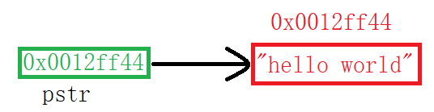
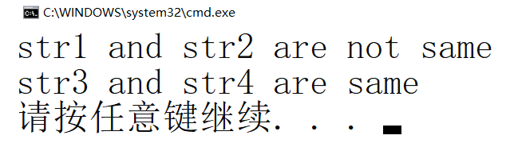
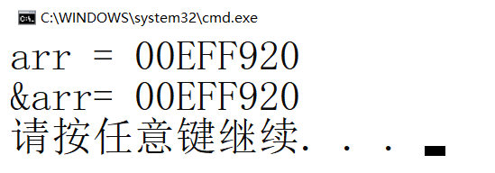
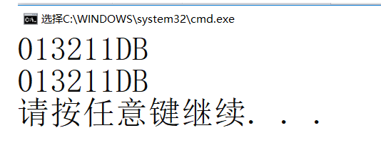

> **🍕博客主页：️[自信不孤单](https://blog.csdn.net/czh1592272237)**
>
> **🍬文章专栏：[C语言](https://blog.csdn.net/czh1592272237/category_12209876.html)**
>
> **🍚代码仓库：[破浪晓梦](https://gitee.com/polang-xiaomeng/study_c)**
>
> **🍭欢迎关注：点赞收藏+关注**

# 指针的进阶

[toc]

---

# 前言

==重点内容==

> 1. 字符指针
>
> 2. 数组指针
>
> 3. 指针数组
>
> 4. 数组传参和指针传参
>
> 5. 函数指针
>
> 6. 函数指针数组
>
> 7. 指向函数指针数组的指针
>
> 8. 回调函数
>
> 9. 指针和数组面试题的解析

==之前我写过一篇《初阶指针》，我们知道了指针的概念：==

> 1. 指针就是个变量，用来存放地址，地址唯一标识一块内存空间。
>
> 2. 指针的大小是固定的4/8个字节（32位平台/64位平台）。
>
> 3. 指针是有类型，指针的类型决定了指针的+-整数的步长，指针解引用操作的时候的权限。
>
> 4. 指针的运算。

==借助这篇文章，我们继续探讨指针更高级的主题。==

# 1、字符指针

> 在指针的类型中我们知道有一种指针类型为字符指针`char*`
> 一般使用方式:

```c
int main()
{
	char ch = 'w';
	char* pc = &ch;
	*pc = 'w';
	return 0;
}
```

> 还有一种使用方式如下：

```c
int main()
{
	const char* pstr = "hello world";//这里是把一个字符串放到pstr指针变量里了吗？
	printf("%s\n", pstr);
	return 0;
}

```

> 代码 `const char* pstr = "hello world";`特别容易让我们以为是把字符串`hello world`放到字符指针`pstr`里了，但是其本质是把字符串`hello world`首字符的地址放到了`pstr`中。



> 上面代码的意思是把一个常量字符串的首字符`h`的地址存放到指针变量`pstr`中。

==那么这段代码输出结果是什么？==

```c
#include <stdio.h>
int main()
{
	char str1[] = "hello world";
	char str2[] = "hello world";
	const char* str3 = "hello world";
	const char* str4 = "hello world";
	if (str1 == str2)
		printf("str1 and str2 are same\n");
	else
		printf("str1 and str2 are not same\n");
	if (str3 == str4)
		printf("str3 and str4 are same\n");
	else
		printf("str3 and str4 are not same\n");
	return 0;
}
```

==这里最终输出的是：==



> 这里str3和str4指向的是一个同一个常量字符串。C/C++会把常量字符串存储到单独的一个内存区域，当几个指针指向同一个字符串的时候，他们实际会指向同一块内存。但是用相同的常量字符串去初始化不同的数组的时候就会开辟出不同的内存块。所以str1和str2不同，str3和str4相同。

# 2、指针数组

> 在初阶里我们也谈到了指针数组，这里做一个简单的回顾

指针数组是一个存放指针的数组。

```c
int* arr1[10]; //整型指针的数组
char* arr2[4]; //一级字符指针的数组
char** arr3[5];//二级字符指针的数组
```

# 3、数组指针

## 3.1 数组指针的定义

> 数组指针是指针？还是数组？
> 答案是：指针。

> 我们已经熟悉：
> 整型指针：` int * pint;` 能够指向整型数据的指针。
> 浮点型指针： `float * pf; `能够指向浮点型数据的指针。
> 那数组指针应该是：能够指向数组的指针。

==下面代码哪个是数组指针？==

```c
int* p1[10];
int(*p2)[10];
//p1, p2分别是什么？
//答案是：p1是指针数组，p2是数组指针。
```

==解释：==

```c
int(*p)[10];
//解释：p先和*结合，说明p是一个指针变量，然后指针指向的是一个大小为10个整型的数组。所以p是一个指针，指向一个数组，叫数组指针。
//这里要注意：[]的优先级要高于*号的，所以必须加上（）来保证p先和*结合。
```

## 3.2 &数组名VS数组名

> 对于下面的数组：

```c
int arr[10];
```

`arr`和`&arr`分别是啥？

> 我们知道`arr`是数组名，数组名表示数组首元素的地址。
> 那`&arr`数组名到底是啥？

==我们看一段代码：==

```c
#include <stdio.h>
int main()
{
	int arr[10] = { 0 };
	printf("%p\n", arr);
	printf("%p\n", &arr);
	return 0;
}
```

==运行结果如下：==



> 可见数组名和&数组名打印的地址是一样的。
> 难道两个是一样的吗？

==我们再看一段代码：==

```c
#include <stdio.h>
int main()
{
	int arr[10] = { 0 };
	printf("arr = %p\n", arr);
	printf("&arr= %p\n", &arr);
	printf("arr+1 = %p\n", arr + 1);
	printf("&arr+1= %p\n", &arr + 1);
	return 0;
}
```

==运行结果如下：==


> 根据上面的代码我们发现，其实&arr和arr，虽然值是一样的，但是意义是不一样的。
> 实际上：`&arr`表示的是数组的地址，而不是数组首元素的地址。（细细体会一下）
>
> 本例中`&arr`的类型是：`int(*)[10]`，是一种数组指针类型数组的地址+1，跳过整个数组的大小，所以`&arr+1`相对于`&arr`的差值是40。

## 3.3 数组指针的使用

> 那数组指针是怎么使用的呢？
> 既然数组指针指向的是数组，那数组指针中存放的应该是数组的地址。

==看代码：==

```c
#include <stdio.h>
int main()
{
	int arr[10] = { 1,2,3,4,5,6,7,8,9,0 };
	int(*p)[10] = &arr;//把数组arr的地址赋值给数组指针变量p
	//但是我们一般很少这样写代码
	return 0;
}
```

==一般数组指针的使用：==

```c
#include <stdio.h>
void print_arr1(int arr[3][5], int row, int col)
{
	int i = 0, j = 0;
	for (i = 0; i < row; i++)
	{
		for (j = 0; j < col; j++)
		{
			printf("%d ", arr[i][j]);
		}
			printf("\n");
	}
}
void print_arr2(int(*arr)[5], int row, int col)
{
	int i = 0, j = 0;
	for (i = 0; i < row; i++)
	{
		for (j = 0; j < col; j++)
		{
			printf("%d ", arr[i][j]);
		}
		printf("\n");
	}
}
int main()
{
	int arr[3][5] = { 1,2,3,4,5,6,7,8,9,10 };
	print_arr1(arr, 3, 5);
	//数组名arr，表示首元素的地址
	//但是二维数组的首元素是二维数组的第一行
	//所以这里传递的arr，其实相当于第一行的地址，是一维数组的地址
	//可以用数组指针来接收
	print_arr2(arr, 3, 5);
	return 0;
}
```

==学了指针数组和数组指针我们来一起回顾并看看下面代码的意思：==

```c
int arr[5];
int* parr1[10];
int(*parr2)[10];
int(*parr3[10])[5];
```

> arr是一个含有五个整型变量的整型数组
> parr1是一个含有十个整型指针的整型指针数组
> parr2是一个指向含有十个整型变量数组的整型数组指针
> parr3是一个含有五个整型数组指针的数组指针数组，每个整型数组指针指向一个含有十个整型变量的数组

# 4、数组参数、指针参数

> 在写代码的时候难免要把【数组】或者【指针】传给函数，那函数的参数该如何设计呢？

## 4.1 一维数组传参

```c
#include <stdio.h>
void test(int arr[])//ok?  right
{}
void test(int arr[10])//ok?  right
{}
void test(int* arr)//ok?  right
{}
void test2(int* arr[20])//ok?  right
{}
void test2(int** arr)//ok?  right
{}
int main()
{
	int arr[10] = { 0 };
	int* arr2[20] = { 0 };
	test(arr);
	test2(arr2);
}
```

> 一维数组传参，形参可以是数组也可以是指针。
> 当形参是指针时，要注意类型。

## 4.2 二维数组传参

```c
void test(int arr[3][5])//ok？  right
{}
void test(int arr[][])//ok？  wrong
{}
void test(int arr[][5])//ok？  right
{}
//总结：二维数组传参，函数形参的设计只能省略第一个[]的数字。
//因为对一个二维数组，可以不知道有多少行，但是必须知道一行多少元素。
//这样才方便运算。
void test(int* arr)//ok？  wrong
{}
void test(int* arr[5])//ok？  wrong
{}
void test(int(*arr)[5])//ok？  right 
{}
void test(int** arr)//ok？  wrong
{}
int main()
{
	int arr[3][5] = { 0 };
	test(arr);
}
```

> 二维数组传参，形参可以时数组也可以是指针。
> 当形参是数组时，形参的行可以省略，但列不能省略；
> 当形参是指针时，实参传过去的是第一行的地址，因此，形参的类型应该是数组指针。

## 4.3 一级指针传参

```c
#include <stdio.h>
void print(int* p, int sz)
{
	int i = 0;
	for (i = 0; i < sz; i++)
	{
		printf("%d\n", *(p + i));
	}
}
int main()
{
	int arr[10] = { 1,2,3,4,5,6,7,8,9 };
	int* p = arr;
	int sz = sizeof(arr) / sizeof(arr[0]);
	//一级指针p，传给函数
	print(p, sz);
	return 0;
}
```

==思考：==

> 当一个函数的参数部分为一级指针的时候，函数能接收什么参数？
> 
> 答：1. 与它相同类型的指针；2. 一个地址。

## 4.4 二级指针传参

==思考：==

> 当函数的参数为二级指针的时候，可以接收什么参数？
>
> 答：1. 一级指针变量的地址；2. 二级指针变量。

# 5、函数指针

==首先看一段代码：==

```c
#include <stdio.h>
void test()
{
	printf("hehe\n");
}
int main()
{
	printf("%p\n", test);
	printf("%p\n", &test);
	return 0;
}
```

==输出的结果：==



> 输出的是两个地址，这两个地址是`test`函数的地址。
> 那我们的函数的地址要想保存起来，怎么保存？

==下面我们看代码：==

```c
void test()
{
	printf("hehe\n");
}
//下面pfun1和pfun2哪个有能力存放test函数的地址？
void (*pfun1)();
void* pfun2();
```

> 首先，能给存储地址，就要求`pfun1`或者`pfun2`是指针，那哪个是指针？
>
> 答案是：`pfun1`可以存放。`pfun1`先和`*`结合，说明`pfun1`是指针，指针指向的是一个函数，指向的函数无参数，返回值类型为`void`。

==阅读两段有趣的代码：==

```c
//代码1
(*(void (*)())0)();
//代码2
void (*signal(int, void(*)(int)))(int);
```

**注 :《C陷阱和缺陷》中提及了这两个代码。**

> 代码1的含义是：先将0强制类型转换为一个`void(*)()`类型的函数指针，然后通过`(*函数指针)()`来调用函数。
>
> 代码2的含义是：此代码的作用是声明signal函数，signal函数的两个参数类型是`(int, void(*)(int))`，signal函数的返回类型是`void(*)(int)`。

==代码2太复杂，如何简化？==

```c
typedef void(*pfun_t)(int);
pfun_t signal(int, pfun_t);
```

# 6、函数指针数组

> 数组是一个存放相同类型数据的存储空间，我们已经了解了指针数组，比如：

```c
int *arr[10];
//数组的每个元素是int*
```

> 那要把函数的地址存到一个数组中，那这个数组就叫函数指针数组，那函数指针的数组如何定义呢？

```c
int (*parr1[10])();
int *parr2[10]();
int (*)() parr3[10];
```


> 答案是：`parr1`
> `parr1`先和[]结合，说明`parr1`是数组，数组的内容是`int (*)()`类型的函数指针。

==下面我们来看看函数指针数组的用途：转移表==

> 举个栗子：（计算器）

```c
#include <stdio.h>
int add(int a, int b)
{
	return a + b;
}
int sub(int a, int b)
{
	return a - b;
}
int mul(int a, int b)
{
	return a * b;
}
int div(int a, int b)
{
	return a / b;
}
int main()
{
	int x, y;
	int input = 1;
	int ret = 0;
	do
	{
		printf("*************************\n");
		printf(" 1:add 2:sub \n");
		printf(" 3:mul 4:div \n");
		printf("*************************\n");
		printf("请选择：");
		scanf("%d", &input);
		switch (input)
		{
		case 1:
			printf("输入操作数：");
			scanf("%d %d", &x, &y);
			ret = add(x, y);
			printf("ret = %d\n", ret);
			break;
		case 2:
			printf("输入操作数：");
			scanf("%d %d", &x, &y);
			ret = sub(x, y);
			printf("ret = %d\n", ret);
			break;
		case 3:
			printf("输入操作数：");
			scanf("%d %d", &x, &y);
			ret = mul(x, y);
			printf("ret = %d\n", ret);
			break;
		case 4:
			printf("输入操作数：");
			scanf("%d %d", &x, &y);
			ret = div(x, y);
			printf("ret = %d\n", ret);
			break;
		case 0:
			printf("退出程序\n");
			break;
		default:
			printf("选择错误\n");
			break;
		}
	} while (input);
	return 0;
}
```

==使用函数指针数组的实现：==

   ```c
   #include <stdio.h>
   int add(int a, int b)
   {
   	return a + b;
   }
   int sub(int a, int b)
   {
   	return a - b;
   }
   int mul(int a, int b)
   {
   	return a * b;
   }
   int div(int a, int b)
   {
   	return a / b;
   }
   int main()
   {
   	int x, y;
   	int input = 1;
   	int ret = 0;
   	int(*p[5])(int x, int y) = { 0, add, sub, mul, div }; //转移表
   	while (input)
   	{
   		printf("*************************\n");
   		printf(" 1:add 2:sub \n");
   		printf(" 3:mul 4:div \n");
   		printf("*************************\n");
   		printf("请选择：");
   		scanf("%d", &input);
   		if ((input <= 4 && input >= 1))
   		{
   			printf("输入操作数：");
   			scanf("%d %d", &x, &y);
   			ret = (*p[input])(x, y);
   			printf("ret = %d\n", ret);
   		}
   		else
   			printf("输入有误\n");
   	}
   	return 0;
   }
   ```

# 7、指向函数指针数组的指针

> 指向函数指针数组的指针是一个指针，指针指向一个数组，数组的元素都是函数指针。

==如何定义？==

```c
void test(const char* str)
{
	printf("%s\n", str);
}
int main()
{
	//函数指针pfun
	void (*pfun)(const char*) = test;
	//函数指针的数组pfunArr
	void (*pfunArr[5])(const char* str);
	pfunArr[0] = test;
	//指向函数指针数组pfunArr的指针ppfunArr
	void (*(*ppfunArr)[5])(const char*) = &pfunArr;
	return 0;
}
```

# 8、 回调函数

> 回调函数就是一个通过函数指针调用的函数。如果你把函数的指针（地址）作为参数传递给另一个函数，当这个指针被用来调用其所指向的函数时，我们就说这是回调函数。回调函数不是由该函数的实现方直接调用，而是在特定的事件或条件发生时由另外的一方调用的，用于对该事件或条件进行响应。

==首先演示一下`qsort`函数的使用：==

```c
#include <stdio.h>
//qosrt函数的使用者得实现一个比较函数
int int_cmp(const void* p1, const void* p2)
{
	return (*(int*)p1 - *(int*)p2);
}
int main()
{
	int arr[] = { 1, 3, 5, 7, 9, 2, 4, 6, 8, 0 };
	int i = 0;
	qsort(arr, sizeof(arr) / sizeof(arr[0]), sizeof(int), int_cmp);
	for (i = 0; i < sizeof(arr) / sizeof(arr[0]); i++)
	{
		printf("%d ", arr[i]);
	}
	printf("\n");
	return 0;
}
```

==使用回调函数，模拟实现`qsort`（采用冒泡的方式）。==

```c
#include <stdio.h>
int int_cmp(const void* p1, const void* p2)
{
	return (*(int*)p1 - *(int*)p2);
}
void _swap(void* p1, void* p2, int size)
{
	int i = 0;
	for (i = 0; i < size; i++)
	{
		char tmp = *((char*)p1 + i);
		*((char*)p1 + i) = *((char*)p2 + i);
		*((char*)p2 + i) = tmp;
	}
}
void bubble(void* base, int count, int size, int(*cmp)(void*, void*))
{
	int i = 0;
	int j = 0;
	for (i = 0; i < count - 1; i++)
	{
		for (j = 0; j < count - i - 1; j++)
		{
			if (cmp((char*)base + j * size, (char*)base + (j + 1) * size) > 0)
			{
				_swap((char*)base + j * size, (char*)base + (j + 1) * size, size);
			}
		}
	}
}
int main()
{
	int arr[] = { 1, 3, 5, 7, 9, 2, 4, 6, 8, 0 };
	int i = 0;
	bubble(arr, sizeof(arr) / sizeof(arr[0]), sizeof(int), int_cmp);
	for (i = 0; i < sizeof(arr) / sizeof(arr[0]); i++)
	{
		printf("%d ", arr[i]);
	}
	printf("\n");
	return 0;
}
```

> 注：
>
> 1. void指针是一种特别的指针：它没有类型
>
> 2. 任何指针都可以赋值给void指针
>
> 3. void指针赋值给其他类型的指针时都要进行转换
>
> 4. void指针不能复引用
>
> 5. void指针不能参与指针运算，除非进行转换

**至此，指针中的难题已被全面攻克，可以拿着指针大杀四方了！**
==创作不易，请点赞+关注再走吧，感谢！！！==
